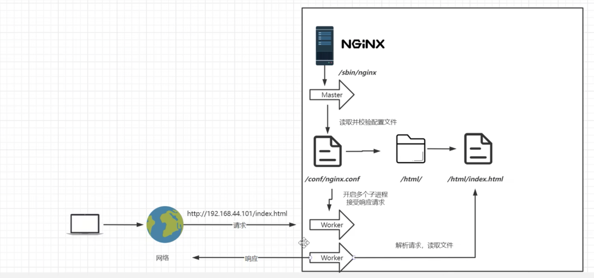
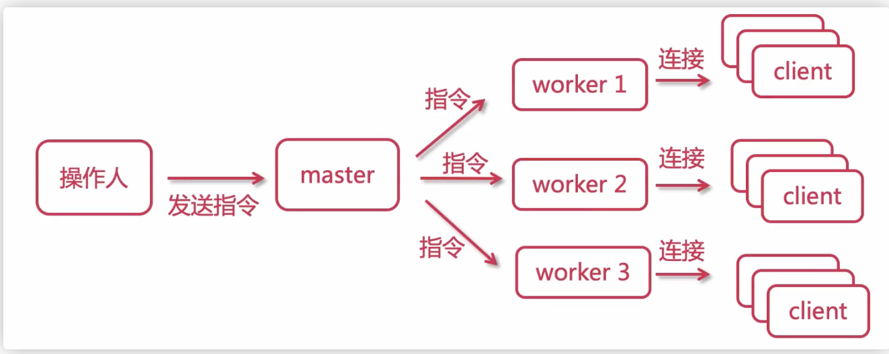
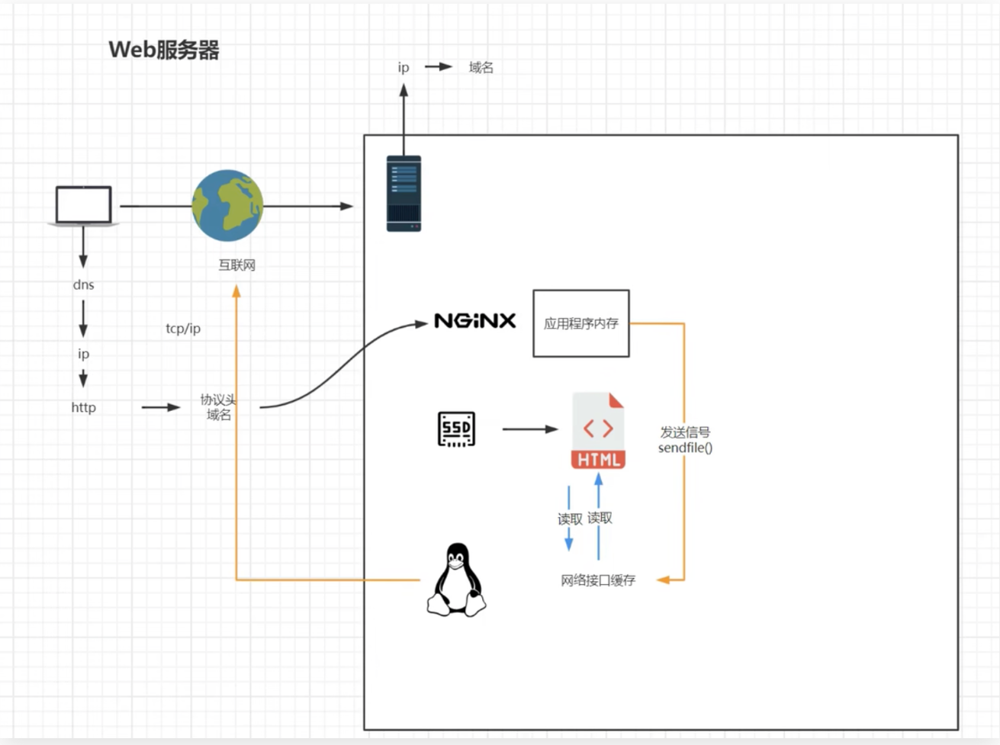
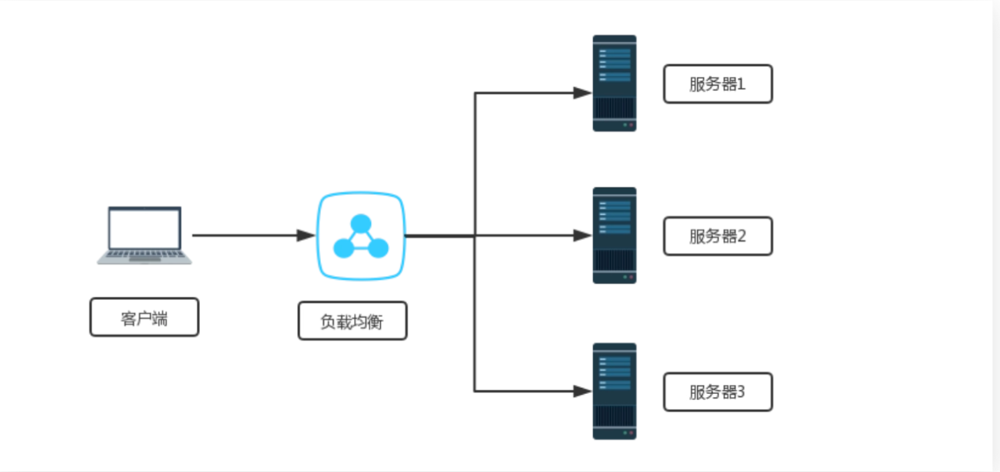

## Nginx学习

### Nginx介绍

Nginx是一个高性能的HTTP、反向代理服务器

主要功能：

- 反向代理
- 实现集群和负载均衡
- 静态资源虚拟化

Nginx的版本：

- Nginx开源版 http://nginx.org/en/

  官方原始的Nginx版本

- Nginx plus商业版

  开箱即用，集成了大量功能

- Open Resty https://openresty.org/cn/

  OpenResty是一个基于Nginx与 Lua 的高性能 Web 平台，其内部集成了大量精良的 Lua 库、第三方模块以及大多数的依赖项。**更适用于需要大量二次开发的场景，有极强的扩展性**

- Tengine https://tengine.taobao.org/

  由淘宝网发起的Web服务器项目。它在[Nginx](http://nginx.org/)的基础上，针对大访问量网站的需求，添加了很多高级功能和特性。Tengine的性能和稳定性已经在大型的网站如[淘宝网](http://www.taobao.com/)，[天猫商城](http://www.tmall.com/)等得到了很好的检验。相比于Open Resty，扩展性不够强，但是能够满足绝多数使用场景

### 什么是代理

#### 正向代理

正向代理可以理解为「客户端」的代理


#### 反向代理

反向代理可以理解为「服务器」的代理


### Nginx安装相关

#### 下载与安装

下载源代码手动编译安装(推荐)，下载Nginx包：[官网下载地址](http://nginx.org/en/download.html)


解压Nginx包，并安装

```
tar -zxvf nginx-1.27.4.tar.gz
[root@nginx ~]# cd nginx-1.27.4
[root@nginx nginx-1.27.4]# ls
```

安装依赖库

```
#安装各种依赖
yum install -y gcc gcc-c++ make pcre pcre-devel zlib zlib-devel
```

编译安装

```
./configure --prefix=/usr/local/nginx # 指定编译选项，--prefix选项指定安装的目录
make # 编译
make install # 安装编译结果
#执行make的结果，这个就是正确的
make[1]: Leaving directory '/root/nginx-1.27.4'
```

启动

```
cd /usr/local/nginx/sbin

ls # 里面是一个nginx的可执行文件

./nginx # 这个就是nginx的可执行文件

systemctl stop firewalld #关闭防火墙才可以访问，内网我就直接关闭了
# 开放端口，例子：firewall-cmd --zone=public --add-port=80/tcp --permanent
firewall-cmd --zone=public --add-port=端口号/协议 --permanent

# 修改后，重启防火墙才会生效
firewall-cmd --reload
```

补充：--zone参数为防火墙规则应用的区域

```
区域包括：
	public：用于公共网络，例如 Internet。
	internal：用于内部网络，例如公司内部网络。
	external：用于外部网络，例如连接到互联网的网络。
	work：用于工作场所网络。
	home：用于家庭网络。
```

#### 注册为系统服务

注册为系统服务后，可以以系统服务的方式启动nginx

#### 新增系统服务配置文件

```
vim usr/lib/systemd/system/nginx.service
```

```
[Unit] 
Description=nginx 
After=network.target remote-fs.target nss-lookup.target 

[Service]
Type=forking 

PIDFile=/usr/local/nginx/logs/nginx.pid
ExecStartPre=/usr/local/nginx/sbin/nginx -t -c /usr/local/nginx/conf/nginx.conf
ExecStart=/usr/local/nginx/sbin/nginx -c /usr/local/nginx/conf/nginx.conf 
ExecReload=/usr/local/nginx/sbin/nginx -s reload 
ExecStop=/usr/local/nginx/sbin/nginx -s stop # 停止
ExecQuit=/usr/local/nginx/sbin/nginx -s quit  
PrivateTmp=true 
   
[Install]   
WantedBy=multi-user.target  
```

文件注释

```
[Unit]
Description=nginx 
After=network.target remote-fs.target nss-lookup.target 

[Service]
Type=forking 

PIDFile=/usr/local/nginx/logs/nginx.pid
ExecStartPre=/usr/local/nginx/sbin/nginx -t -c /usr/local/nginx/conf/nginx.conf
ExecStart=/usr/local/nginx/sbin/nginx -c /usr/local/nginx/conf/nginx.conf 
ExecReload=/usr/local/nginx/sbin/nginx -s reload 
ExecStop=/usr/local/nginx/sbin/nginx -s stop 
ExecQuit=/usr/local/nginx/sbin/nginx -s quit  
PrivateTmp=true 

[Install]
WantedBy=multi-user.target  
```


重新加载系统文件

```
systemctl daemon-reload
```

系统服务如何使用？

```
systemctl enable xxx服务名 # 自启动服务
systemctl status xxx服务名 # 服务运行状态

systemctl start xxx服务名
systemctl reload xxx服务名
```

#### Nginx常用命令

```
./nginx -s stop # 快速停止（正在进行的请求会直接被中断，很少使用）
./nginx -s quit # 处理完已接受的请求后，才会停止（优雅关机）
./nginx -s reload # 重新加载配置

./nginx -c xxx.conf # 配置nginx使用的配置文件地址（默认为conf/nginx.conf ）

./nginx -t # 检查nginx配置是否正确
./nginx -v # nginx版本号
```

给nginx配置好系统服务之后可以用systemctl 来使用nginx命令

```
systemctl start nginx  
systemctl stop nginx
systemctl restart nginx
systemctl reload nginx
```

查看nginx状态

```
ps -ef|grep nginx

pgrep -f nginx
```


#### Nginx目录

Nginx一般安装在`/usr/local/nginx`目录下（安装时--prefix可指定安装目录）


```
conf #配置文件
	｜-nginx.conf # 主配置文件
	｜-其他配置文件 # 可通过那个include关键字，引入到了nginx.conf生效
	
html #静态页面

logs（默认不是放在这里，可以在配置文件中修改为这里）
	｜-access.log #访问日志(每次访问都会记录)
	｜-error.log #错误日志
	｜-nginx.pid #进程号
	
sbin
	｜-nginx #主进程文件
	
*_temp #运行时，生成临时文件
```

### Nginx进程模型

一个Master：监听请求，并分配worker进程处理

默认一个worker进程（可以在配置文件中修改worker数量）：处理客户端请求



每个worker之间彼此独立，每一个worker处理多个请求



#### worker的抢占机制

多个worker进程争抢一个锁，获取锁的进程进行响应


#### Worker事件处理机制

传统HTTP服务器是同步处理，当多个客户端请求时，如果Client1的请求被阻塞，Master会fork新的worker进程处理

但是Nginx采用的是异步非阻塞方式，如果Client1的请求被阻塞，worker会取处理下一个请求，不会阻塞当前worker进程。所以Nginx的一个worker进程可以并发处理大量请求


### Nginx配置文件

后面学习Nginx配置，每次修改配置文件，一定要重载才能生效

```
systemctl reload nginx # 以系统服务的方式启动nginx
```

#### nginx.conf配置文件

```
# master进程会启动worker进程，该选项设置在系统中显示启动该进程的用户名（一般不改动，默认nobody）
# user nobody

# 启动的worker进程数
worker_processes  1; 

# 错误日志放置的路径 notice、info是错误日志的级别，比如：info就是日志级别大于info才生成日志
# 默认地址为/var/log/nginx/error.log ，可通过nginx -V返回的--eror-log-path字段获取实际值
#error_log  logs/error.log;
#error_log  logs/error.log  notice;
#error_log  logs/error.log  info;

# pid文件存放路径,默认：/var/run/nginx/nginx.pid，可通过nginx -V返回的--pid-path字段获取实际值
#pid        logs/nginx.pid;

# 配置事件处理方式、worker最大连接数
events {
		use epoll; # 使用epoll事件处理机制（默认值）
    worker_connections  1024; # 每个worker进程处理的最大连接数
}


# http模块配置
http {
    include       mime.types; #include是引入关键字，这里引入了mime.types这个配置文件的内容（同在conf目录下，mime.types是用来定义，请求返回的content-type）
    default_type  application/octet-stream; #mime.types未定义的，使用默认格式application/octet-stream
    
    # 访问日志格式
    #log_format  main  '$remote_addr - $remote_user [$time_local] "$request" '
    #                  '$status $body_bytes_sent "$http_referer" '
    #                  '"$http_user_agent" "$http_x_forwarded_for"';

		# 访问日志地址，默认：/var/log/nginx/access.log，可通过nginx -V返回的--http-log-path字段获取实际值
    #access_log  logs/access.log  main;

		# 详见下文
    sendfile        on; 
    #tcp_nopush     on;
    
    keepalive_timeout  65; # TCP链接超时时间,单位秒
	
		# 压缩相关，详见下文
		gzip on; # 开启压缩，压缩后发送给客户端
		
		# 详见下文 
    server {
        //xxx
    }
}
```

#### sendfile配置

打开sendfile，用户请求的数据不用再加载到nginx的内存中，而是直接发送

高负载的场景下，使用 sendfile 功能可以降低 CPU 和内存的占用，提升服务器性能

```
http{
	sendfile:on # off
}

# 或者指定某个server开启
server {
    location / {
        sendfile off;
        ...
    }
}
```



#### gzip配置 #一般不用

```
http{
	  gzip on; # 开启压缩，压缩后发送给客户端
		gzip_min_length 1;# 设置最小压缩下限。1就是小于1字节的文件不压缩
		gzip_comp_level 3 # 压缩级别0-9，值越大文件就压缩的越小，相应的会损耗更多性能
		gzip_type text/plain application/javascript image/* # 指定哪些 MIME 类型，开启压缩（不写默认全部），可以使用通配符 image/* 就是所有图片。具体哪些类型可以看conf/mime.types文件
}
```

nginx 中的 gzip 压缩分为动态压缩、静态压缩

- 动态压缩：服务器给客户端返回响应时，消耗自身的资源进行实时压缩，保证客户端拿到 gzip 格式的文件

  gzip on开启的就是动态压缩，gzip_comp_level设置的级别高，可能会造成CPU占用过高（文章：[简单一招竟把nginx服务器性能提升50倍](https://www.toutiao.com/article/7329343713828897280/?app=news_article&timestamp=1707783801&use_new_style=1&req_id=202402130823202F9A6100389685E57A11&group_id=7329343713828897280&share_token=F2E89DA7-CC1F-4AAC-9BCC-A82B8020A9D6&tt_from=weixin&utm_source=weixin&utm_medium=toutiao_ios&utm_campaign=client_share&wxshare_count=1&source=m_redirect)）

- 静态压缩：直接将预先压缩过的 .gz 文件返回给客户端，不再实时压缩文件，如果找不到 .gz 文件，会使用对应的原始文件

  该功能需要模块： `ngx_http_gzip_static_module`（默认不会被构建）

  我们可以通过下面命令查看，当前安装的是否包含该模块

```
./nginx -V #注意大写
```


如果不包含，需要重新编译Nginx

```
./configure --with-http_gzip_static_module # 指定编译配置，这个参数安装模块`ngx_http_gzip_static_module`
make # 编译
make install # 安装
```

包含该模块，则可以启用下面配置

```
http{
	gzip_static  on;
	gzip_proxied expired no-cache no-store private auth;
}
```

#### server配置

虚拟主机配置（可以启用多个），多个server字段，会根据请求的域名+端口从前向后匹配

用户访问`www.lxxhaven.top`（注意：需要解析到当前Nginx的这台机器），请求会匹配到下面的配置中

（我们本地测试时可以直接修改win系统的hosts，建立域名与Nginx所在机器IP的映射）

（server_name设置为localhost，即表示匹配任何打到这台机器的请求）

需要有域名，在哪个服务商进行解析都可以


在虚拟机创建目录

```
cd /
mkdir -p www/www
mkdir -p www/vod
```

nginx.conf配置文件内容

```
[root@nginx conf]# cat nginx.conf
worker_processes  1;
events {
    worker_connections  1024;
}
http {
    include       mime.types;
    default_type  application/octet-stream;
    sendfile        on;

    keepalive_timeout  65;
#虚拟主机
    server {
        listen       80;
#域名或者主机名,还可以配置多个域名为同一个网页解析，直接在server_name添加即可
        server_name  www.lxxhaven.top; 

        location / {
            root   /www/www;
            index  index.html index.htm;
        }

        error_page   500 502 503 504  /50x.html;
        location = /50x.html {
            root   html;
        }

    }

#虚拟主机2
    server {
        listen       80;
        server_name  vod.lxxhaven.top;
        
        location / {
            root   /www/vod;
            index  index.html index.htm;
        }
        
        error_page   500 502 503 504  /50x.html;
        location = /50x.html {
            root   html;
        }
        
    }


}
```

不同域名进行访问


### 反向代理与负载均衡

**反向代理**：这种代理方式叫做，隧道代理。有性能瓶颈，因为所有的数据都经过Nginx，所以Nginx服务器的性能至关重要


**负载均衡**：把请求，按照一定算法规则，分配给多台业务服务器（即使其中一个坏了/维护升级，还有其他服务器可以继续提供服务）



#### L4、L7负载均衡

**L4负载均衡**

在传输层（第四层）上工作的。它基于 IP 地址和端口号来进行负载均衡，不考虑传输的具体内容，仅通过查看传入数据包的目标 IP 地址和端口号，并根据预定义的规则将其转发到后端服务器上。

四层负载均衡器的主要优点是性能高，因为它只关注传输层的信息，不需要解析应用层协议的数据。常见的四层负载均衡器：

- F5硬负载均衡（硬件，价格昂贵）
- LVS四层负载均衡
- Haproxy四层负载均衡
- Nginx四层负载均衡（Nginx 1.9版本后才支持，用得少Nginx一般用做七层负载均衡）

**L7负载均衡**

在应用层（第七层）上工作的。它不仅考虑了传输层的信息（如 IP 地址和端口号），还分析了传输的应用层数据，例如 HTTP 请求的 URL、Cookie、报头等信息。基于这些信息，七层负载均衡器可以做出更精细的决策，并根据具体的应用需求将流量分发到不同的后端服务器上。

七层负载均衡器在传输层和应用层之间工作，因此它比四层负载均衡器更智能，可以实现更复杂的负载均衡策略。常见的七层负载均衡器：

- Nginx七层负载均衡
- Haproxy七层负载均衡
- apache七层负载均衡（并发到达百万级别，性能会大幅下降）

#### Nginx负载均衡

##### 负载均衡配置

**反向代理单个服务器**

启用proxy_pass，root和index字段就会失效

proxy_pass后的地址必须写完整 `http://xxx `、`https://xxx`

**注意：目标服务器如果是https的，需要特殊配置**

当请求命中了这条规则，会被转发到目标服务器地址

```
http{ 		
 		server {
        listen       80;
        server_name  localhost;

        location / { 
        		proxy_pass http://xxx; # 参数是 http://server_name;
        		proxy_pass http://qq.com;  #例子
        }
		}
}
```


路径 + 参数会被一起转发

```
假设Nginx机器的地址为：http://www.xxx.com


请求 http://www.xxx.com/test?a=1
会被 proxy_pass地址/test?a=1
```

重写需求： 例如只有api前缀的才转发到后台服务器，但是接口并不包含api路径

```
location / { 
	 rewrite ^/api/(.*)  $1 
   proxy_pass http://xxx; # 参数是 http://server_name
}
```

```
请求 http://www.xxx.com/api/test?a=1
会被 proxy_pass地址/test?a=1
```

**反向代理集群**

上面Nginx接到请求后，会转发到一个目标地址。可以设置多个，实现负载集群

请求会代理到`192.168.3.210:80`和`192.168.3.211:80`这两个服务

每次访问随机分配到两个地址

```
http{
	upstream test_server{ # 参数是server_name
		server 192.168.3.210:80; #如果是80端口，可以省略不写
		server 192.168.3.211:80;
	}
	server {
        listen       80;
        server_name  localhost;

        location / { 
        		proxy_pass http://test_server; #与上面的upstream一致
        }
		}
}
```

**设置权重**

多个请求，Nginx会根据权重分配

```
upstream test_server{
		server 192.168.3.210:80 weight=10;
		server 192.168.3.211:80 weight=80;
}
```

**关闭**

为什么使用down关闭，而不是直接删除？请看ip_hash部分

```
upstream test_server{
		server 192.168.3.210:80 down; #表示某个机器不参与负载均衡,让机器休息
		server 192.168.3.211:80;
}
```

**备用机**

backup的这个机器正常是不会被访问到，如果`192.168.3.211:80`出现故障，无法提供服务，才会自动启用

```
upstream test_server{
		server 192.168.3.210:80 ;
		server 192.168.3.211:80 backup;
}
```

##### 动静分离配置

大多数用于中小型网站，让网站速度更快

这里添加另一个location是因为配置proxy_pass其他设置就已经失效了，所以要另行添加

```
http{
	upstream test_server{ 
		server 192.168.3.210:80; 
		server 192.168.3.211:80;
	}
	server {
        listen       80;
        server_name  localhost;

        location / { 
        		proxy_pass http://test_server; 
        }
        location /css {    
        #表示引用./html/css/html/index.html和index.htm
          root html;
          index index.html index.htm;
        }
		}
}
```

