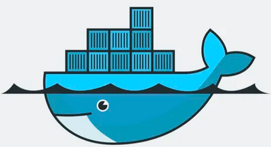

# Kubernetes弃用Docker

## 1.Kubernetes简介

*Kubernetes* 源自希腊语，意为“舵手”或“飞行员”。*Kubernetes* 是 *Google* 公司于2014年6月发布的开源容器编排引擎，前身是 *Google* 的内部 *Borg* (*Borg* 是最早的容器编排系统，在 *Google* 内部运行超过 15 年)。
通常，业内更习惯的简称 *Kubernetes* 为 "*K8s*"。[官方网站](https://kubernetes.io/)

 

## 2.Kubernetes对比Docker

### 2.1 层次差异

按分层的架构思想来评价二者，*Docker* 更像是底层；而 *K8s* 则更像上层。

### 2.2 应用领域

2013年初 *Docker Inc* 公司成立，同年3月将 Docker 开源(前身是 *DotCloud* 公司的内部项目)；

 一个应用通常是由多个容器(服务)组成的，*Docker* 本质上是将**程序和程序运行环境**打包成镜像，并由此运行容器的引擎。

 

### 2.3 二者的竞争

竞争：看图说话

## 3.结束语

"*K8s* 弃用 *Docker*"这个令业内引起骚动的话语，是一种误解；

真实的情况是：*K8s* 自1.24版删除了"docker-shim"，不再直接使用 docker 作为底层的容器运行时。

