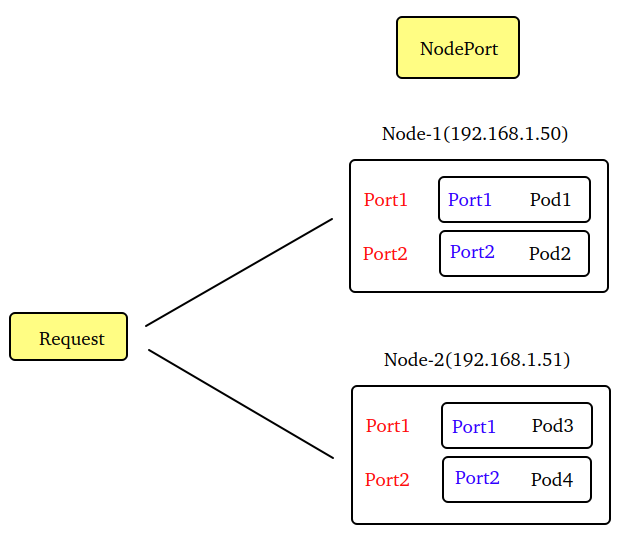
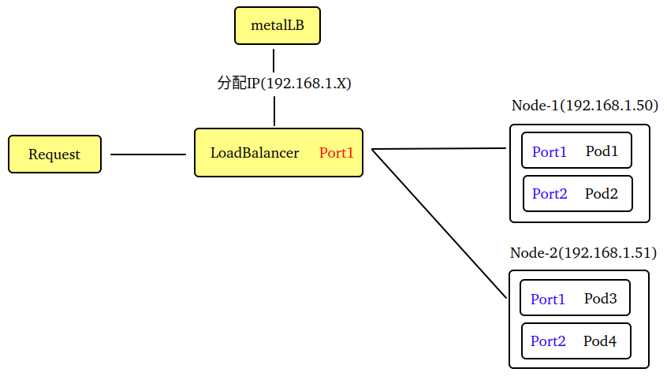
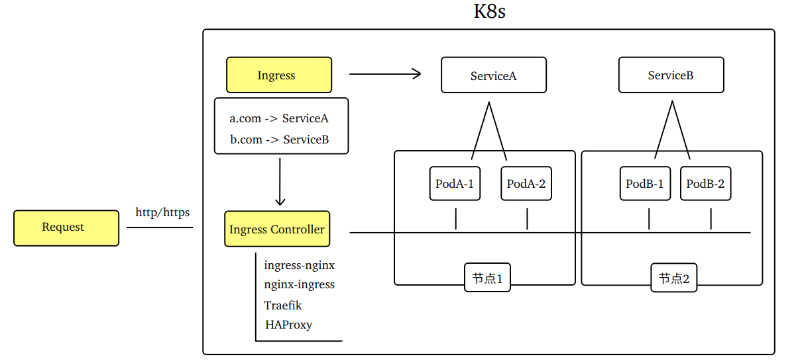

# Ingress

## 1. 什么是ingress

Ingress 是 K8s 中的一种资源类型，缩写为 "ing"，支持命名空间。

~~~shell
k api-resources |head -1;k api-resources|grep ingresses
~~~

Ingress 充当了进入K8s 集群的"网关"，负责接收外部请求，并将请求根据既定规则转发到正确的目标上(对外暴露 Service 的一种方式)。

以往介绍过的对外暴露 Service 的类型：

| 方式         | 优点                                           | 缺点                                                         |
| ------------ | ---------------------------------------------- | ------------------------------------------------------------ |
| NodePort     | 简单直接，暴露节点端口即可                     | 占用(非常用)节点端口，依赖节点(节点故障则无法访问)等等       |
| LoadBalancer | 不占节点端口，高可用(节点故障服务IP可漂移)等等 | 需单独配置LB插件，非公有云的LB网段需与节点相同，一个Service对一个LB等等 |

 

 

## 2. Ingress的工作原理

 

说明：

~~~markdown
1. Ingress通过http/https对外暴露服务
2. Ingress负责反代规则(哪个域名对应哪个service)
3. Ingress Controller负责读取Ingress规则将请求转发至合适的Pod，并可动态感知Ingress规则变化
~~~

## 3. 安装Ingress-Controller

本次选用K8s官方提供的 ingress 控制器 "ingress-nginx"，此控制器基于 nginx 打造由 K8s 社区维护。

修改从 [GitHub官网](https://github.com/kubernetes/ingress-nginx)  下载的 YAML 文件

~~~markdown
1. 修改控制器类型，由"Deployment"改为"DaemonSet"，实现所有工作节点可访问
   kind: Deployment改为DaemonSet  line：392
   strategy改为updateStrategy  	line：410
2. 修改镜像拉取的地址，由"registry.k8s.io"改为"aliyuncs"
   line：445、547、601
   docker load -i nginx-ingress_image_1.12.0.tar
3. 修改Service的类型，由"LoadBalancer"改为"NodePort"，LoadBalancer还需额外的负载均衡器支持
   line：366
~~~

执行 YAML 部署清单

~~~shell
kubectl apply -f ingress-deploy.yaml
~~~

查看运行的资源(DaemonSet/Pod、Service、Job等等)

~~~shell
# 查看ingress-nginx的service端口(80-http端口；443-https端口)
kubectl get svc -n ingress-nginx | grep controller
# 查看ingress-nginx的pod(每个工作节点运行一个pod)
kubectl get pod -n ingress-nginx -o wide | grep controller
~~~

## 4. 创建Pod和Service

[nginx_124.yaml](../YAML/ingress/nginx_124.yaml) 、[nginx_126.yaml](../YAML/ingress/nginx_126.yaml)

~~~markdown
1. 使用Deployment控制创建pod(mydeploy124、mydeploy126)
kubectl get deploy -owide
2. 创建了两个Service(nginx-service124、nginx-service126)
kubectl get svc -owide
3. Deployment和Service都放在default命名空间
~~~

## 5. 创建Ingress规则

~~~yaml
apiVersion: networking.k8s.io/v1
kind: Ingress
metadata:
  name: my-nginx-ingress
  namespace: default
spec:
  # 0.指定Ingress资源所使用的Ingress Controller的名字
  ingressClassName: nginx
  # 1.路由规则
  rules:
      # 2.自定义域名
    - host: nginx124.com
      http:
        # 3.域名下的具体路径
        paths:
          - path: / 
            backend:
              service:              
                # service名字
                name: nginx-service124
                # service端口
                port: 
                  number: 80
            # 路径匹配类型      
            pathType: Prefix # Prefix前缀匹配区分大小写，Exact精确匹配且区分大小写
      # 2.自定义域名
    - host: nginx126.com
      http:
        # 3.域名下的具体路径
        paths:
          - path: /
            backend:
              service:              
                # service名字
                name: nginx-service126
                # service端口
                port: 
                  number: 80
            # 路径匹配类型      
            pathType: Prefix # Prefix前缀匹配区分大小写，Exact精确匹配且区分大小写
~~~

## 6. 测试访问

自定义域名由于是未注册的测试域名，须在集群外主机的hosts文件中添加

~~~shell
echo '192.168.1.50 nginx124.com nginx126.com' >> /etc/hosts
echo '192.168.1.51 nginx124.com nginx126.com' >> /etc/hosts
~~~

通过浏览器输入`http://nginx124.com:32464` 或者 `http://nginx126.com:32464` 进行访问

## 7. 实现HTTPS代理

Ingress 基于 http 协议或 https 协议对外暴露服务。

~~~markdown
1. https通过SSL/TLS协议进行加密传输，而http以明文传输存在安全风险
2. https需要使用CA(第三方证书颁发机构)证书来进行加密和解密，而http不需要证书
3. https端口是443，http端口是80
~~~

CentOS内置命令 `openssl req ` 可以生成自签名证书(自签名证书是免费的，不需要给 CA 支付费用)。

~~~shell
# 创建自签名证书-x509；不对私钥文件加密-nodes；
openssl req -x509 -nodes -days 365 \
# 加密算法rsa:2048；自动创建私钥文件server.key；自签证书的输出文件server.crt
-newkey rsa:2048 -keyout server.key -out server.crt \
# 指定SSL证书的主题信息：C=国家；ST-省份；CN-通用名称；O-组织名
-subj "/C=CN/ST=Changsha/CN=*.laoli.com/O=*.laoli.com"
~~~

~~~shell
openssl req -x509 -nodes -days 365 \
-newkey rsa:2048 -keyout server.key -out server.crt \
-subj "/C=CN/ST=Changsha/CN=*.laoli.com/O=*.laoli.com"
~~~

创建使用证书的Secret

~~~shell
kubectl create secret tls www.laoli.com --key server.key --cert server.crt
~~~

创建测试所用的 Pod 和 Service
[nginx.yaml](../YAML/ingress/nginx.yaml)

创建使用证书的Ingress

~~~yaml
apiVersion: networking.k8s.io/v1
kind: Ingress
metadata:
  name: my-nginx-ingress
  namespace: default
spec:

  # 1.指定Ingress资源所使用的Ingress Controller的名字
  ingressClassName: nginx
  
  # 2.路由规则 
  rules:
      # 2.1 自定义域名
    - host: www.laoli.com
      # 2.2 http协议(含有tls配置的http会自动跳转到https上)
      http:       
        paths:
          - path: /
            backend:
              service:
                name: nginx-service
                port: 
                  number: 80
            pathType: Prefix       
            
  # 3.tls配置       
  tls:
      # 3.1 TLS证书中包含的主机列表
    - hosts:
      - www.laoli.com
      # 3.2 配置指定的secret，与前面'kubectl create secret tls'命令中的名字一致
      secretName: www.laoli.com
~~~

修改主机的hosts文件

~~~shell
echo '192.168.1.50 www.laoli.com' >> /etc/hosts
echo '192.168.1.51 www.laoli.com' >> /etc/hosts
~~~

查看 ingress-controller 的 service 端口

~~~shell
kubectl get svc -n ingress-nginx
~~~

通过浏览器输入`https://www.laoli.com:31591`  进行访问

关闭http自动跳转到https

~~~yaml
 annotations:
    nginx.ingress.kubernetes.io/ssl-redirect: 'false'
~~~

通过浏览器输入`http://www.laoli.com:30658`  进行访问
