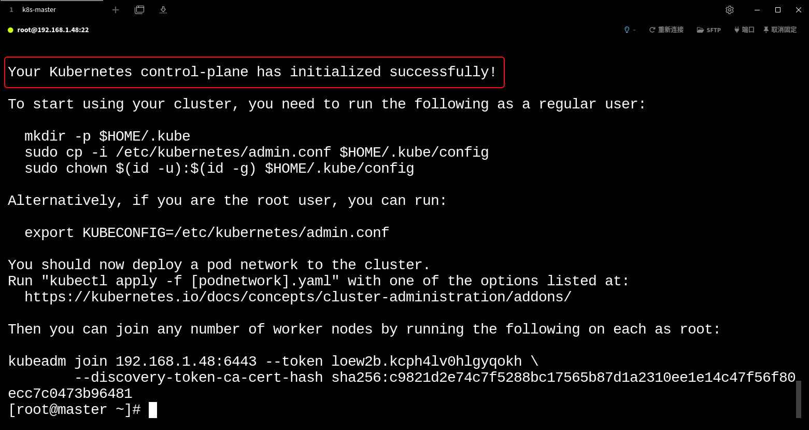

# 搭建Kubernetes环境

## 0.前言

### 0.1 系统配置

K8s的集群节点分 master 和 node 两种，使用 VirtualBox 虚拟机实现。配置如下：

| 节点   | IP           | 系统      | 内核   | CPU  | 内存 | 硬盘 |
| ------ | ------------ | --------- | ------ | ---- | ---- | ---- |
| master | 192.168.1.49 | CentOS7.9 | 3.10.0 | 4    | 4    | 40   |
| node1  | 192.168.1.50 | CentOS7.9 | 3.10.0 | 4    | 4    | 40   |
| node2  | 192.168.1.51 | CentOS7.9 | 3.10.0 | 4    | 4    | 40   |

### 0.2 源的问题

本次安装所采用的各种"源"，基本上都使用国内的源(阿里云)。无法使用国内源的已提前下载好并制作为本地安装包，以避免无法下载导致安装被迫中断。

### 0.3 虚拟机ova 包

视频所生成的 VirtualBox 虚拟机会导出成 ova 包，方便大家导入直接使用。

注意：导入后修改IP等与本地环境密切关联的参数！

## 1. 节点基础环境

### 1.1 CentOS更换yum源

CentOS7在2024年6月30日停止技术服务支持。

~~~markdown
# 下载阿里云的repo文件
curl -o /etc/yum.repos.d/CentOS-Base.repo http://mirrors.aliyun.com/repo/Centos-7.repo
# 清空旧yum缓存并重建新缓存
yum clean all && yum makecache
# 更新软件包
yum update -y
~~~

### 1.2 修改主机名与解析主机名

为方便集群节点间的直接调用(不用IP而用主机名)，配置一下主机名及其解析文件

~~~markdown
# 修改主机
hostnamectl set-hostname k8s-master|k8s-node1|k8s-node2
# 主机名解析文件(注意以下所有IP地址根据本地环境酌情修改)
cat << EOF >> /etc/hosts
192.168.1.49 k8s-master
192.168.1.50 k8s-node1
192.168.1.51 k8s-node2
EOF
~~~

### 1.3 关闭防火墙

容器的端口要在防火墙默中逐一开放才可对外提供访问，学习状态将防火墙关闭避免开端口的繁琐。

~~~markdown
# 查看防火墙状态
systemctl status firewalld
# 关闭防火墙
systemctl stop firewalld
# 禁止开机自启
systemctl disable firewalld
~~~

### 1.4 关闭SELINUX

SELinux是一种Linux内核的安全模块，它提供了强大的访问控制机制，但在某些情况下可能会干扰K8S的正常运行。

~~~markdown
# 查看状态
sestatus
# 交互式关闭	
vim /etc/selinux/config
	修改 "SELINUX=enforcing" 为 "SELINUX=disabled"	
# 非交互式关闭
sed -ri 's/SELINUX=enforcing/SELINUX=disabled/' /etc/selinux/config
# 重启生效
reboot
~~~

### 1.5 关闭swap

‌‌swap是一种虚拟内存技术，当物理内存不足时，swap可以将部分数据从内存转移到硬盘上；
开启swap会导致K8s的性能和稳定出现问题，包括‌内存和I/O性能下降，‌cgroups设置的内存上限会失效等。

~~~markdown
# 查看swap
free -h
# 交互式关闭
vim /etc/fstab
	注释 "/dev/mapper/centos-swap……" 那一行
# 非交互式关闭
sed -ri 's/.*swap.*/#&/' /etc/fstab
# 重启生效
reboot	
~~~

### 1.6 升级内核

K8s集群中运行的容器通常依赖于 Linux 内核特定功能和特性的；
CentOS7系列系统默认版本是3.10.0，该版本的内核在社区已反馈出很多的Bug，故升级内核十分必要；
CentOS 可使用 ELRepo升级内核，[ELRepo](https://www.elrepo.org)是一个第三方软件仓库，专注于提供硬件驱动和内核更新支持。

~~~markdown
# 查看内核版本
uname -r
# 设置阿里云的elrepo源	
cat << EOF > /etc/yum.repos.d/elrepo.repo
[elrepo]
name=elrepo
baseurl=https://mirrors.aliyun.com/elrepo/archive/kernel/el7/x86_64
gpgcheck=0
enabled=1
EOF
# 重建yum缓存
yum clean all && yum makecache
~~~

~~~markdown
# 查看仓库中的内核包(lt-长期维护版,ml-最新稳定版)
yum list | grep kernel*
yum list | grep kernel-lt.x86_64
yum list | grep kernel-ml.x86_64
# 安装内核(5.4.278)
yum install -y kernel-lt.x86_64
# 查看内核(3.10与5.4并存)
cat /etc/grub2.cfg | grep menuentry|awk -F "\'" '$1=="menuentry " {print i++ " : " $2}'
# 默认引导5.4内核
grub2-set-default 0
# 重新生成grub2的引导文件
grub2-mkconfig -o /boot/grub2/grub.cfg
# 重启生效
reboot
~~~

### 1.7 时间同步

时间同步是为了保证节点之间时间的一致性，避免因为时间不一致而引发问题；
Centos7+ 默认使用 Chrony 替代传统的 ntpd 或 ntpdate实现时间同步，因同步速度更快、低延迟、低CPU占用和低内存消耗。

~~~markdown
# 查看服务状态
systemctl status chronyd
# 修改配置(手动修改同步服务器)
vim /etc/chrony.conf
server ntp1.aliyun.com
server ntp2.aliyun.com
server ntp3.aliyun.com
# 手动同步
chronyc makestep
# 查看系统时间
date
# 查看同步状态
chronyc tracking

# 安装Chrony(CentOS7默认已安装)
yum -y install chrony
# 启动chronyd服务(CentOS7默认启动)
systemctl start chronyd
# chronyd服务开机自启(CentOS7默认开机自启)
systemctl enable chronyd
~~~

### 1.8 路由转发及网桥过滤

路由转发是指当一个节点接收到数据包的目标地址不是本地的时候，需要将数据包发送给另一个节点来处理；
网桥过滤会根据数据包的目标 MAC 地址判断应从哪个接口转发出去，它提高了网络通信的效率和安全性‌。

~~~markdown
# k8s路由转发配置文件
cat << EOF > /etc/sysctl.d/k8s.conf
net.bridge.bridge-nf-call-iptables  = 1
net.bridge.bridge-nf-call-ip6tables = 1
net.ipv4.ip_forward                 = 1
vm.swappiness = 0
EOF
# 网桥过滤
modprobe br_netfilter
# 载入/etc/sysctl.conf文件中的设置使生效
    sysctl -p /etc/sysctl.d/k8s.conf 或者 sysctl --system
~~~

### 1.9 安装ipset和ipvsadm

ipset是一个用于管理IP地址集的工具，它在K8S中用于负载均衡和防火墙规则的管理；
K8s的 service 有两种代理模型，一种基于iptables，另一种基于ipvs。两者比较ipvs的性能要高一些；
ipvsadm 则是 ipvs（Linux虚拟服务器）的管理工具，可帮助完成手工载入 ipvs 所需的模块。

~~~markdown
# 安装ipset和ipvsadm
yum install ipset ipvsadm -y
# 脚本文件
cat << EOF > /etc/sysconfig/modules/ipvs.modules
#!/bin/bash
modprobe -- ip_vs
modprobe -- ip_vs_rr
modprobe -- ip_vs_wrr
modprobe -- ip_vs_sh
modprobe -- nf_conntrack
EOF
# 赋予执行权限
chmod +x /etc/sysconfig/modules/ipvs.modules
# 执行脚本
bash /etc/sysconfig/modules/ipvs.modules
# 检测
lsmod | grep -e ip_vs -e nf_conntrack
~~~

至此，节点基础环境准备完毕，建议将状态进行备份，以防后面操作失误无法还原！

## 2. 容器运行时环境

### 2.1 安装Docker和更换镜像源

搜索 "莲城的老李 Linux中部署Docker环境"

~~~markdown
# 安装docker依赖
yum install -y yum-utils device-mapper-persistent-data lvm2
# 添加阿里云repo
yum-config-manager --add-repo https://mirrors.aliyun.com/docker-ce/linux/centos/docker-ce.repo && \
sed -i 's+download.docker.com+mirrors.aliyun.com/docker-ce+' /etc/yum.repos.d/docker-ce.repo
# 更新Yum的缓存
yum makecache fast
# 安装docker引擎和其他组件
yum install -y docker-ce docker-ce-cli containerd.io docker-buildx-plugin docker-compose-plugin
# 启动docker并设置开机自启
systemctl start docker && systemctl enable docker
# 更换docker的镜像源
vim /etc/docker/daemon.json
{
"registry-mirrors": ["https://docker.m.daocloud.io"]
}
# 重载配置文件和重启docker
sudo systemctl daemon-reload && sudo systemctl restart docker
~~~

### 2.2 修改cgroupdriver

cgroups 是控制组群（control groups）的简写，是Linux内核的一个功能，用来限制、控制与分离一个进程组的资源（如CPU、内存、磁盘输入输出等）；
cgroupdriver 是 cgroups 的驱动程序，Docker默认驱动与k8s默认驱动不一致，会导致问题，k8s推荐使用systemd。

~~~markdown
# 配置文件
vim /etc/docker/daemon.json
{
"exec-opts": ["native.cgroupdriver=systemd"]
}
# 重载配置文件和重启docker
systemctl daemon-reload && systemctl restart docker
~~~

### 2.3 安装cri-dockerd

~~~markdown
# Github官网下载rpm	
https://github.com/Mirantis/cri-dockerd/releases/download/v0.3.8/cri-dockerd-0.3.8-3.el7.x86_64.rpm
# 安装cri-dockerd(此处采用提前下载好的rpm文件)
yum install cri-dockerd-0.3.8-3.el7.x86_64.rpm -y
# 修改配置
vim /usr/lib/systemd/system/cri-docker.service
    “ExecStart=/usr/bin/cri-dockerd --container-runtime-endpoint fd://” 
    改为：
    " ExecStart=/usr/bin/cri-dockerd --network-plugin=cni --pod-infra-container-image=registry.aliyuncs.com/google_containers/pause:3.9 --container-runtime-endpoint fd:// "
# 启动服务和开机自启
systemctl start cri-docker && systemctl enable cri-docker
~~~

至此，容器运行时环境准备完毕，建议将状态进行备份，以防后面操作失误无法还原！

## 3. K8s集群环境

### 3.1 配置k8s的yum源

配置K8s的yum源的主要原因是方便快捷地获取和安装K8S组件。

~~~markdown
# 添加repo文件
cat << EOF > /etc/yum.repos.d/kubernetes.repo
[kubernetes]
name=Kubernetes
baseurl=http://mirrors.aliyun.com/kubernetes/yum/repos/kubernetes-el7-x86_64
enabled=1
gpgcheck=0
repo_gpgcheck=0
gpgkey=http://mirrors.aliyun.com/kubernetes/yum/doc/yum-key.gpg http://mirrors.aliyun.com/kubernetes/yum/doc/rpm-package-key.gpg
EOF
# 重建yum缓存
yum clean all && yum makecache
~~~

### 3.2 安装集群软件

~~~markdown
# 查看版本(1.28.2-0)
yum list | grep kubeadm.x86_64 && \
yum list | grep kubelet.x86_64 && \
yum list | grep kubectl.x86_64
# 安装
yum install kubeadm kubelet kubectl -y
# 配置kubelet
vim /etc/sysconfig/kubelet
	将 KUBELET_EXTRA_ARGS= 改为 KUBELET_EXTRA_ARGS=--cgroup-driver=systemd
# 载入配置生效和开机自启
systemctl daemon-reload && systemctl enable kubelet
~~~

### 3.3 镜像准备

提前拉取与 Kubernetes 版本相匹配的所有必需镜像，并将它们保存在本地，可以避免在初始化集群时出现镜像拉取失败的问题。

~~~markdown
# 查看镜像
kubeadm config images list
# 拉取镜像(阿里云)
kubeadm config images pull --image-repository registry.aliyuncs.com/google_containers --cri-socket=unix:///var/run/cri-dockerd.sock
~~~

### 3.4 网络插件准备

网络插件可帮助K8s实现IP分配、网络模型选择、网络安全隔离、优化网络性能方面的功能，目前常用的是CNI网络插件( cri-docker.service文件有指定CNI网络插件 )。

~~~markdown
# 以yaml文件方式安装Calico
curl -O https://calico-v3-25.netlify.app/archive/v3.25/manifests/calico.yaml
# 修改calico.yaml
vim calico.yaml
    # 取消下两句原有注释，value修改为 pod-network-cidr 的值
    - name: CALICO_IPV4POOL_CIDR
    value: "10.244.0.0/16"
    # 多网卡节点必须增加下两句，value修改为 apiserver-advertise-address 的网卡名
    - name: IP_AUTODETECTION_METHOD
    value: "interface=enp0s3"
# 查看配置文件中所需的镜像
grep image calico.yaml  | grep -i calico | awk -F'/' '{print $2"/"$3 }' | uniq
# 下载所有镜像(此处使用事先准备好的tar包)  
docker pull calico/cni:v3.25.0 && \
docker pull calico/node:v3.25.0 && \
docker pull calico/kube-controllers:v3.25.0
# 导入tar包
docker load -i /root/calico_image_3_25_0.tar.gz
~~~

注意：到此步骤截止，master节点和node节点所需的相同环境已搭建完毕，建议备份当前状态！

### 3.5 复制生成node节点

master节点与node节点到上一步截止，所需的环境是相同的，可以借助 VirtualBox 的"复制"功能，将当前虚拟机复制生成node节点。

注意：由于是复制得到 node 节点，其 ip 地址和 hostname 必将与master相同，需要手工修改

~~~markdown
# 修改网卡参数
vim /etc/sysconfig/network-scripts/ifcfg-enp0s3
# 具体修改如下：
    TYPE="Ethernet"
    PROXY_METHOD="none"
    BROWSER_ONLY="no"
    # BOOTPROTO="dhcp" 改为 BOOTPROTO="static"
    BOOTPROTO="static"
    DEFROUTE="yes"
    IPV4_FAILURE_FATAL="no"
    IPV6INIT="yes"
    IPV6_AUTOCONF="yes"
    IPV6_DEFROUTE="yes"
    IPV6_FAILURE_FATAL="no"
    IPV6_ADDR_GEN_MODE="stable-privacy"
    NAME="enp0s3"
    UUID="69b687c8-673e-4bea-9c2d-b8cc73dd885f"
    DEVICE="enp0s3"
    # ONBOOT="no" 改为 ONBOOT="yes"，默认ONBOOT="yes"则无视
    ONBOOT="yes"
    # 添加如下4行(静态ip、网络掩码、网关、DNS域名服务器，注意以下所有IP地址根据本地环境酌情修改)
    IPADDR="192.168.1.50"
    NETMASK="255.255.255.0"
    GATEWAY="192.168.1.1"
    DNS="114.114.114.114"
# 重启网络服务  
systemctl restart network
~~~

~~~markdown
# 修改主机名
hostnamectl set-hostname k8s-node1
# 重启生效
reboot
~~~

更多的node节点，参考本节点的方法生成！

## 4. 集群初始化和节点加入

### 4.1 集群初始化

集群初始化仅在master节点配置！

~~~markdown
kubeadm init \
--apiserver-advertise-address=192.168.1.49 \
--image-repository registry.aliyuncs.com/google_containers \
--kubernetes-version v1.28.2 \
--service-cidr=10.96.0.0/12 \
--pod-network-cidr=10.244.0.0/16 \
--cri-socket=unix:///var/run/cri-dockerd.sock \
--v=5	
# apiserver-advertise-address指明Master节点使用哪个ip与其他节点通信，注意IP地址根据本地环境酌情修改
# service-cid是设置k8s service的虚拟ip网段，不改动
# pod-network-cidr是设置k8s的pod网段，是k8s集群内部通信用的，不改动
~~~

### 4.2 集群配置

集群配置仅在master节点配置！

初始化集群后，需要将集群的配置信息放到 $HOME/.kube/config 中，这样节点才能正确连接到你的集群。

~~~markdown
# 创建.kube目录
mkdir -p $HOME/.kube
# copy一个admin的配置
sudo cp -i /etc/kubernetes/admin.conf $HOME/.kube/config
# 修改文件权限
sudo chown $(id -u):$(id -g) $HOME/.kube/config	
~~~

### 4.3 安装网络插件

安装网络插件仅在master节点配置！

~~~markdown
# 通过前面下载的calico.yaml文件安装
kubectl apply -f calico.yaml
~~~

### 4.4 节点加入

~~~markdown
# master节点执行命令，查询加入集群命令
kubeadm token create --print-join-command
~~~

注意：如果node节点是通过其他node节点复制的，其配置文件和证书文件会和源node是一样的。

解决方案：

~~~markdown
# 删除k8s配置文件和证书文件并重置节点环境
rm -rf /etc/kubernetes/kubelet.conf /etc/kubernetes/pki/ca.crt && kubeadm reset --cri-socket=unix:///var/run/cri-dockerd.sock	
# 重新执行 " kubeadm join "加入集群
~~~

## 5. 集群测试

### 5.1 查看节点和版本

~~~markdown
# 查看集群节点
kubectl get nodes
# 查看K8s版本
kubectl version
~~~

### 5.2 创建应用并部署

~~~markdown
# 创建一个名叫nginx的deployment(自动创建名字为nginx-随机数的pod)
kubectl create deployment nginx --image=nginx
# 查看镜像拉取状态(“宽”格式显，当status为running就是拉取完成已经运行了)
kubectl get pod  -o wide
# 将部署nginx暴露，并自动创建service(servicename=nginx)
kubectl expose deployment nginx --port=80 --type=NodePort
# 查看所有service(目的是获取应用端口)
kubectl get service

# 删除nginx的deployment
kubectl delete deployment nginx
# 删除nginx的service
kubectl delete service nginx
~~~

