## 日志收集EFK

### 一、实验目标

学习日志收集EFK

快速搭建一套日志收集系统。分为几个步骤。

1. 环境准备-需要下载软件包，创建用户，修改系统配置，创建证书。
2. 安装ELasticsearch，数据库，主要用于存储分析日志。
3. 安装Kibana，web页面，主要用于展示Elasticsearch上的数据。
4. 安装Filebeat，客户端，收集日志。

5. 在Kibana搜索查看日志。

### 二、实验环境

| IP            | 端口 | 服务          | 作用    | 系统         |
| ------------- | ---- | ------------- | ------- | ------------ |
| 192.168.3.122 | 9200 | ELasticsearch | 数据库  | rocky linux9 |
|               | 5601 | Kibana        | web页面 |              |
|               | 无   | Filebeat      | 客户端  |              |

Filebeat只是日志采集器

### 三、实验实操

##### 3.1下载软件压缩包

软件包官网

```
https://www.elastic.co/cn/downloads
```

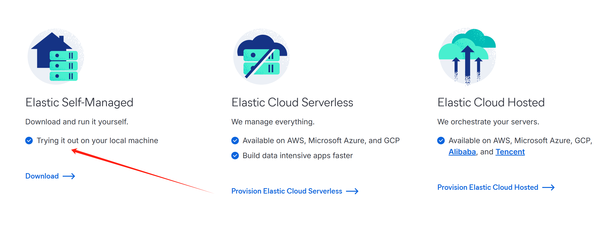

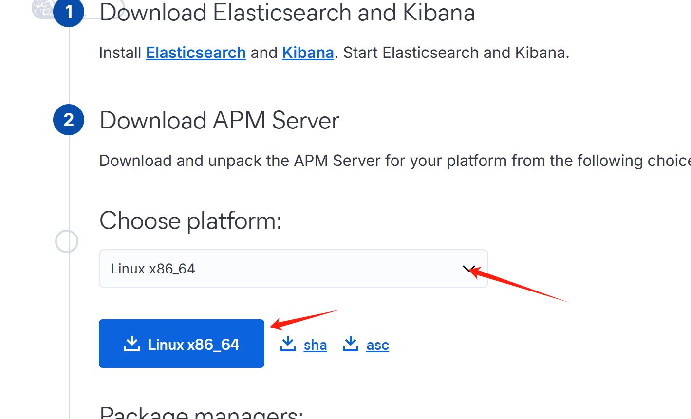


全部直接下载linux的X86版本，当前时间2025.3.16最新版本8.17.3，版本要一致。

###### 开始安装elastic

创建一个普通用户，因为Elasticsearch和Kibana需要使用普通用户执行。

```
useradd -m -s /bin/bash -p $(openssl passwd -1 "123456")  elk
```

系统配置/etc/sysctl.conf中增加一行：  

```
vm.max_map_count=262144
```

这个是设置虚拟内存数量的

应用一下：

```
sysctl -p
```

之后需要创建证书，ELasticsearch为了方便用户使用，自己带了一个工具可以方便的创建证书，解压ELasticsearch之后创建证书。

**安装Elasticsearch**

解压ELasticsearch，创建CA证书：

```
cd /opt 
tar -zxvf elasticsearch-8.17.3-linux-x86_64.tar.gz
cd elasticsearch-8.17.3
# 创建证书,输入Y
bin/elasticsearch-certutil ca --pem -s --out config/certs/ca.zip
#安装工具解压zip
yum install unzip
unzip config/certs/ca.zip -d config/certs
```

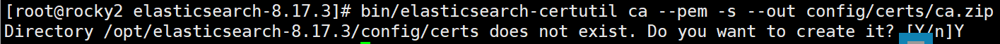

使用CA证书创建节点证书，注意更改其中的ip地址，或者使用域名访问：

```
bin/elasticsearch-certutil cert --pem -s --ca-cert config/certs/ca/ca.crt --ca-key config/certs/ca/ca.key -out config/certs/es01.zip --name es01 --ip 192.168.3.122 --dns es01.lxx.net
```

创建之后就可以用IP+端口或者域名+端口

如:192.168.3.122:9200  es01.lxx.net:9200


之后解压生成的证书

```
unzip config/certs/es01.zip -d config/certs
```

更改Elasticsearch目录的权限为普通用户的权限：

```
chown -R elk:elk /opt/elasticsearch-8.17.3
```

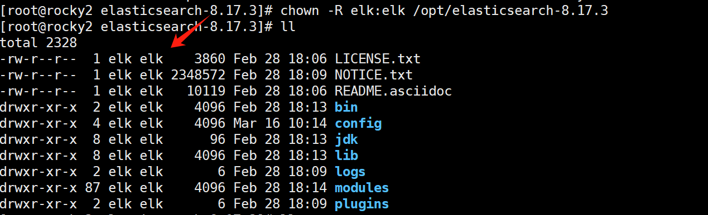

更改Elasticsearch的配置文件：

```
cat > config/elasticsearch.yml<<EOF
cluster.name: "my-cluster"

network.host: 0.0.0.0

node.name: "es01"

cluster.initial_master_nodes:
  - es01

xpack.security.enabled: true
xpack.security.enrollment.enabled: true

xpack.security.http.ssl:
  enabled: true
  key: certs/es01/es01.key
  certificate: certs/es01/es01.crt
  certificate_authorities: certs/ca/ca.crt

xpack.security.transport.ssl:
  enabled: true
  verification_mode: certificate
  key: certs/es01/es01.key
  certificate: certs/es01/es01.crt
  certificate_authorities: certs/ca/ca.crt
EOF
```

```
集群配置：cluster.name、network.host、node.name、cluster.initial_master_nodes 用于定义集群和节点的基本信息。

安全功能：xpack.security.enabled 和 xpack.security.enrollment.enabled 启用安全功能和节点注册。

SSL/TLS 配置：xpack.security.http.ssl 和 xpack.security.transport.ssl 分别配置 HTTP 层和传输层的加密，确保通信安全。
```

使用elk用户启动Elasticsearch：

```
runuser -l elk -c "/opt/elasticsearch-8.17.3/bin/elasticsearch"
```

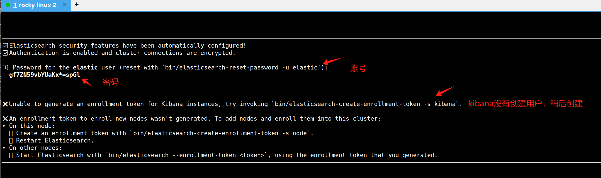

###### 账号密码

```
账号:elastic
密码:gf7ZN59vbYUaKx*=spGl

kibana
账号: kibana_system
密码: ZZ6baV=ABDv5I7pMUF6I
```

成功启动后会输出elastic用户的密码，如果不小心丢了密码，可以使用命令重置：

```
bin/elasticsearch-reset-password -u elastic
# 再重置一个kibana_system的密码
bin/elasticsearch-reset-password -u kibana_system
# New value: ZZ6baV=ABDv5I7pMUF6I
```


```
https://192.168.3.122:9200 # 注意是https
```

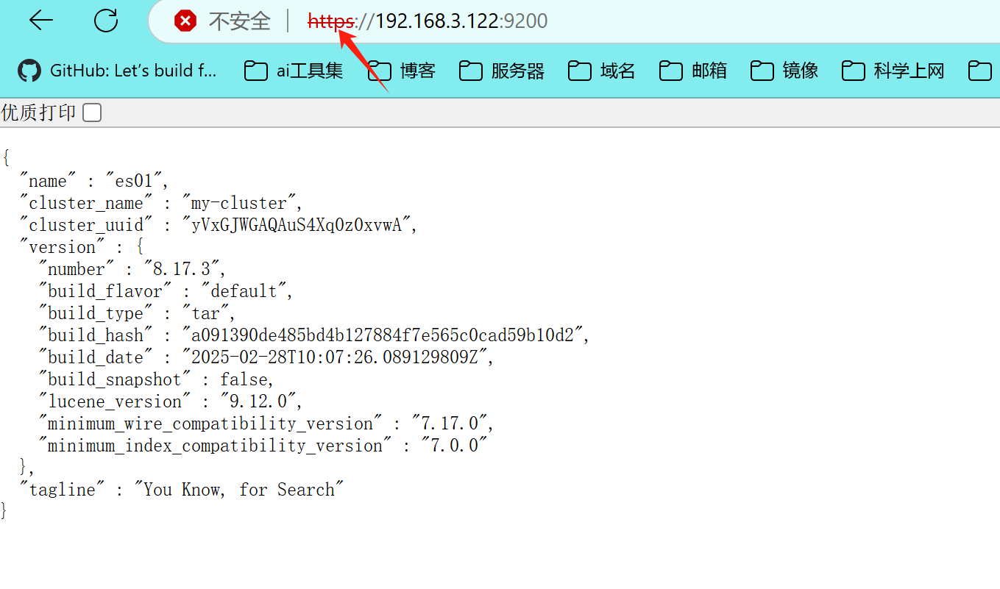

新开终端，因为程序需要占用一个终端，可以配置成system的方式或者使用screen或者其他的方式来运行。

##### 3.2 安装kibana

创建一个新的终端。解压

```
cd /opt
tar xvf kibana-8.17.3-linux-x86_64.tar.gz
chown -R elk:elk kibana-8.17.3
cd kibana-8.17.3
```

复制CA证书到Kibana

```
cp /opt/elasticsearch-8.17.3/config/certs/ca/ca.crt ./config/
```

更改配置文件

```
cat >config/kibana.yml<<EOF
server.port: 5601
server.host: 0.0.0.0

elasticsearch.hosts: ["https://192.168.3.122:9200"]
elasticsearch.username: "kibana_system"
elasticsearch.password: "ZZ6baV=ABDv5I7pMUF6I"

elasticsearch.ssl.certificateAuthorities: [ "/opt/kibana-8.17.3/config/ca.crt" ]
i18n.locale: "zh-CN"

server.publicBaseUrl: "http://192.168.3.122:5601"
EOF
```

下面是对配置的解释:

```
1. 服务器端口
server.port: 5601
作用：设置 Kibana 服务的监听端口为 5601。

2. 服务器绑定地址
server.host: 0.0.0.0
作用：设置 Kibana 监听所有网络接口，允许从任何 IP 地址访问。

3. Elasticsearch 连接地址
elasticsearch.hosts: ["https://192.168.3.122:9200"]
作用：指定 Kibana 连接的 Elasticsearch 地址为 https://192.168.3.122:9200。

4. Elasticsearch 认证
elasticsearch.username: "kibana_system"
elasticsearch.password: "ZZ6baV=ABDv5I7pMUF6I"
作用：设置 Kibana 连接 Elasticsearch 时使用的用户名和密码。

5. Elasticsearch SSL 配置
elasticsearch.ssl.certificateAuthorities: [ "/opt/kibana-8.17.3/config/ca.crt" ]
作用：指定 Elasticsearch 的 CA 证书路径，用于验证 Elasticsearch 的 SSL 证书。

6. 国际化配置
i18n.locale: "zh-CN"
作用：设置 Kibana 的界面语言为简体中文。

7. 公共基础 URL
server.publicBaseUrl: "http://192.168.3.122:5601"
作用：设置 Kibana 的公共基础 URL，用于生成外部链接。
```

启动服务

```
runuser -l elk -c "/opt/kibana-8.17.3/bin/kibana"
```

之后访问Kibana的web站点，http://192.168.3.122:5601，账号使用elastic账号和对应的密码。

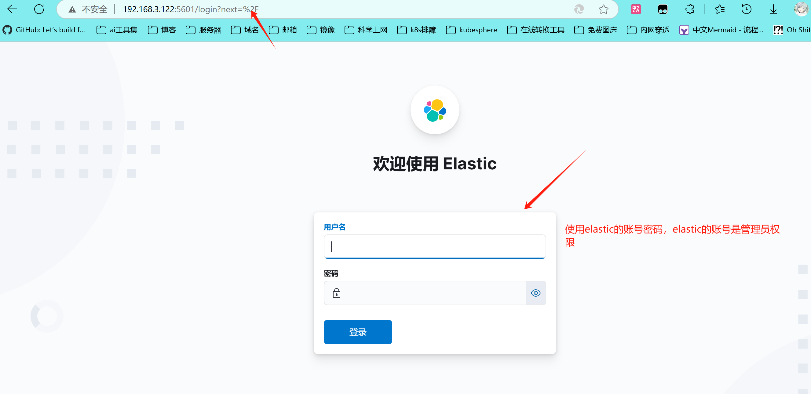


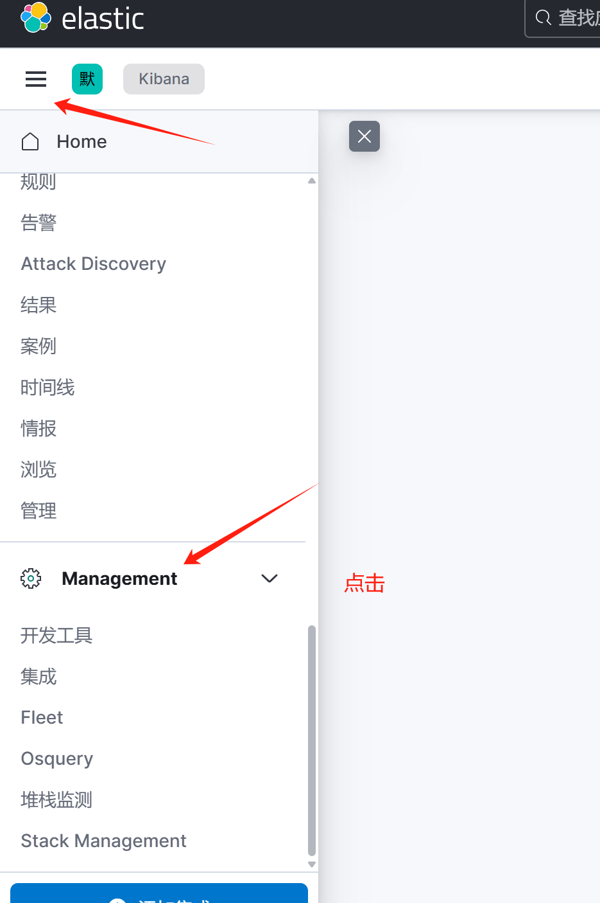

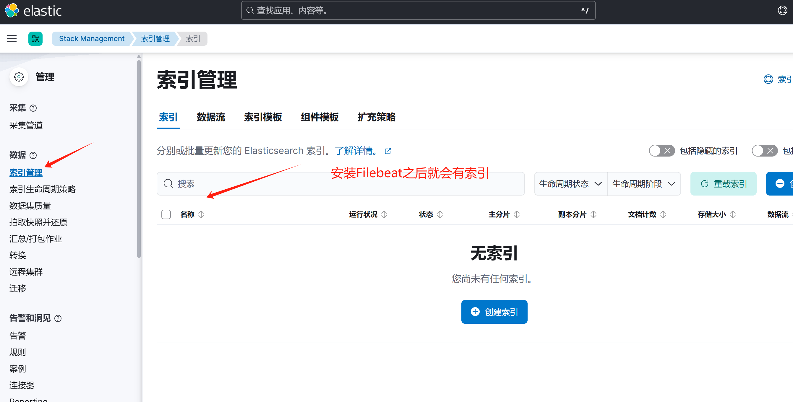


##### 3.3安装Filebeat

新建一个终端

```
cd /opt
tar xvf filebeat-8.17.3-linux-x86_64.tar.gz
cd filebeat-8.17.3-linux-x86_64
```

同样的将CA证书复制到此目录中：

```
cp /opt/elasticsearch-8.17.3/config/certs/ca/ca.crt ./
```


更改配置文件,输入:%d 回车，删除全部内容，然后配置文件

```
filebeat.inputs:
  - type: filestream
    paths:               #rocky linux 系统路径，别的系统路径可能不一样
      - /var/log/secure      # 认证日志
      - /var/log/messages    # 系统日志
      - /var/log/audit/audit.log  # 审计日志（可选）
    parsers:
      - syslog:
          format: rfc3164
          timezone: Asia/Shanghai

output.elasticsearch:
  hosts: ["https://192.168.3.122:9200"]
  username: "elastic"
  password: "gf7ZN59vbYUaKx*=spGl"
  index: "newtest-%{[agent.version]}-%{+yyyy.MM.dd}"
  ssl:
    enabled: true
    certificate_authorities: ${path.config}/ca.crt

setup.template.name: "filebeat"
setup.template.pattern: "filebeat-*"
```

配置文件解析

```
# ====== 输入配置 ======
filebeat.inputs:
  - type: filestream
    enabled: true
    paths:
      - /var/log/secure      # 用户认证日志（SSH登录、sudo操作等）
      - /var/log/messages    # 系统级日志（内核、服务启动等）
      - /var/log/audit/audit.log  # 审计日志（SELinux/安全事件，可选）
    parsers:
      - syslog:
          format: rfc3164     # 标准syslog格式
          timezone: Asia/Shanghai  # 日志时间戳时区

# ====== Elasticsearch输出配置 ======
output.elasticsearch:
  hosts: ["https://192.168.3.122:9200"]  # Elasticsearch地址
  username: "elastic"                    # 用户名
  password: "gf7ZN59vbYUaKx*=spGl"       # 密码
  index: "newtest-%{[agent.version]}-%{+yyyy.MM.dd}"  # 动态索引名（版本+日期）
  ssl:
    enabled: true                        # 启用HTTPS
    certificate_authorities: "${path.config}/ca.crt"  # CA证书路径（Filebeat目录下）

# ====== 索引模板配置 ======
setup.template:
  name: "filebeat"         # 模板名称
  pattern: "filebeat-*"    # 匹配索引模式
```


测试文件有没有问题

```
./filebeat test config -e
```

运行：

```
./filebeat -e -c ./filebeat.yml
```

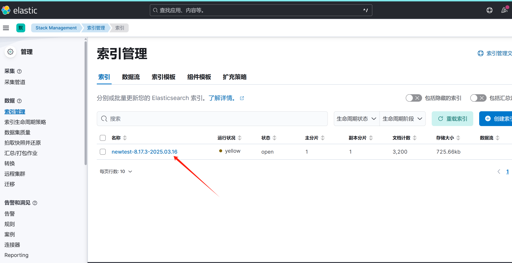

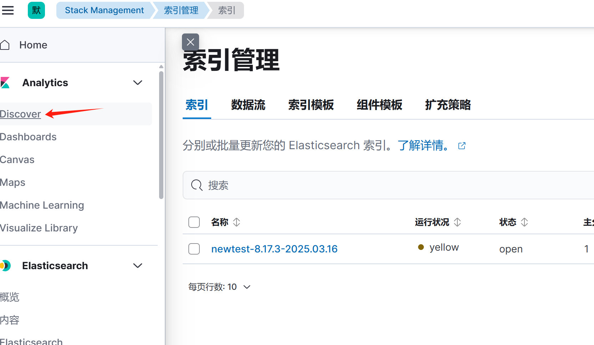

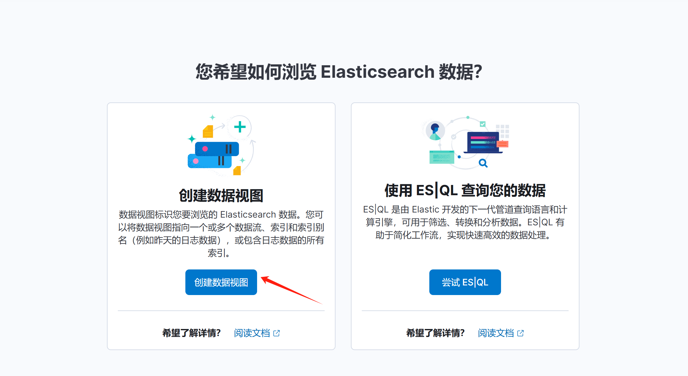

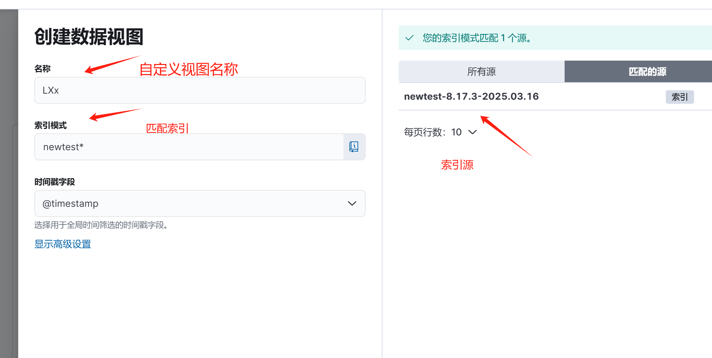

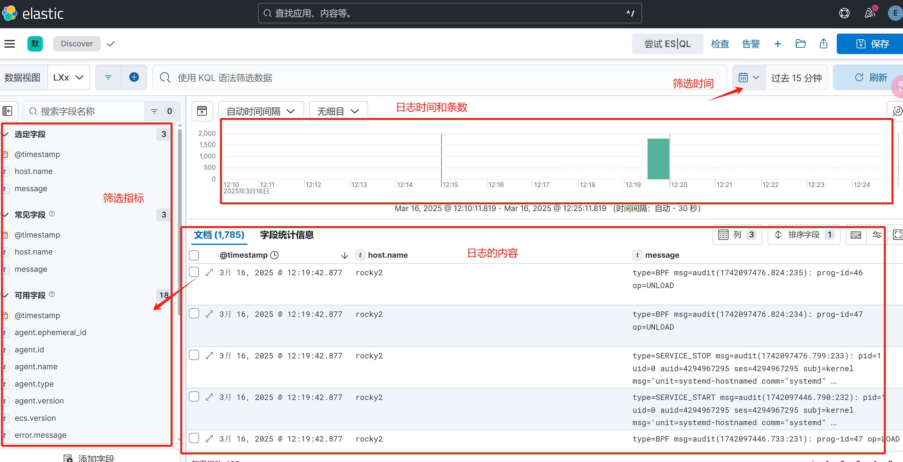

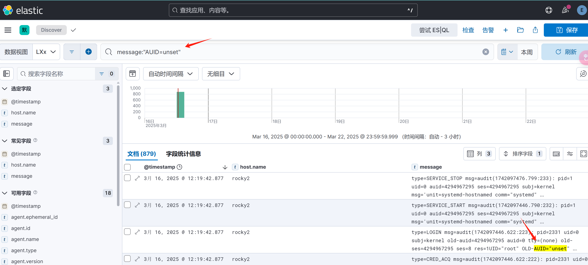