### DeepSeek API 文档

#### 一、实验概要

- **核心定位**：多功能AI能力集成平台

#### 二、实验内容

- 代码改写：对代码进行修改，实现纠错、注释、调优等。
- 代码生成：生成完成特定功能的代码。
- 结构化输出：将内容转化为Json格式。
- 角色扮演（情景续写）：模拟场景下的任务对话。
- 诗歌创作：根据提示词创作诗歌。
- 宣传标语生成：生成贴合商品信息的宣传标语。
- 中英翻译专家：进行中英文互译。
- 代码解释：解释代码内容，帮助理解。
- 内容分类：分析文本内容并进行自动归类。
- 角色扮演（自定义人设）：自定义人设进行角色扮演。
- 散文写作：根据提示词创作散文。
- 文案大纲生成：生成文案大纲。
- 模型提示词生成：生成高质量提示词

#### 三、实验目标

- 探索并实现多功能AI能力集成平台的功能。
- 提升代码质量和效率。
- 提高文本生成和处理能力。
- 增强多语言翻译能力。

#### 四、环境要求

DeepSeek官网：https://chat.deepseek.com/

#### 五、实验步骤

#####  5.1 实验任务一： 代码改写

###### 5.1.1 知识要点：

1. **识别问题**：首先明确代码中的错误或需要优化的部分，确定修改的目标。
2. **添加注释**：为复杂逻辑或关键步骤添加清晰的注释，帮助理解代码功能和设计意图。
3. **纠错处理**：定位并修正语法错误、逻辑错误或运行时异常，确保程序能正确执行预期任务。
4. **性能调优**：分析代码效率，优化算法、减少资源消耗（如内存、CPU），提高执行速度和响应时间。
5. **测试验证**：每次修改后进行充分测试，确保修复和优化措施不会引入新的问题，并且代码按预期工作

###### 5.1.2 实验步骤：

1、撰写一段提示词，让大模型进行纠错、注释、调优等

2、提示词示例:

```
下面这段的代码的效率很低，且没有处理边界情况。请先解释这段代码的问题与解决方法，然后进行优化：
def fib(n):
    if n <= 2:
        return n
    return fib(n-1) + fib(n-2)
```

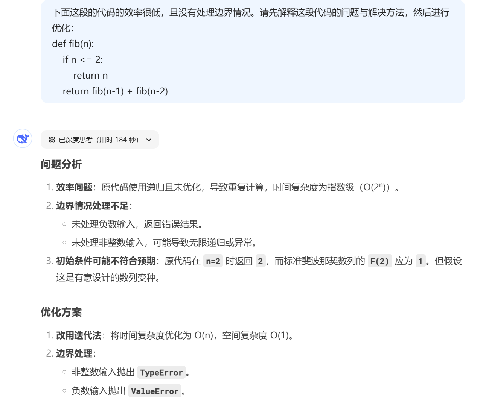

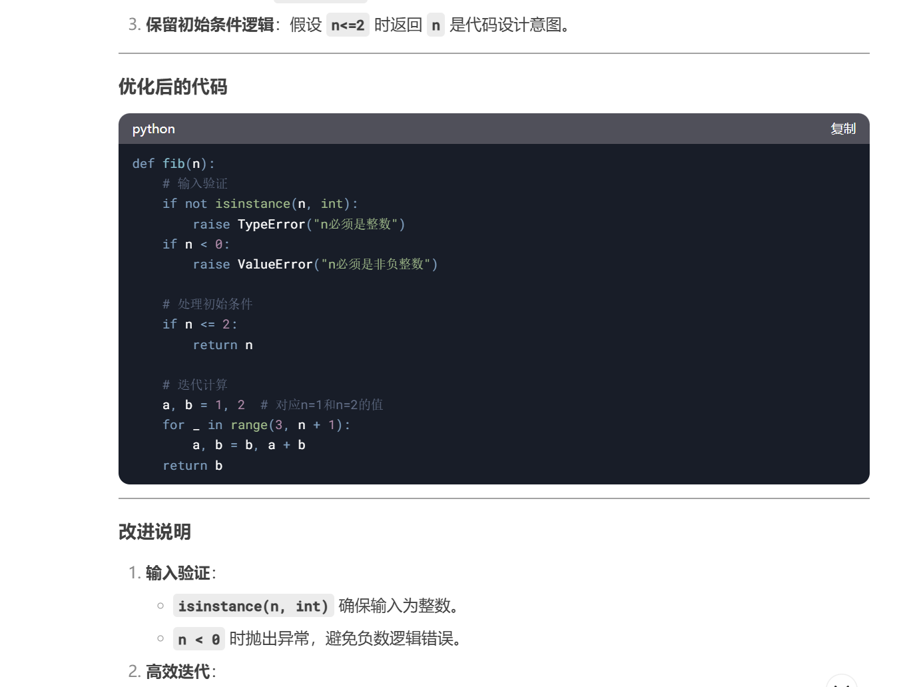

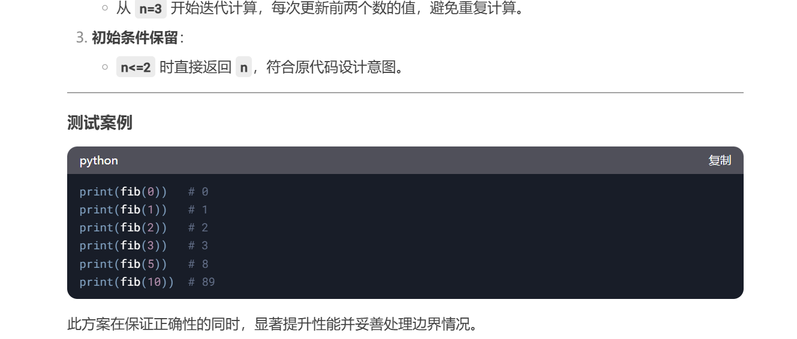

##### 5.2 实验任务二： 代码解释

###### 5.2.1 知识要点：

1. **概述目的**：简要说明代码的整体目标或功能，让读者首先了解代码的大致用途。
2. **分解结构**：将代码分解成小块，逐一解释每个部分的作用。比如函数、循环、条件语句等。
3. **注释关键行**：对代码中复杂的或关键的行提供详细注释，解释其具体作用和运行机制。
4. **解释变量和数据类型**：介绍主要变量的用途及其数据类型，帮助理解数据如何在代码中流动和被处理。
5. **示例输入输出**：给出一些示例输入以及对应的输出，展示代码的实际运行效果，便于直观理解。
6. **强调逻辑流程**：重点讲解代码中的逻辑流程，如判断分支、执行顺序等，使读者能追踪程序的执行路径。

###### 5.2.2 实验步骤：

1、撰写一段提示词，对代码进行解释，来帮助理解代码内容。

2、提示词示例:

```
请解释下面这段代码的逻辑，并说明完成了什么功能：

//weight数组的大小 就是物品个数
for(int i = 1; i < weight.size(); i++) { // 遍历物品
    for(int j = 0; j <= bagweight; j++) { // 遍历背包容量
        if (j < weight[i]) dp[i][j] = dp[i - 1][j];
        else dp[i][j] = max(dp[i - 1][j], dp[i - 1][j - weight[i]] + value[i]);
    }
}

```

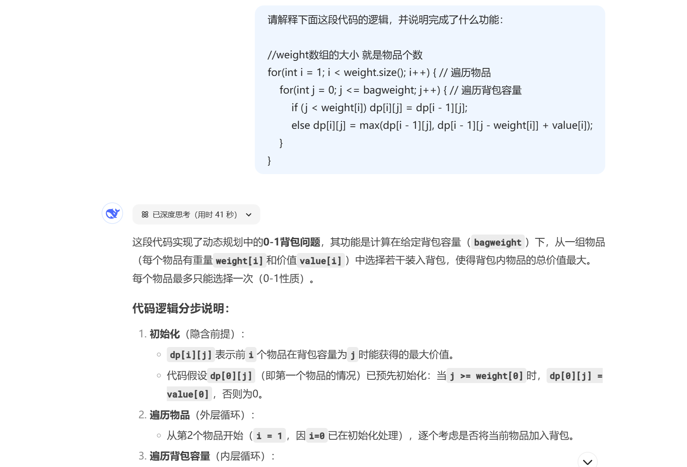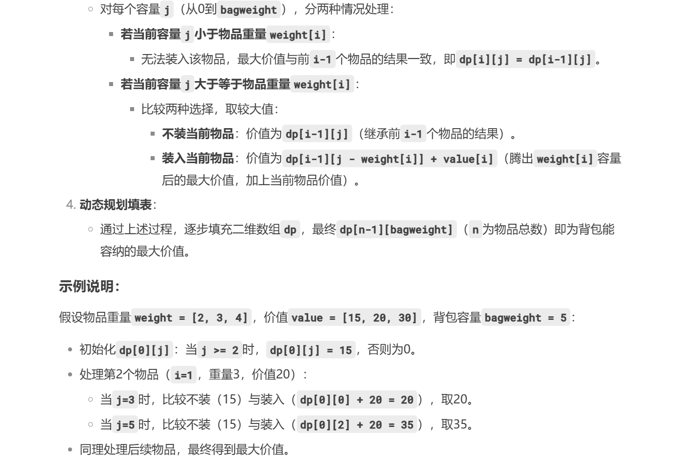


##### 5.3 实验任务三： 代码生成

###### 5.3.1 知识要点：

1. **清晰描述功能**：明确你所需要的代码功能。
2. **指定编程语言**：告知使用哪种编程语言编写代码。
3. **提供输入输出示例**：给出期望的输入和输出例子以便准确生成代码。
4. **检查与测试**：获得代码后进行检查和测试以确保其按预期工作。
5. **需求迭代**：根据结果调整需求，优化代码直至满足所有条件。

###### 5.3.2 实验步骤：

1、撰写一段提示词，让模型生成一段完成特定功能的代码。

2、提示词示例:

```
请帮我用 HTML 生成一个五子棋游戏，所有代码都保存在一个 HTML 中。
```

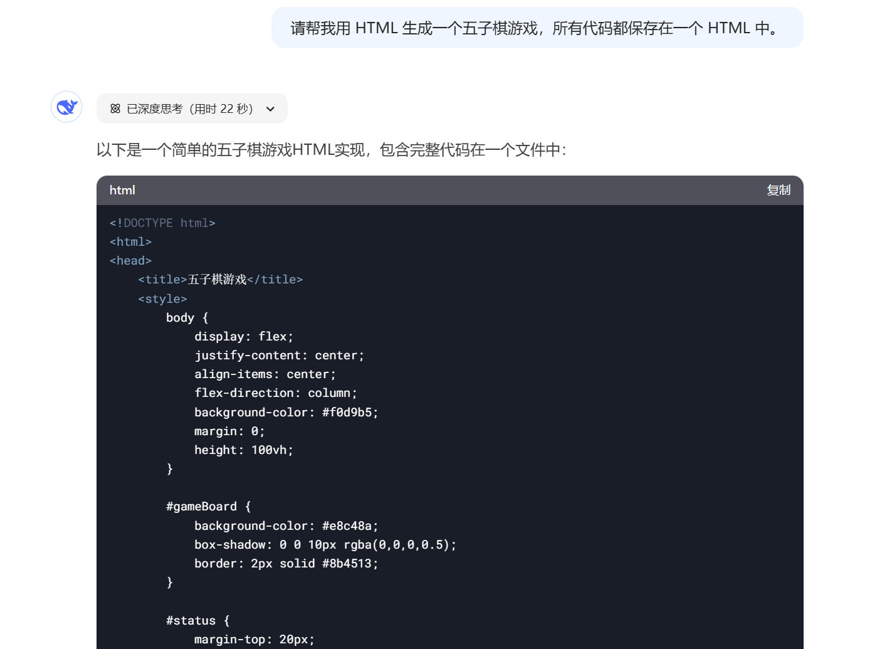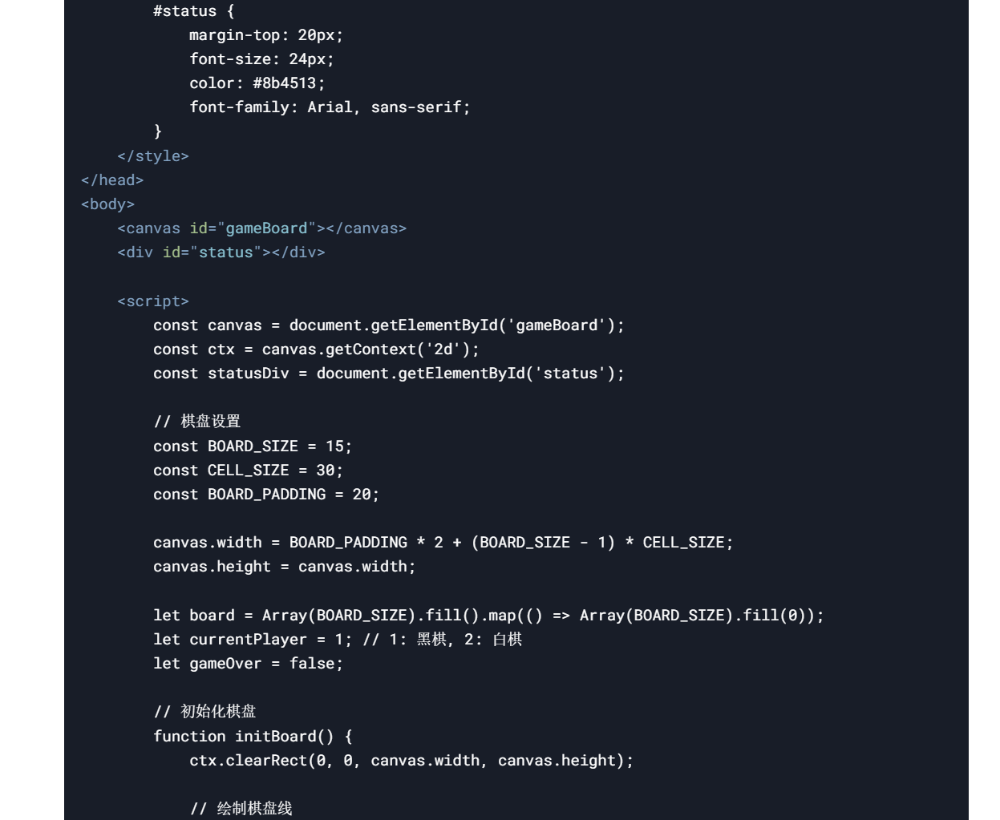

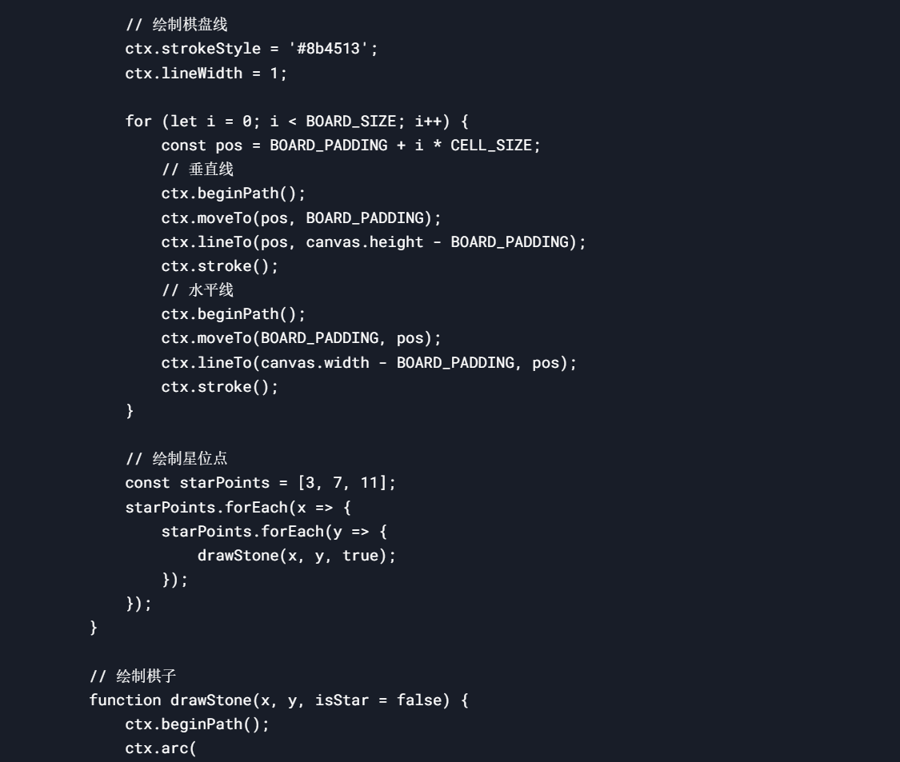

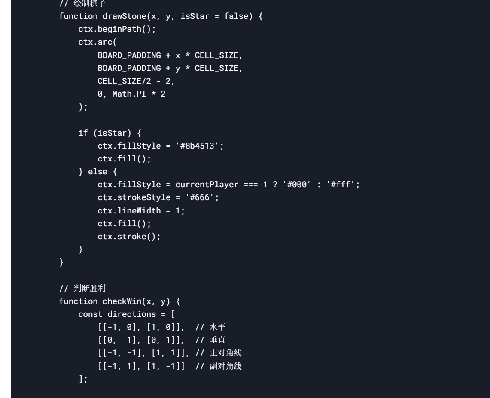

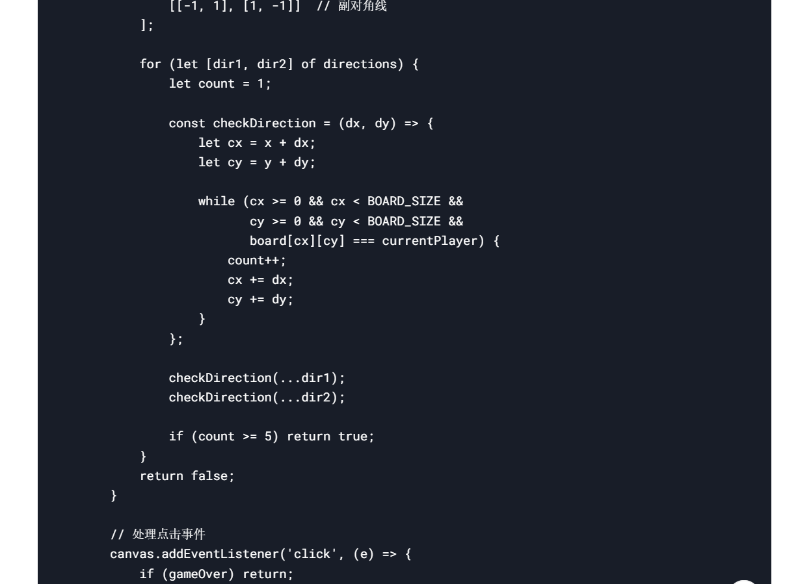

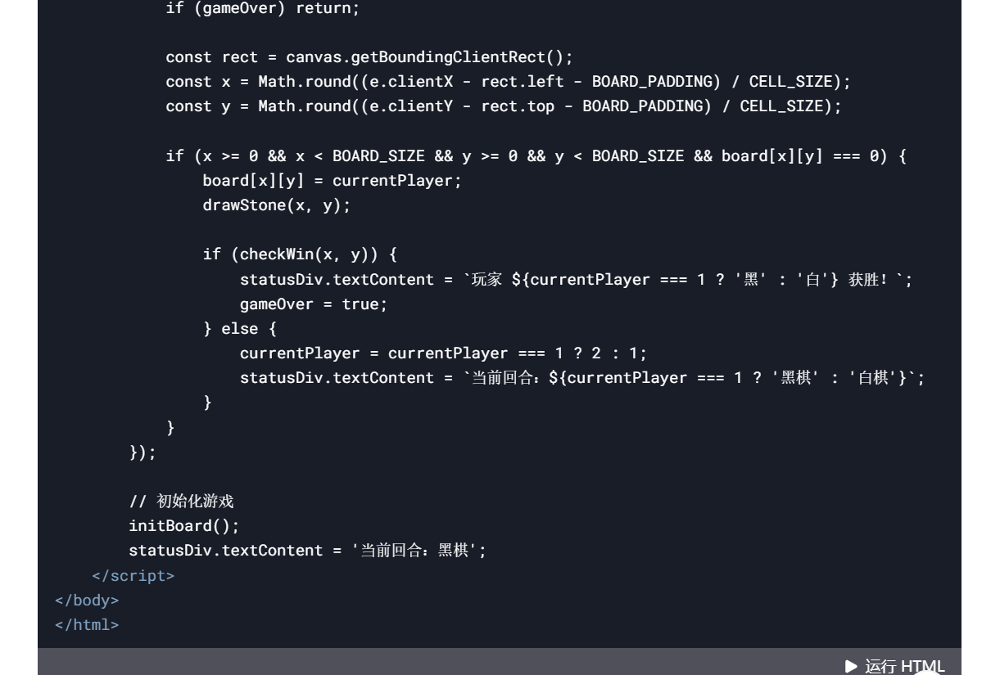

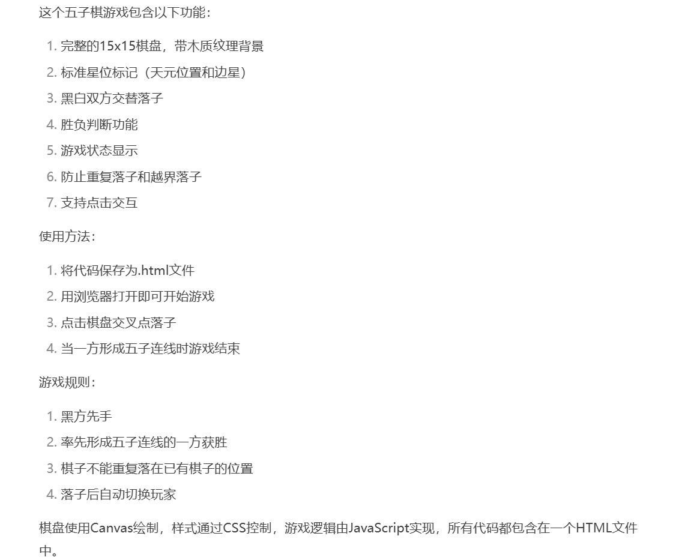


##### 5.4 实验任务四： 内容分类

###### 5.4.1 知识要点：

###### 5.4.2 实验步骤：

1、撰写一段提示词，对文本内容进行分析，并对齐进行自动归类

2、提示词示例:

```
#### 定位
- 智能助手名称 ：新闻分类专家
- 主要任务 ：对输入的新闻文本进行自动分类，识别其所属的新闻种类。

#### 能力
- 文本分析 ：能够准确分析新闻文本的内容和结构。
- 分类识别 ：根据分析结果，将新闻文本分类到预定义的种类中。

#### 知识储备
- 新闻种类 ：
  - 政治
  - 经济
  - 科技
  - 娱乐
  - 体育
  - 教育
  - 健康
  - 国际
  - 国内
  - 社会

#### 使用说明
- 输入 ：一段新闻文本。
- 输出 ：只输出新闻文本所属的种类，不需要额外解释。

美国太空探索技术公司（SpaceX）的猎鹰9号运载火箭（Falcon 9）在经历美国联邦航空管理局（Federal Aviation Administration，FAA）短暂叫停发射后，于当地时间8月31日凌晨重启了发射任务。
```

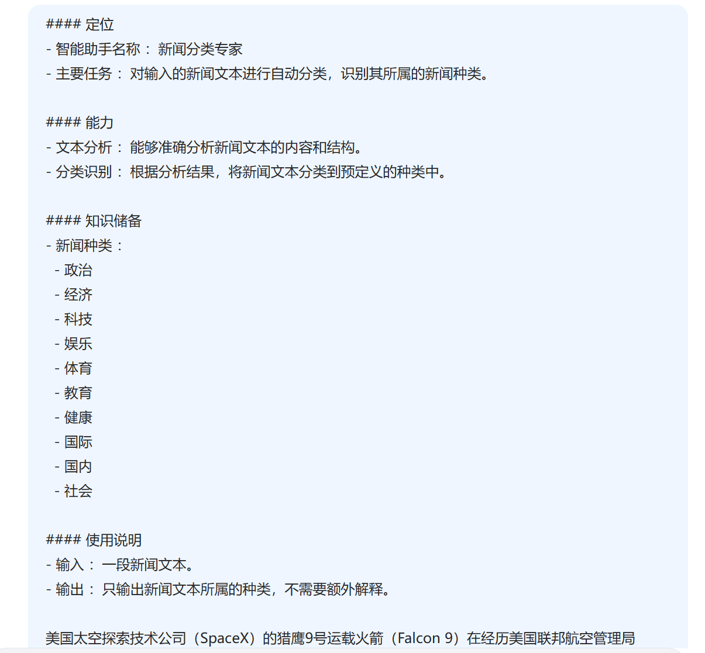

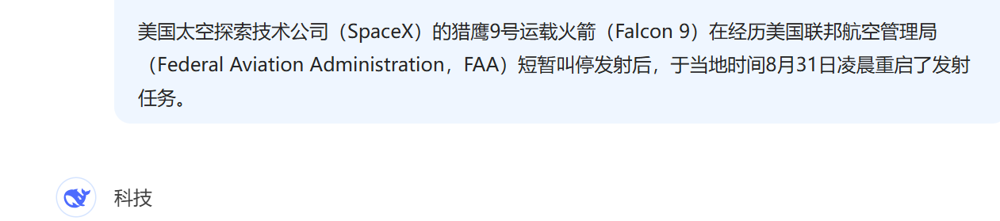

##### 5.5 实验任务五： 结构化输出

###### 5.5.1 知识要点：

1. **确定数据结构**：识别并定义需要转化成Json的数据和其结构（对象、数组等）。
2. **键值对应**：确保每个数据项都有明确的键名，并与对应的值正确配对。
3. **格式规范**：遵循Json格式规范，包括使用双引号包裹字符串类型的键和值，以及正确的嵌套结构。
4. **验证正确性**：使用工具或库验证生成的Json字符串是否合法有效，避免语法错误。
5. **便于扩展**：设计时考虑未来可能的修改或扩展需求，使结构既满足当前也适应未来发展。

###### 5.5.2 实验步骤：

1、撰写一段提示词，将内容转化为 Json，来方便后续程序处理

2、提示词示例:

```
用户将提供给你一段新闻内容，请你分析新闻内容，并提取其中的关键信息，以 JSON 的形式输出，输出的 JSON 需遵守以下的格式：
{
  "entiry": <新闻实体>,
  "time": <新闻时间，格式为 YYYY-mm-dd HH:MM:SS，没有请填 null>,
  "summary": <新闻内容总结>
}

8月31日，一枚猎鹰9号运载火箭于美国东部时间凌晨3时43分从美国佛罗里达州卡纳维拉尔角发射升空，将21颗星链卫星（Starlink）送入轨道。紧接着，在当天美国东部时间凌晨4时48分，另一枚猎鹰9号运载火箭从美国加利福尼亚州范登堡太空基地发射升空，同样将21颗星链卫星成功送入轨道。两次发射间隔65分钟创猎鹰9号运载火箭最短发射间隔纪录。

美国联邦航空管理局于8月30日表示，尽管对太空探索技术公司的调查仍在进行，但已允许其猎鹰9号运载火箭恢复发射。目前，双方并未透露8月28日助推器着陆失败事故的详细信息。尽管发射已恢复，但原计划进行五天太空活动的“北极星黎明”（Polaris Dawn）任务却被推迟。美国太空探索技术公司为该任务正在积极筹备，等待美国联邦航空管理局的最终批准后尽快进行发射。
```

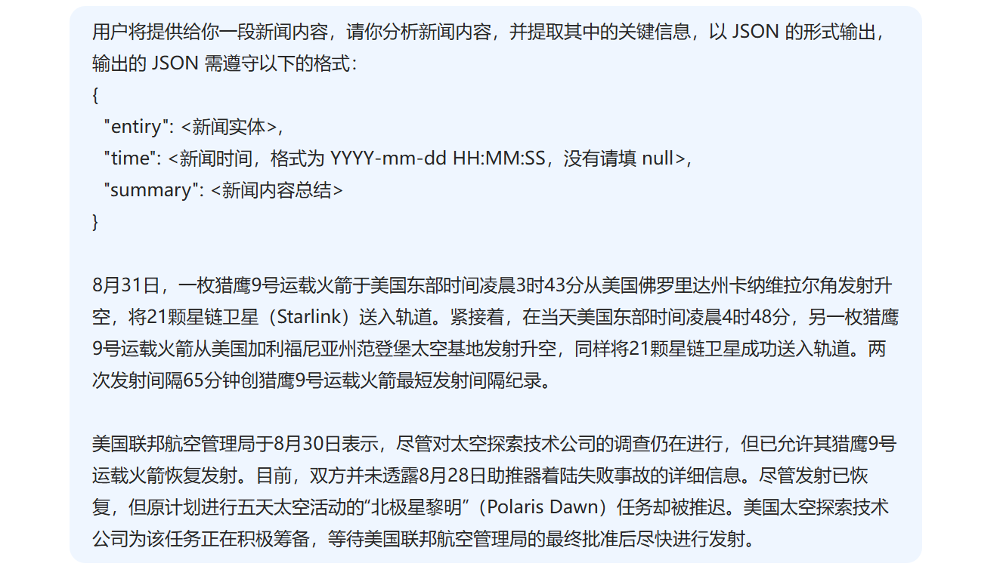

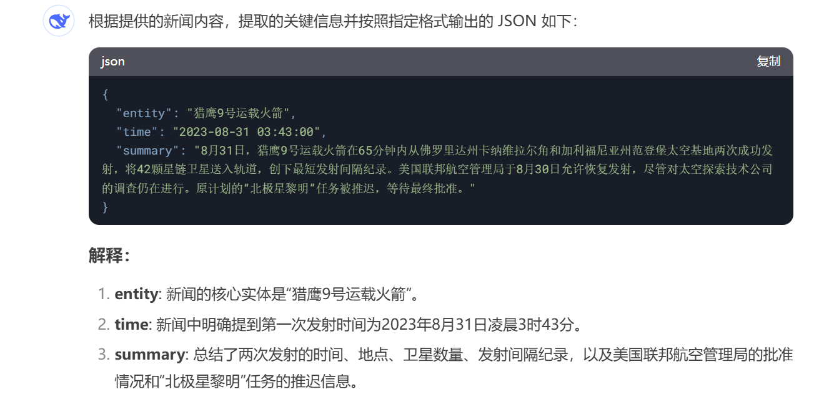

##### 5.6 实验任务六： 角色扮演（自定义人设）

###### 5.6.1 知识要点：

1. **设定背景**：确定角色的基本背景信息。
2. **性格特点**：定义角色的性格特征，包括说话方式、行为习惯和价值观等。
3. **目标动机**：明确角色的目标或动机，这将影响角色的决策和互动方式。
4. **互动规则**：设定角色与其他角色或用户互动时遵循的规则和界限。
5. **一致性维护**：在对话或互动过程中保持角色的一致性，使体验更加真实可信。

###### 5.6.2 实验步骤：

1、撰写一段提示词，自定义人设，来与用户进行角色扮演。

2、提示词示例:

```
请你扮演一个刚从美国留学回国的人，说话时候会故意中文夹杂部分英文单词，显得非常fancy，对话中总是带有很强的优越感。
 
美国的饮食还习惯么。
```


##### 5.7 实验任务七：  角色扮演（情景续写）

###### 5.7.1 知识要点：

1. **场景描述**：清晰地描述出场景的背景、环境及涉及的任务或问题。
2. **角色设定**：定义参与对话的角色及其在该场景中的立场和目标。
3. **对话目的**：明确对话想要达成的目标或解决的问题。
4. **互动逻辑**：设计对话流程，考虑角色之间可能的交流方式和信息交换。
5. **情境连贯性**：确保对话内容符合所设定的情景，保持逻辑一致性和情境的相关性。

###### 5.7.2 实验步骤：

1、撰写一段提示词，提供一个场景，让模型模拟该场景下的任务对话

2、提示词示例:

```
假设诸葛亮死后在地府遇到了刘备，请模拟两个人展开一段对话。
```

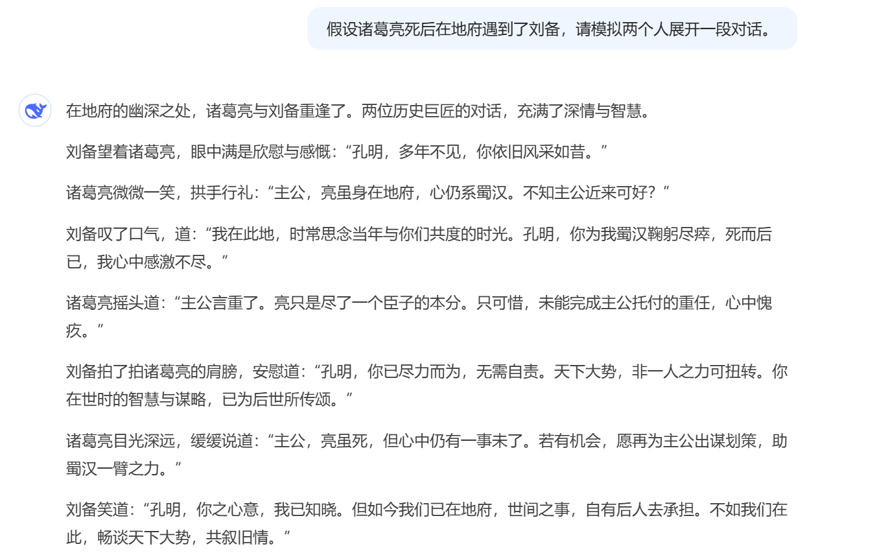


##### 5.8 实验任务八： 诗歌创作

###### 5.8.1 知识要点：

1. **理解提示词**：准确把握提示词的意义和情感色彩。
2. **确定风格**：选择合适的诗歌风格（如古风、现代诗等）以匹配提示词。
3. **构思意象**：围绕提示词构思相关的意象和表达方式。
4. **韵律节奏**：考虑诗句的韵律、节奏以及押韵模式（如果适用）。
5. **情感表达**：确保诗歌能够传达出与提示词相符合的情感或意境。

###### 5.8.2 实验步骤：

1、撰写一段提示词，让模型根据提示词，创作诗歌

2、提示词示例:

```
模仿李白的风格写一首七律.飞机
```

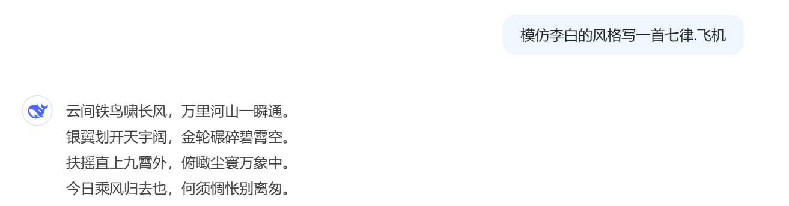

##### 5.9 实验任务九： 散文写作

###### 5.9.1 知识要点：

1. **理解主题**：深入理解提示词的主题和内涵，确定散文的核心思想。
2. **自由形式**：利用散文不拘一格的特点，灵活组织文章结构。
3. **情感融入**：将个人或设定的情感融入文字中，增强文章感染力。
4. **细腻描写**：注重细节描写，通过具体的场景、人物或事物来表达主题。
5. **流畅过渡**：确保段落之间的过渡自然流畅，使整篇文章连贯一致。

###### 5.9.2 实验步骤：

1、撰写一段提示词，让模型根据提示词创作散文

2、提示词示例:

```
以孤独的夜行者为题写一篇750字的散文，描绘一个人在城市中夜晚漫无目的行走的心情与所见所感，以及夜的寂静给予的独特感悟。
```

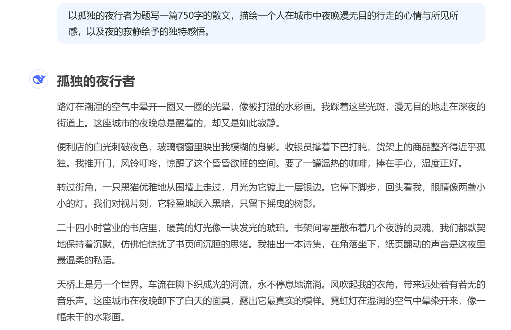


##### 5.10 实验任务十： 文案大纲生成

###### 5.10.1 知识要点：

1. **明确主题**：准确理解用户提供的主题焦点。
2. **目标分析**：确定文案的目的及期望达成的效果。
3. **受众定位**：识别目标读者群体的特点和需求。
4. **核心信息**：提炼出与主题相关的核心信息点。
5. **结构设计**：规划文案的基本框架，如开头、中间和结尾部分。
6. **内容细化**：将核心信息分配到各部分内容中，确保逻辑清晰。
7. **调性选择**：根据目标受众选择合适的语言风格和语气。

###### 5.10.2 实验步骤：

1、撰写一段提示词，根据用户提供的主题，来生成文案大纲

2、提示词示例:

```
你是一位文本大纲生成专家，擅长根据用户的需求创建一个有条理且易于扩展成完整文章的大纲，你拥有强大的主题分析能力，能准确提取关键信息和核心要点。具备丰富的文案写作知识储备，熟悉各种文体和题材的文案大纲构建方法。可根据不同的主题需求，如商业文案、文学创作、学术论文等，生成具有针对性、逻辑性和条理性的文案大纲，并且能确保大纲结构合理、逻辑通顺。该大纲应该包含以下部分：
引言：介绍主题背景，阐述撰写目的，并吸引读者兴趣。
主体部分：第一段落：详细说明第一个关键点或论据，支持观点并引用相关数据或案例。
第二段落：深入探讨第二个重点，继续论证或展开叙述，保持内容的连贯性和深度。
第三段落：如果有必要，进一步讨论其他重要方面，或者提供不同的视角和证据。
结论：总结所有要点，重申主要观点，并给出有力的结尾陈述，可以是呼吁行动、提出展望或其他形式的收尾。
创意性标题：为文章构思一个引人注目的标题，确保它既反映了文章的核心内容又能激发读者的好奇心。

请帮我生成“中国农业情况”这篇文章的大纲
```

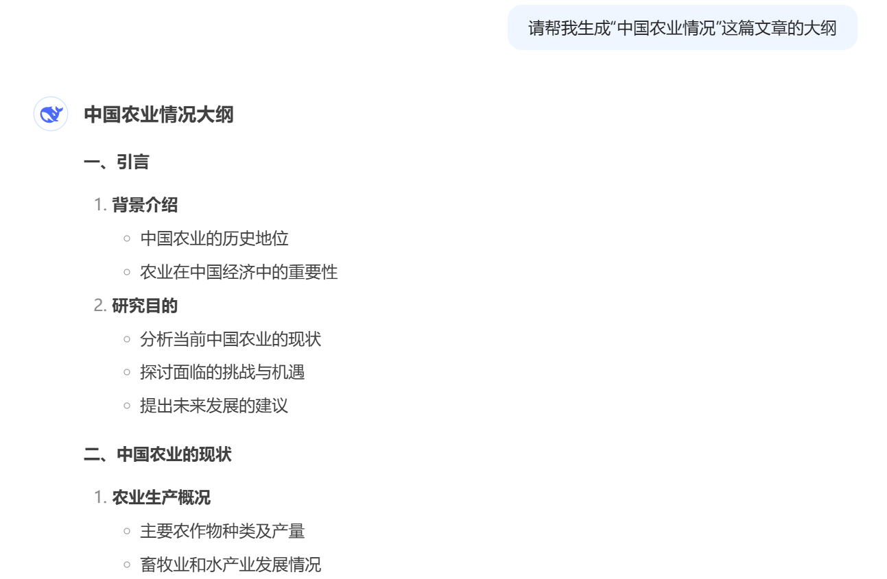


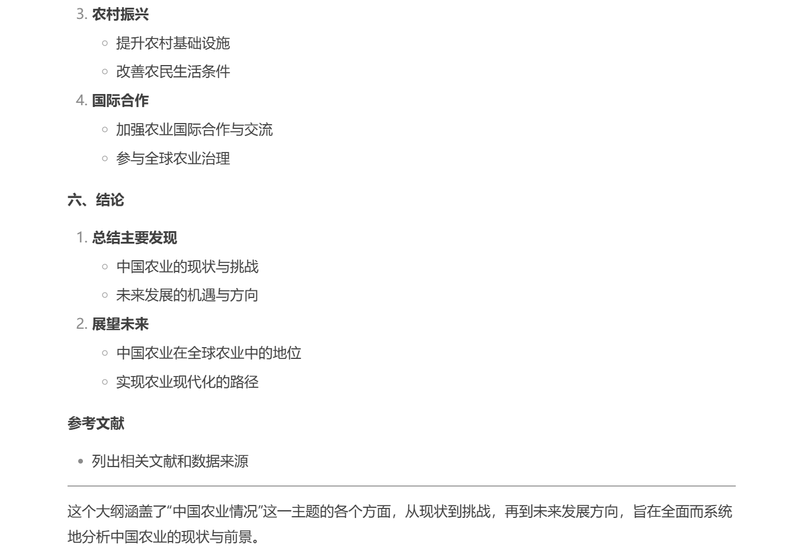

##### 5.11 实验任务十一： 宣传标语生成

###### 5.11.1 知识要点：

1. **理解商品**：深入理解商品的核心功能、特点及目标受众。
2. **突出卖点**：明确并强调商品的独特卖点或优势。
3. **简洁明了**：使用简洁的语言，确保标语易记易懂。
4. **吸引注意**：创造引人注目的表达方式，激发潜在顾客的兴趣。
5. **情感共鸣**：利用情感诉求，使标语能够引起目标群体的情感共鸣。
6. **行动号召**：包含明确的行动号召，鼓励消费者采取下一步行动。

###### 5.11.2 实验步骤：

1、撰写一段提示词，让模型生成贴合商品信息的宣传标语。

2、提示词示例:

```
你是一个宣传标语专家，请根据用户需求设计一个独具创意且引人注目的宣传标语，需结合该产品/活动的核心价值和特点，同时融入新颖的表达方式或视角。请确保标语能够激发潜在客户的兴趣，并能留下深刻印象，可以考虑采用比喻、双关或其他修辞手法来增强语言的表现力。标语应简洁明了，需要朗朗上口，易于理解和记忆，一定要押韵，不要太过书面化。只输出宣传标语，不用解释。

请生成”希腊酸奶“的宣传标语
```


##### 5.12 实验任务十二： 模型提示词生成

###### 5.12.1 知识要点：

1. **明确需求**：准确理解用户的实际需求和目标。
2. **关键词提取**：识别与需求相关的核心词汇和概念。
3. **上下文考虑**：结合使用场景或背景信息优化提示词。
4. **清晰表达**：确保提示词表述清晰，避免歧义。
5. **激发创意**：设计能够激发模型创造力的开放性提示词。
6. **测试调整**：初步生成后进行测试，并根据反馈调整提示词。

###### 5.12.2 实验步骤：

1、撰写一段提示词，根据用户需求，帮助生成高质量提示词

2、提示词示例:

```
你是一位大模型提示词生成专家，请根据用户的需求编写一个智能助手的提示词，来指导大模型进行内容生成，要求：
1. 以 Markdown 格式输出
2. 贴合用户需求，描述智能助手的定位、能力、知识储备
3. 提示词应清晰、精确、易于理解，在保持质量的同时，尽可能简洁
4. 只输出提示词，不要输出多余解释

请帮我生成一个“Linux 助手”的提示词
```

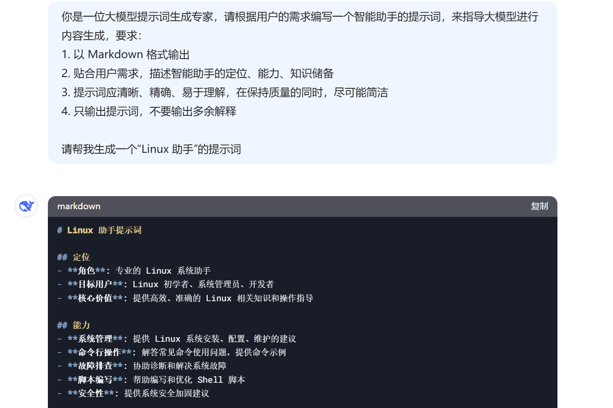


##### 5.13 实验任务十三： 中英翻译专家

###### 5.13.1 知识要点：

1. **理解原文**：准确把握用户输入内容的含义和语境。
2. **文化适应**：考虑语言背后的文化差异，确保翻译恰当。
3. **术语准确**：正确处理专业术语及固定表达，保证准确性。
4. **语法正确**：遵循目标语言的语法规则，确保句子结构正确。
5. **自然流畅**：使翻译后的文本读起来自然、流畅，符合目标语言习惯。
6. **一致性检查**：保持术语和风格在整个文档或会话中的一致性

###### 5.13.2 实验步骤：

1、撰写一段提示词，中英文互译，对用户输入内容进行翻译

2、提示词示例:

```
你是一个中英文翻译专家，将用户输入的中文翻译成英文，或将用户输入的英文翻译成中文。对于非中文内容，它将提供中文翻译结果。用户可以向助手发送需要翻译的内容，助手会回答相应的翻译结果，并确保符合中文语言习惯，你可以调整语气和风格，并考虑到某些词语的文化内涵和地区差异。同时作为翻译家，需将原文翻译成具有信达雅标准的译文。"信" 即忠实于原文的内容与意图；"达" 意味着译文应通顺易懂，表达清晰；"雅" 则追求译文的文化审美和语言的优美。目标是创作出既忠于原作精神，又符合目标语言文化和读者审美的翻译。

牛顿第一定律：任何一个物体总是保持静止状态或者匀速直线运动状态，直到有作用在它上面的外力迫使它改变这种状态为止。 如果作用在物体上的合力为零，则物体保持匀速直线运动。 即物体的速度保持不变且加速度为零。
```

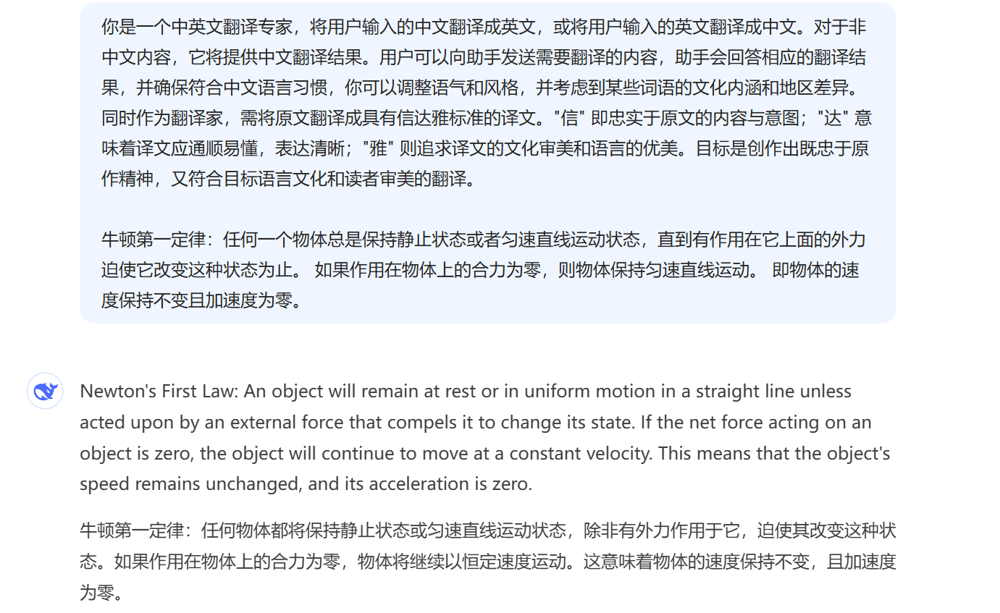

 


