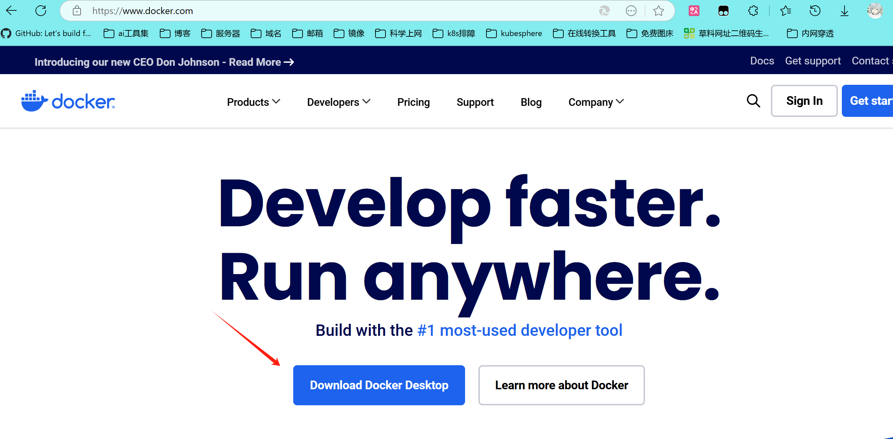
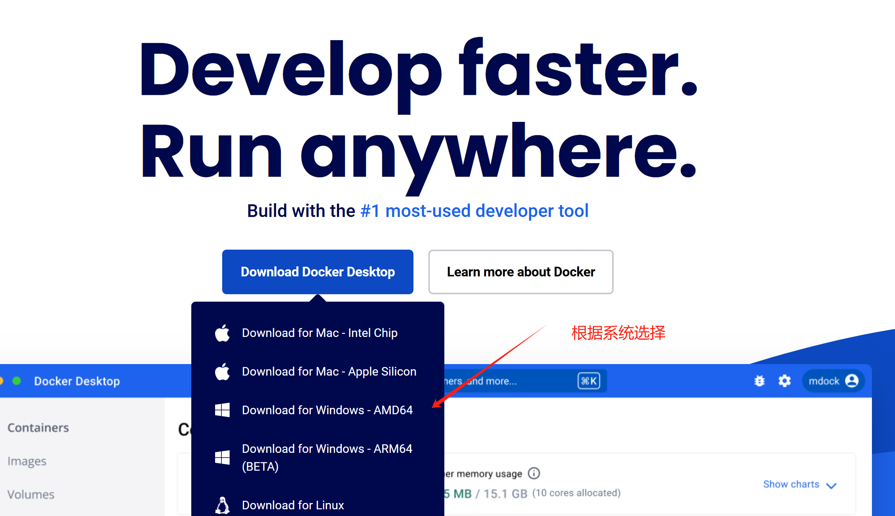
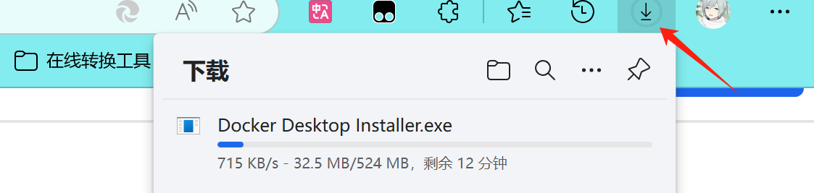
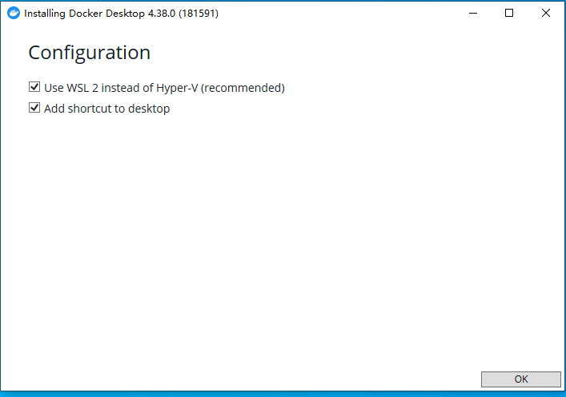
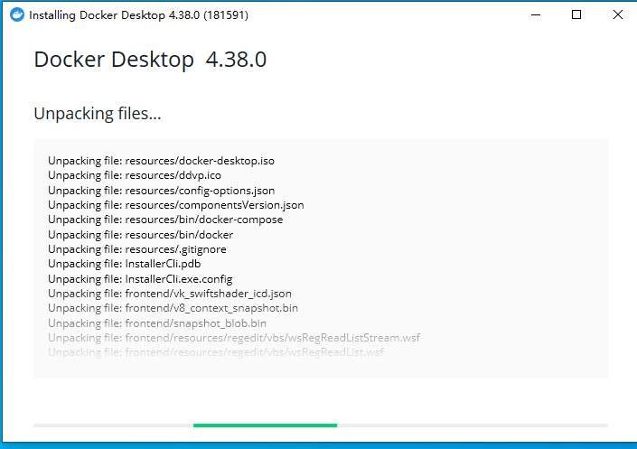
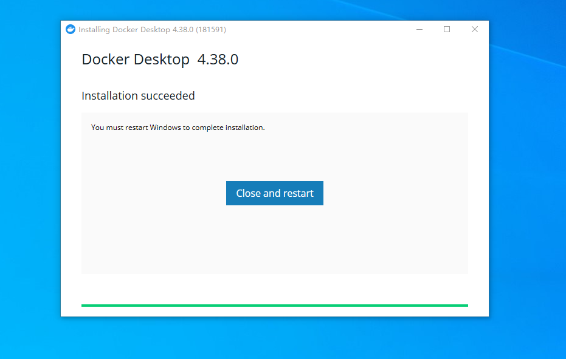

# docker + dify 安装

## 实验概述

本实验通过本地环境完成 docker + dify的部署任务，涵盖从环境搭建、模型加载、配置到本地服务启动的完整流程。通过该实验，学生将掌握如何在本地环境中部署 docker + dify，并了解部署过程中的关键步骤和注意事项。

## 实验目的

了解 docker + dify的基本功能和在本地环境中的部署流程

## 实验环境

1. 操作系统： Windows 10
2. 编程语言：Python 3.8 或以上版本

## 实验步骤

### 任务 1 部署安装docker

1.进入docker官网安装docker

官网：[Docker: Accelerated Container Application Development](https://www.docker.com/)

注：如果需要打开网站，要按住 Ctrl 再点击网站














### 任务 2 安装ollama

1. 安装ollama

   从https://ollama.com/中下载ollama并安装

   

   

2. 安装完成后，打开cmd验证是否安装成功

   ```bash
   ollama
   ```

   

3. 有两种方式运行大模型

   一、最简单的方式，使用命令

   ```bash
   ollama run deepseek-r1:1.5b
   ```

   等待他下载即可运行

   

   但是网络这种方式可能存在网络卡顿等问题，于是可以采用第二种

   二、自行下载模型并导入

   使用魔搭社区里面提供的模型（https://modelscope.cn/models/unsloth/DeepSeek-R1-Distill-Qwen-1.5B-GGUF/files），选择q4km

   

   编辑一个Modelfile文件，可以先用txt编辑，此处可以有更多配置，有兴趣可以自行搜索查看

   ```markdown
   # 这里填入gguf文件路径
   FROM C:\Users\Download\DeepSeek-R1-Distill-Qwen-1.5B-Q4_K_M.gguf
   ```

   在命令行输入以下命令导入（替换为自己的modefile路径）

   ```bash
   ollama create DeepSeek-R1-Distill-Qwen-1.5B-Q4_K_M -f C:\Users\Desktop\Modelfile
   
   ```

   

   使用命令查看是否导入

   ```bash
   ollama list
   ```

   

   运行

   ```bash
   ollama run DeepSeek-R1-Distill-Qwen-1.5B-Q4_K_M:latest
   ```

   

4. 直接命令行询问（模型能力较弱，回答可能有问题）

   

   遇到卡顿可以在任务管理器结束任务，并重新运行

   

5. 测试ollama服务是否在运行

   访问（[127.0.0.1:11434](http://127.0.0.1:11434/)），如果需要跨设备访问，参考此处配置（https://www.jianshu.com/p/2fe9772f897d）

   

### 任务 3 安装dify

dify一键安装脚本

```
https://pan.baidu.com/s/19SabNmL8gY7E4V4Q6uhKVw?pwd=mvri
```

下载完成后进行解压


```
需要时间等待
```


```
安装好了之后会自动打开页面
```

