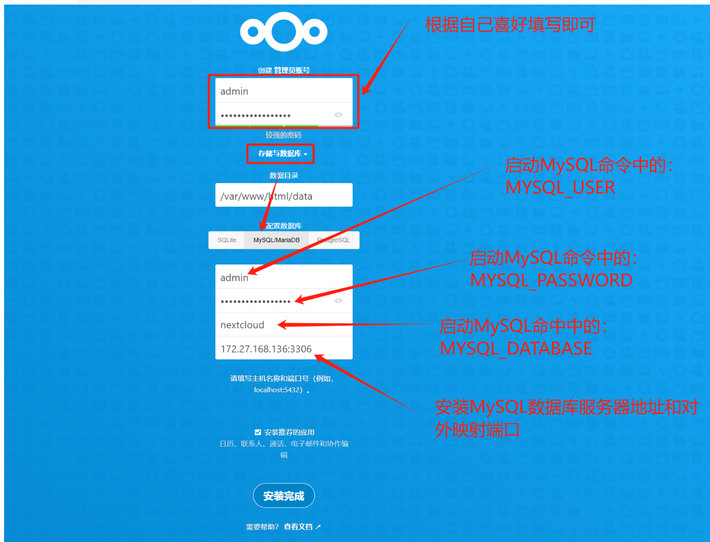
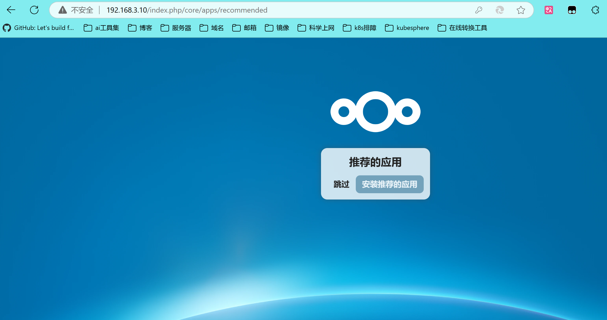
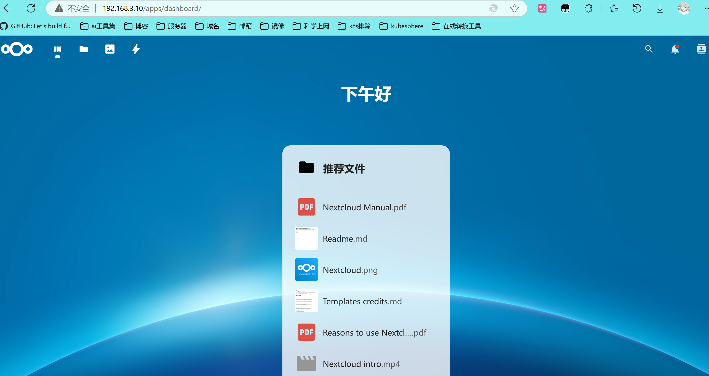

# Docker搭建基于Nextcloud的个人云盘/私有云盘/个人相册/家庭NAS

#### 拉取nextcloud镜像和mysql镜像

```
docker pull mysql
docker pull nextcloud
```

#### 创建docker网络，允许容器之间进行安全的通信

```
docker network create Nextcloud-group
```

#### 创建本地挂载数据存储目录并且启动容器

```
mkdir -p /date/mysql/
mkdir -p /data/html/
```

#### 启动mysql

```
docker run -d --name mysql  \
-v /date/mysql:/var/lib/mysql \
-e MYSQL_USER=admin \
-e MYSQL_PASSWORD=Password \
-e MYSQL_DATABASE=nextcloud \
-e MYSQL_ROOT_PASSWORD=Password \
-p 3306:3306 \
--network Nextcloud-group \
--memory=750m \
--cpus=0.8 \
mysql
```

#### 启动nextcloud

```
docker run -d --name nextcloud \
-v /data/html:/var/www/html \
-p 80:80 \
--network Nextcloud-group \
--memory=600m \
--cpus=0.8 \
nextcloud
```

#### 配置nextcloud

> 浏览器打开 服务器IP:80



> 等待安装后可以选择跳过



> 到此算已经安装完成



