### Prometheus监控快速搭建，马上就要

#### 一、实验目的

马上就要搭建一套Prometheus监控，来监控本地Linux服务器。

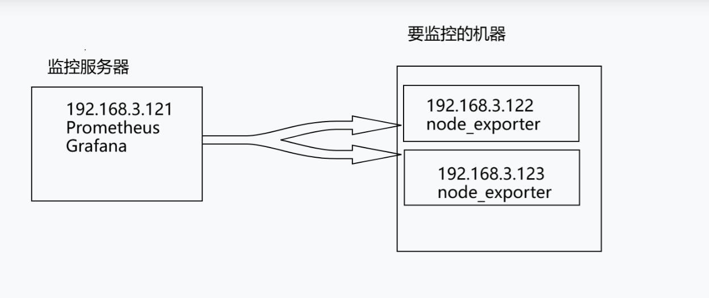

#### 二、实验环境

这里使用了3台机器进行测试：

| IP            | 作用       | 搭建服务      | 使用端口 | 系统         |
| ------------- | ---------- | ------------- | -------- | ------------ |
| 192.168.3.121 | 监控服务端 | Prometheus    | 9090     | rocky linux9 |
|               | 仪表盘     | Grafana       | 3000     | rocky linux9 |
| 192.168.3.122 | 监控客户端 | node_exporter | 9100     | rocky linux9 |
| 192.168.3.123 | 监控客户端 | node_exporter | 9100     | rocky linux9 |

#### 三、实验实操

```
setenforce 0
systemctl stop firewalld
```


##### 3.1 被监控服务器部署

在要监控的机器上部署node_exporter

###### 在所有要监控的机器上部署此服务

```
wget https://github.com/prometheus/node_exporter/releases/download/v1.8.1/node_exporter-1.8.1.linux-amd64.tar.gz

tar xvf node_exporter-1.8.1.linux-amd64.tar.gz

mv node_exporter-1.8.1.linux-amd64/node_exporter /usr/bin
```

```
https://github.com/prometheus/node_exporter/releases/
```

网络有问题也可以直接下载然后上传到虚拟机

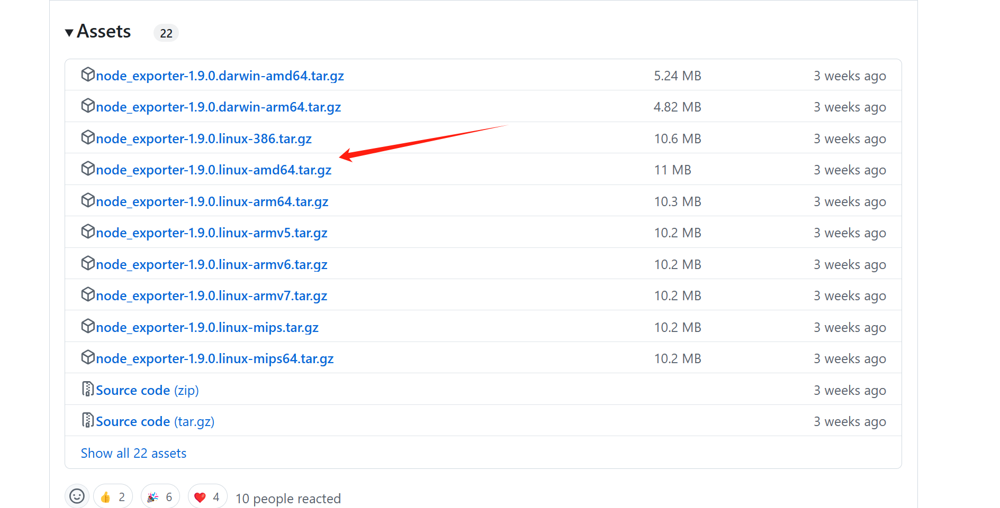

###### 将node_exporter配置成服务，方便管理,被监控的两台机器操作

```
cat >/etc/systemd/system/node_exporter.service <<EOF
[Unit]
Description=node_exporter
After=network.target  

[Service]
ExecStart=/usr/bin/node_exporter --web.listen-address=:9100
Restart=on-failure

[Install]
WantedBy=multi-user.target
EOF
```

```
systemctl daemon-reload
systemctl enable --now node_exporter
systemctl status node_exporter
```

启动服务

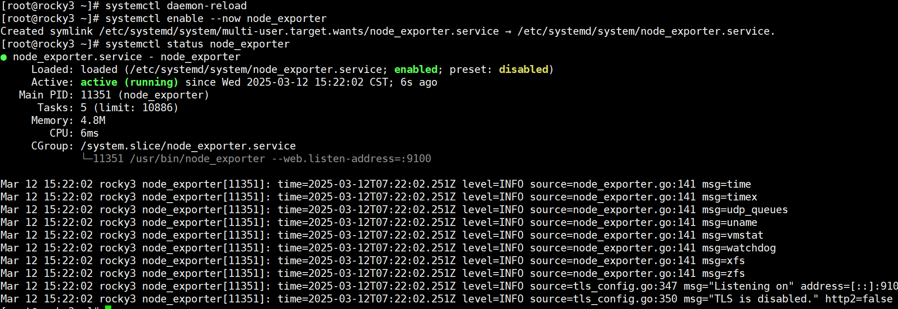

##### 3.2 开始在监控服务器部署

###### 使用docker部署Prometheus

```
docker run -d \
    --restart=unless-stopped \
    --name prometheus \
    -p 9090:9090 \
    -v prometheus:/prometheus \
    registry.us-west-1.aliyuncs.com/ymyw/prometheus:v2.53.0 \
    --storage.tsdb.path=/prometheus/data
```

```
cat > /var/lib/docker/volumes/prometheus/_data/prometheus.yml <<EOF
global:
  scrape_interval: 15s
  evaluation_interval: 15s

scrape_configs:
  - job_name: prometheus
    static_configs:
      - targets: ['localhost:9090', '192.168.3.122:9100', '192.168.3.123:9100']
EOF
```

重启容器

```
docker restart prometheus
```

###### 部署Grafana

```
docker run -d \
    -p 3000:3000 \
    --restart=unless-stopped \
    -v grafana:/var/lib/grafana \
    -e "GF_SECURITY_ADMIN_PASSWORD=admin8888" \
    registry.cn-hangzhou.aliyuncs.com/ymyw/grafana:11.1.0
```

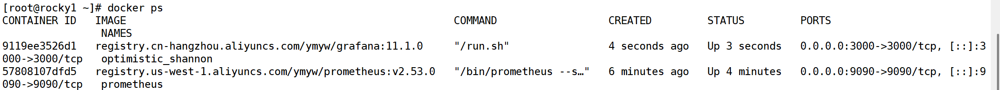

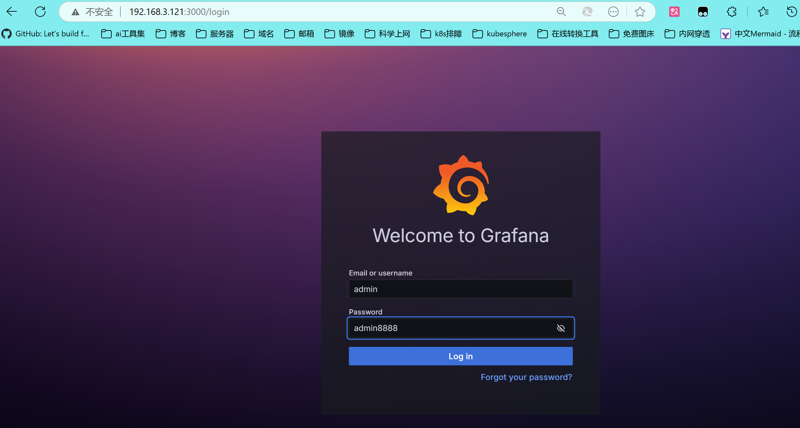

###### 添加数据源

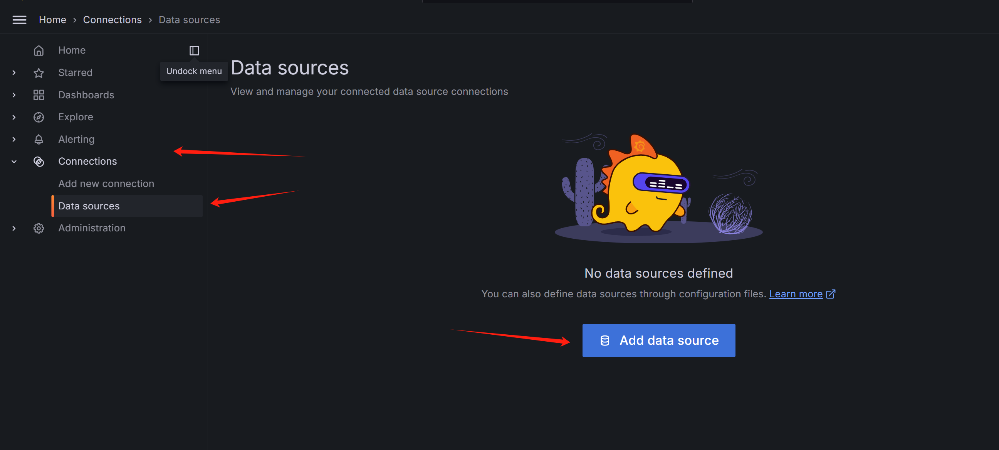

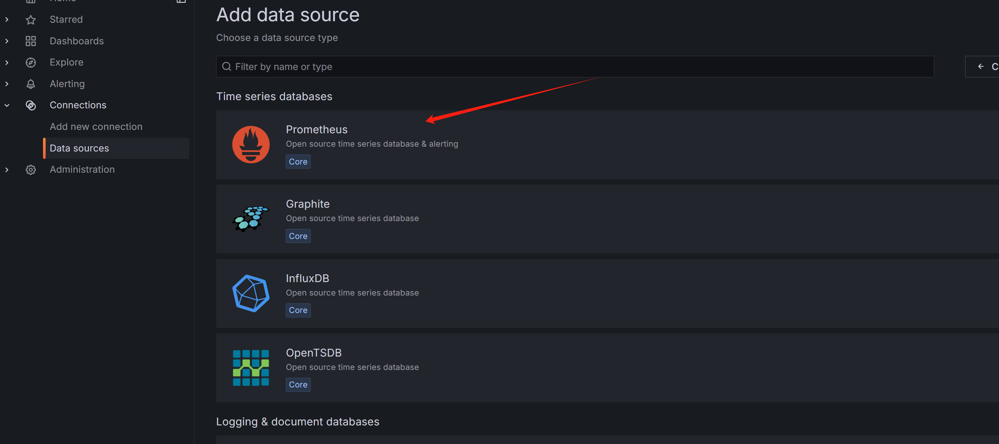

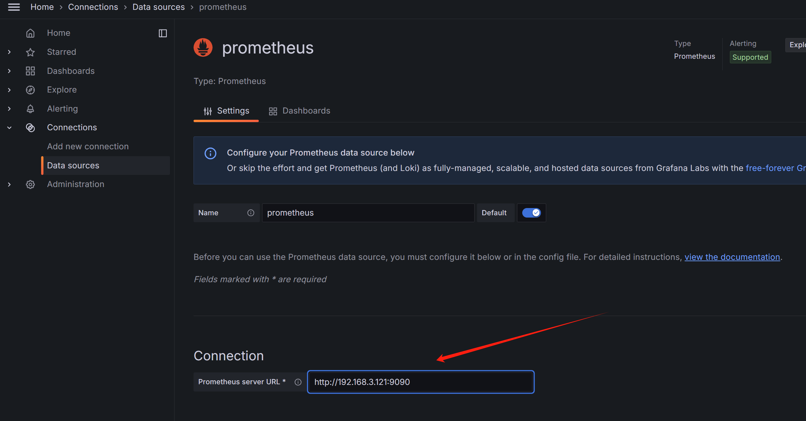

这里因为我的prometheus跟grafana在同一台机器所以IP是一样的

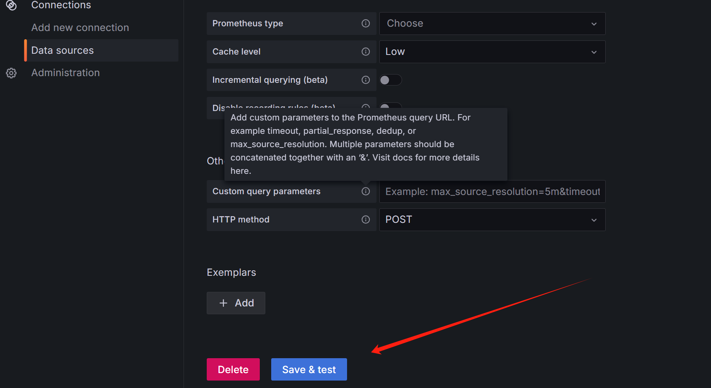

下拉添加


###### 添加仪表盘

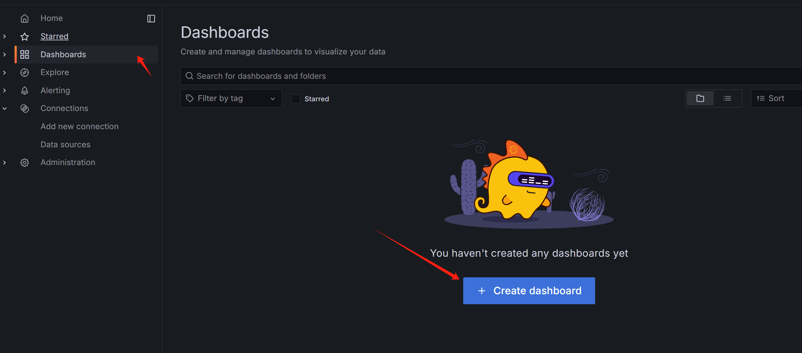

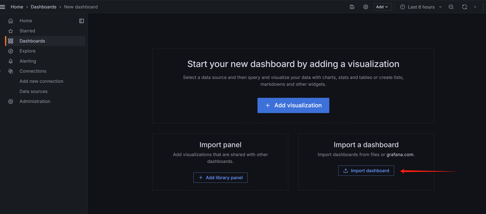

配置prometheus数据库，模板号码16098

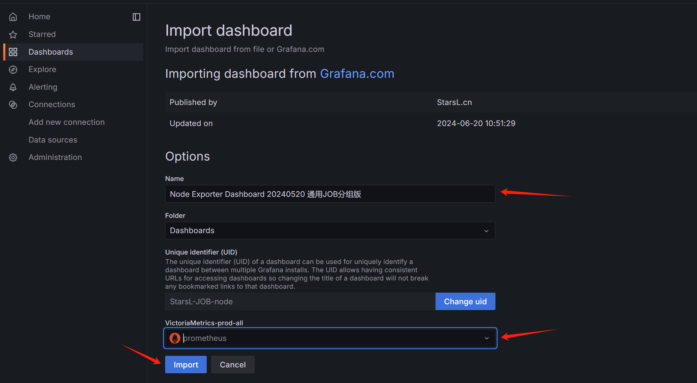

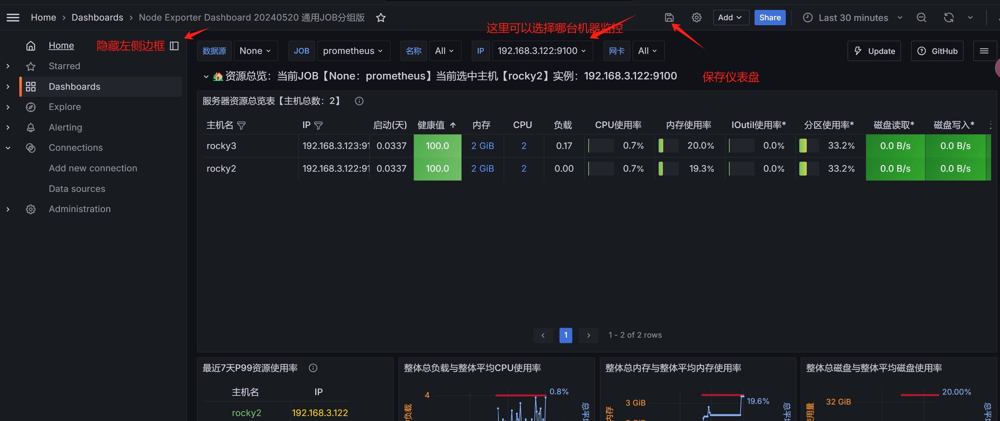

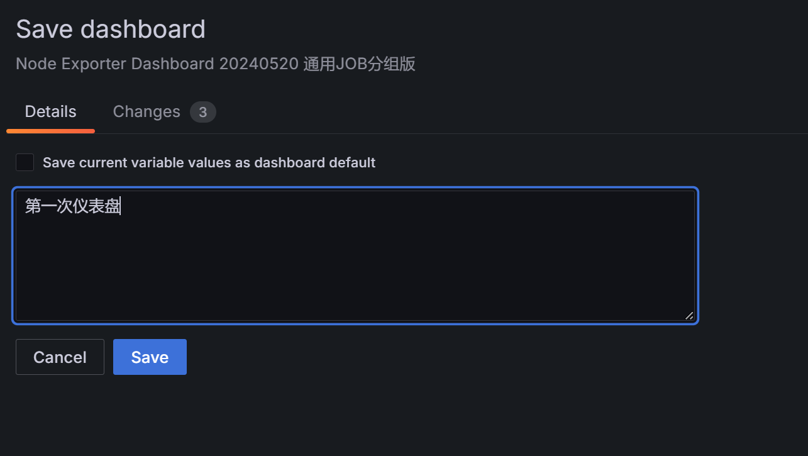

###### 上面是Grafana页面，下面是Prometheus页面

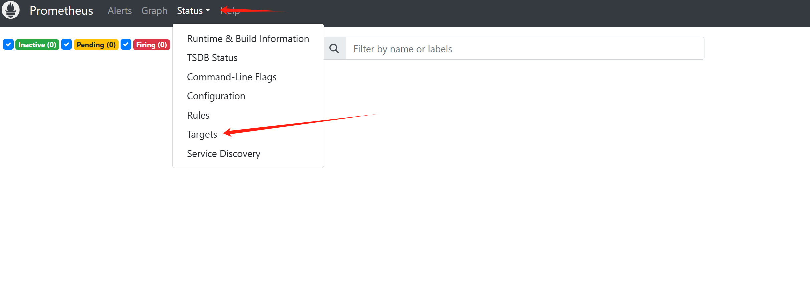

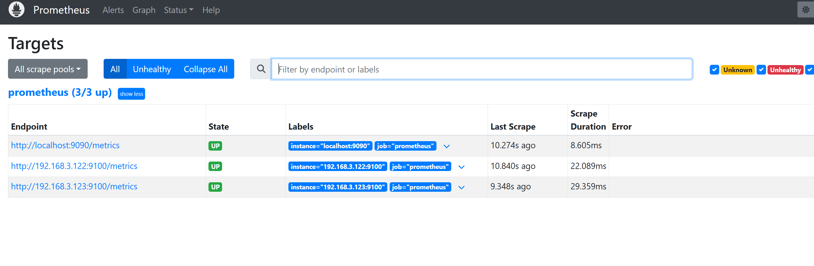