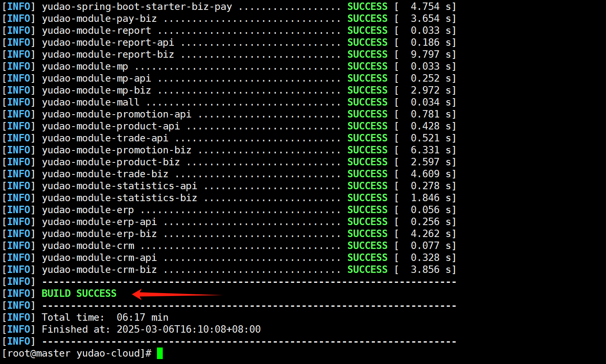

## 芋道源码部署

### 一、实验目的

练习

### 二、实验环境

| ip地址        | 系统      |
| ------------- | --------- |
| 192.168.3.200 | centos7.9 |

不推荐centos7.9练习，推荐rocky linux/ubuntu

### 三、实操

#### 本地启动

##### 3.1 后端服务构建  

```
https://jdk.java.net/archive/
```

进入jdk历史版本网站，往下拉找到jdk21

###### 安装jdk


配置JAVA环境

```
cd /opt
tar xvf openjdk-21.0.2_linux-x64_bin.tar.gz
```

编辑文件`~/.bashrc`在文件最后添加三行内容

```
export JAVA_HOME=/opt/jdk-21.0.2
export CLASSPATH=.:${JAVA_HOME}/lib
export PATH=${CLASSPATH}:${JAVA_HOME}/bin:$PATH
```

重新加载配置

```
source ~/.bashrc
```

查看JAVA版本

```
java --version
```

如果版本为openjdk 21.0.2,说明没有问题

###### 安装配置maven

```
cd /opt
wget https://dlcdn.apache.org/maven/maven-3/3.9.6/binaries/apache-maven-3.9.6-bin.tar.gz
tar -xzvf apache-maven-3.9.6-bin.tar.gz
```

编辑 `~/.bashrc`环境变量

```
export MAVEN_HOME=/opt/apache-maven-3.9.6
export PATH=$MAVEN_HOME/bin:$PATH
```

生效配置

```
source ~/.bashrc
```

检查版本

```
mvn -v
```


配置国内源,更改配置文件`vi /opt/apache-maven-3.9.6/conf/settings.xml`找到`<mirrors>`标签行,将下面内容添加到此标签内

```
<mirror>
    <id>aliyunmaven</id>
    <mirrorOf>central</mirrorOf>
    <name>aliyun maven</name>
    <url>https://maven.aliyun.com/repository/public </url>
</mirror>
```


###### 下载源码

```
mkdir -p /opt/gitdir
cd /opt/gitdir
yum install -y git
git clone https://gitee.com/zhijiantianya/yudao-cloud.git
```


> 这里看到哪里有jdk的分支可以切换过去

切换分支 由于官方更新了项目，将`master-jdk21`分支替换为了`master-jdk17`,所以这里不一样。又因为官方更新速度比较快，有时候新代码无法通过构建，使用时无需追求最新的代码而是选择一个稳定能够通过的代码。项目提供了tag，可以切换到最新的tag来成功构建。可以在项目下执行`git tag`来查看项目所有的tag，这里使用最新的tag：

```
cd yudao-cloud/
git checkout -b remotes/origin/master-jdk17
```


构建项目  时间较长，需要看网络

```
mvn clean package -Dmaven.test.skip=true
```



至此,已经部署好了后端环境,成功构建了后端项目

为了方便构建可以注释掉一些不用的扩展


注释后


重新构建

```
mvn clean package -Dmaven.test.skip=true #时间明显缩短
```


##### 3.2 中间件服务搭建

现在需要用到docker，自行安装

这里必须搭建的有3个

- **`Mysql`**:数据库
- **`Redis`**:缓存
- **`Nacos`**:注册中心配置中心

###### 部署mysql

使用Docker部署mysql数据库

```
cd /opt/gitdir/yudao-cloud/
```

```
docker run -d -p 3306:3306 \
  --restart=unless-stopped \
  --name=yudao_mysql \
  -e MYSQL_ROOT_PASSWORD=123456 \
  -v "/etc/localtime:/etc/localtime" \
  -v yc_mysql:/var/lib/mysql \
  swr.cn-north-4.myhuaweicloud.com/ddn-k8s/docker.io/mysql:8.4.2
```

客户端连接数据库软件地址

```
https://dbeaver.io/
```


导入数据

使用mysql创建数据库`ruoyi-vue-pro`

导入后端项目下sql目录中的`ruoyi-vue-pro.sql`进行初始化


```
rz 是上传文件   sz 是下载文件
```


```
导入刚刚在虚拟机用sz下载的数据库文件
```


```
等待执行完成
```


前面步骤比较多，也可以直接用命令行执行

```
cd /opt/gitdir/yudao-cloud/sql/mysql
docker exec -i yudao_mysql mysql -h 127.0.0.1 -uroot -p123456 -e 'CREATE DATABASE `ruoyi-vue-pro`;'
docker exec -i yudao_mysql mysql -h 127.0.0.1 -uroot -p123456 ruoyi-vue-pro < ./ruoyi-vue-pro.sql
```

验证导入结果

```
docker exec -it yudao_mysql mysql -h 127.0.0.1 -uroot -p123456 -e 'USE `ruoyi-vue-pro`; SHOW TABLES;'
```


修改后端配置中数据库地址

数据库连接配置在`application-local.yaml`文件中,默认是使用`127.0.0.1:3306`端口，并且账号是`root`，密码是`123456`

我们需要修改其ip地址,因为文件比较多,我们使用shell批量替换

以下所有的查找替换操作都是在项目的根目录下执行的

查找所有application-local.yaml查看其中的数据库配置

```
cd /opt/gitdir/yudao-cloud/
```

```
find ./ -name application-local.yaml -exec grep -l 'jdbc:mysql://127.0.0.1:3306' {} +
```

更改数据库配置中的ip地址,注意更换为自己的ip地址

```
find ./ -name application-local.yaml -print0 | xargs -0 sed -i 's|jdbc:mysql://127.0.0.1:3306|jdbc:mysql://192.168.3.200:3306|g'
```

上面的地址要修改成自己数据库的地址

###### **Redis**

使用docker部署

```
docker run -d \
  --restart=unless-stopped \
  --name=yudao_redis \
  -v "/etc/localtime:/etc/localtime" \
  -p 6379:6379 \
  swr.cn-north-4.myhuaweicloud.com/ddn-k8s/docker.io/redis:7.2.5
```

修改后端redis配置   注意：修改成自己的ip地址

```
find ./ -name application-local.yaml -print0 | xargs -0 sed -i 's|host: 127.0.0.1 # 地址|host: 192.168.3.200 # 地址|g'
```

查看更改后内容

```
find ./ -name application-local.yaml -exec grep 'host: 192.168.3.200 # 地址' {} +
```

###### Nacos

使用Docker部署Nacos

```
docker run -d \
  -p 8848:8848 \
  -p 9848:9848 \
  --restart=unless-stopped \
  --name=yudao_nacos \
  -e MODE=standalone \
  -v "/etc/localtime:/etc/localtime" \
  swr.cn-north-4.myhuaweicloud.com/ddn-k8s/docker.io/nacos/nacos-server:v2.4.0
```


电脑主机进入页面

```
192.168.3.200:8848/nacos  
```

新建命名空间


修改后端配置中Nacos的地址

```
find ./ -name application-local.yaml -print0 | xargs -0 sed -i 's|server-addr: 127.0.0.1:8848|server-addr: 192.168.3.200:8848|g'
```

查看有没有修改成功

```
grep -r "server-addr: 192.168.3.200:8848" .
```

##### 3.3 启动基础后端服务

之前构建了后端服务

又部署了中间件服务:**`mysql`**,**`redis`**,**`nacos`**

由于默认项目下的配置文件中使用的地址是`127.0.0.1`

上个文档中已经改好了ip地址,现在需要重新构建后端服务,这样服务才能正确使用修改后的配置文件

###### 重新构建

重新构建后端服务

```
# 进入项目根目录
cd /opt/gitdir/yudao-cloud
mvn clean install package '-Dmaven.test.skip=true'
```

> 构建需要时间，耐心等待

###### 启动主要后端服务

启用gateway服务

这个服务的主要提供API 服务网关，提供用户认证、服务路由、灰度发布、访问日志、异常处理等功能。

构建完成后`yudao-gateway/target/`目录下会有一个`yudao-gateway.jar`文件,使用`java -jar xxx.jar`启动这个文件即可,注意要写对路径

之后的后端服务也是一样的方式启动,文档演示时的当前目录为项目的根目录(就是`/opt/gitdir/yudao-cloud`)

1.创建screen会话 这个命令可以在一个终端窗口中创建多个虚拟终端,能让程序在虚拟终端中保持前台执行.哪怕你的终端窗口关闭也不受影响

```
screen -R gateway  # 没有创建的虚拟终端会自动创建，gateway是虚拟终端的名称
```

2.在虚拟终端启动服务

```
java -jar yudao-gateway/target/yudao-gateway.jar
```

3.查看项目启动情况


4.访问页面端口 这里我的虚拟机ip地址为192.168.3.200

此服务默认端口为`48080`,所以访问页面的地址为`http://192.168.3.200:48080`

显示如下界面就是正常的，因为还有其他服务没有启动


```
screen  基础操作
screen -R  终端名称   #创建虚拟终端   screen -list  #查看全部虚拟终端
ctrl + A + D: 返回正常终端     
Ctrl + A + C：创建一个新的窗口。
Ctrl + A + N：切换到下一个窗口。
Ctrl + A + P：切换到上一个窗口。
Ctrl + A + 0-9：切换到指定编号的窗口。
Ctrl + A + W：显示当前所有窗口。
Ctrl + A + K：强制关闭当前窗口。
screen -X -S <session_id> quit    外部终端结束虚拟终端
```

**启动system服务**

```
screen -R system
```

```
java -jar yudao-module-system/yudao-module-system-biz/target/yudao-module-system-biz.jar
```

启动成功的日志输出内容也跟上面的gateway服务类似

默认端口为48081

这里访问两个页面,这两个页面一个是实际的48081服务页面,一个是经过网关48080的页面

```
http://192.168.3.200:48080/admin-api/system
http://192.168.3.200:48081/admin-api/system
```


**启动infra服务**

此服务与系统的基础设施相关

启动服务

```
screen -R info
```

```
java -jar yudao-module-infra/yudao-module-infra-biz/target/yudao-module-infra-biz.jar
```

##### 3.4 启动前端业务

###### 安装环境

前端项目先启动到windows上,用于测试调整    需要安装几个软件git,node.js还有vscode

###### 安装git

```
https://git-scm.com/downloads
```


安装node.js

```
https://nodejs.org/en
```


###### 安装vscode

略过

###### Vue后台管理项目

在`d`盘下创建一个`gitdir`目录     进入目录下面按图操作

> 按住  Shift 然后右键


下载项目源码

```
git clone https://gitee.com/yudaocode/yudao-ui-admin-vue3.git
```

构建项目

```
cd yudao-ui-admin-vue3
git checkout v2.1.0
# 设置国内npm源
npm config set registry https://registry.npmjs.org
nvm install 18
nvm use 18
# 安装pnpm
npm install -g pnpm@9.15
# 设置国内源
pnpm config set registry https://registry.npmmirror.com
# 安装项目包
pnpm install
#构建
pnpm build:local
#运行
pnpm run dev
```

pnpm版本需要为9.15,版本错误可以删除之后重新下载

```
# 卸载pnpm
npm uninstall -g pnpm
# 安装9.15版本pnpm
npm install -g pnpm@9.15
# 清理pnpm缓存
pnpm store prune
pnpm cache delete
# 安装包
pnpm install
```


> 修改密码，查看是否连接数据库


> 修改之后退出然后登录


登录成功说明已经正常连接上后端

#### docker启动服务

##### 3.5 服务容器化

之前已经成功启动服务了,但是启动方式比较麻烦

需要启动多个screen虚拟终端,要么就启动多个窗口

这节将前后端服务都制作成docker镜像,这样启动和管理就会方便很多

部署到其他机器上都不用考虑环境的问题,无论宿主机上是否有java21

只要有docker,那么启动就不会有任何问题

###### 制作后端Docker镜像

后端有3个服务,**`gateway`**,**`system`**,**`infra`**

分别进入各自的子目录,项目自己提供了Dockerfile文件,不需要我们生成。可以更改FROM基于的镜像下载更快。

```
# 制作gateway镜像
cd /opt/gitdir/yudao-cloud/yudao-gateway
docker build -t yudao_gateway .

# 制作system镜像
cd /opt/gitdir/yudao-cloud/yudao-module-system/yudao-module-system-biz
docker build -t yudao_system .

# 制作infra镜像
cd /opt/gitdir/yudao-cloud/yudao-module-infra/yudao-module-infra-biz
docker build -t yudao_infra .
```


> 3个目录里面都有Dockerfile


###### 启动后端容器

```
docker run -d \
  --network=host \
  --name yudao_gateway \
  -v "/etc/localtime:/etc/localtime" \
  yudao_gateway

docker run -d \
  --network=host \
  --name yudao_system\
  -v "/etc/localtime:/etc/localtime" \
  yudao_system

docker run -d \
  --network=host \
  --name yudao_infra\
  -v "/etc/localtime:/etc/localtime" \
  yudao_infra
```

启动之后,可以通过docker logs来查看服务的日志,参数-f可以实时查看日志的更新,查看完毕后使用Ctrl+C来退出查看

```
docker logs -f yudao_gateway 
docker logs -f yudao_system
docker logs -f yudao_infra
```

###### 制作前端docker镜像


把端口改成自己的ip地址之后重新构建镜像

```
npm install -g pnpm@9.15
# 设置国内源
pnpm config set registry https://registry.npmmirror.com
# 安装项目包
pnpm install
#构建
pnpm build:local
```

然后把文件上传到虚拟机进行前端镜像构建


制作镜像,新建Dockerfile文件,写入以下内容

**Dockerfile**

```
FROM swr.cn-north-4.myhuaweicloud.com/ddn-k8s/docker.io/nginx:1.27
ADD ./dist/ /usr/share/nginx/html/
```


构建镜像

```
docker build -t yudao_ui_admin .
```

启动容器

```
docker run --name yudao_ui_admin -d -p 8080:80 yudao_ui_admin
```

这些是全部要启动的容器


主机可以直接访问虚拟机设置的nginx端口，密码使用修改后的密码

##### 3.6 Harbor镜像仓库

###### 下载harbor压缩包

> 这次是要把构建好的镜像推送到私有仓库

```
https://github.com/goharbor/harbor/releases
```


在/opt目录下解压

```
tar xvf harbor-offline-installer-v2.12.2.tgz
```

###### 下载docker compose

```
https://github.com/docker/compose
```


```
[root@master opt]# mv docker-compose-linux-x86_64 docker-compose
[root@master opt]# chmod +x ./docker-compose 
[root@master opt]# mv ./docker-compose /usr/local/bin/
[root@master opt]# docker-compose -v
Docker Compose version v2.32.4
```


###### 开始安装harbor

```
cd harbor
cp harbor.yml.tmpl harbor.yml
vi harbor.yml
```


全部都要注释，图中少了一个没有注释

```
#设置好保存之后输入，会自动导入离线镜像
./install.sh
```


安装好了之后打开IP:80


镜像仓库搭建完成

##### 3.7 上传镜像到仓库

###### 启动harbor

```
docker compose start
```


登录harbor

```
docker logout 192.168.3.200   #清除登录信息
docker login 192.168.3.200 -u admin -p Harbor12345  #登录
```

新增项目仓库


###### 节点信任仓库镜像

因为我们没有为镜像仓库配置证书,所以我们需要在docker的配置中设置信任镜像仓库才能够正常的使用镜像仓库

需要编辑docker的配置文件`/etc/docker/daemon.json`

添加以下内容,这个ip地址是我镜像仓库的ip地址,如果镜像仓库不是使用的80端口,还需要添加对应的端口

```
{
  "insecure-registries" : ["192.168.163.135"]
}
```

如果我们之前添加过国内镜像仓库,那么配置文件看起来就是这样

```
{
  "insecure-registries" : ["192.168.163.135"],
  "registry-mirrors": ["http://hub-mirror.c.163.com"]
}
```

更改完之后,需要重新启动docker服务

```
systemctl restart docker
```

###### 推送前后端镜像到镜像仓库

镜像推送到镜像仓库,需要使用docker tag生成新的镜像名称和版本

使用下面命令更改镜像名称

```
docker tag yudao_ui_admin 192.168.3.200/myimages/yudao_ui_admin
docker tag yudao_infra 192.168.3.200/myimages/yudao_infra
docker tag yudao_system 192.168.3.200/myimages/yudao_system
docker tag yudao_gateway 192.168.3.200/myimages/yudao_gateway
```

上传到镜像仓库

```
docker push 192.168.3.200/myimages/yudao_ui_admin
docker push 192.168.3.200/myimages/yudao_infra
docker push 192.168.3.200/myimages/yudao_system
docker push 192.168.3.200/myimages/yudao_gateway
```


之后到harbor站点上查看镜像是否上传成功


