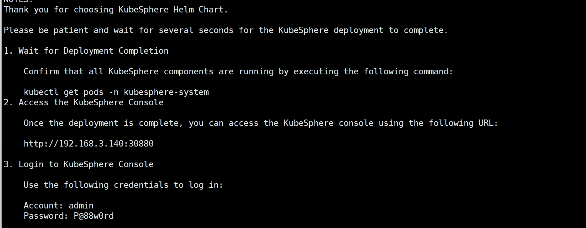

## ubuntu 安装kubernetes+kubesphere

### 一、实验目的

使用开源工具kk快速安装k8s+kubesphere

### 二、实验环境

| IP            | 角色   | 系统           | 内存/cpu/硬盘 |
| ------------- | ------ | -------------- | ------------- |
| 192.168.3.140 | master | ubuntu 22.04.5 | 4G4C40G       |
| 192.168.3.141 | node1  | ubuntu 22.04.5 | 4G4C40G       |
| 192.168.3.142 | node2  | ubuntu 22.04.5 | 4G4C40G       |

### 三、实验实操

在 Ubuntu 操作系统上，执行以下命令为服务器安装依赖项：

```
sudo apt install socat conntrack ebtables ipset -y
```

#### 创建 Kubernetes 集群

1. 如果您访问 GitHub/Googleapis 受限，请登录任意集群节点，执行以下命令设置下载区域：

   ```
   export KKZONE=cn
   ```

2. 执行以下命令下载 KubeKey 最新版本：

   ```
   curl -sfL https://get-kk.kubesphere.io | sh -
   ```

   上面不行使用下面这个,wget需要指定版本

   ```
   wget https://kubernetes.pek3b.qingstor.com/kubekey/releases/download/v3.1.6/kubekey-v3.1.6-linux-amd64.tar.gz
   
   tar xvf kubekey-v3.1.6-linux-amd64.tar.gz
   ```

   下载完成后当前目录下将生成 KubeKey 二进制文件 **kk**。

3. 执行以下命令为 KubeKey 二进制文件 **kk** 添加执行权限：

   ```
   mv kk /usr/local/bin/
   ```

可以使用  `kk -h`来查看命令对应的参数

```Bash
kk -h 
kk create -h
kk create config -h

# 查看支持的版本
kk version --show-supported-k8s
```

 创建配置文件

```
kk create config -f k8s.yaml --with-kubernetes v1.31.0
config 创建配置文件 k8s.yaml 文件名称   k8s版本
```

以下是k8s.yaml的重点配置,集群基本信息

```
metadata:
  name: sample
spec:
  hosts:
  - {name: master, address: 192.168.3.140, internalAddress: 192.168.3.140, user: root, password: "000000"}
  - {name: node1, address: 192.168.3.141, internalAddress: 192.168.3.141, user: root, password: "000000"}
  - {name: node2, address: 192.168.3.142, internalAddress: 192.168.3.142, user: root, password: "000000"}
  roleGroups:
    etcd:
    - master
    control-plane:      #控制平面
    - master
    worker:
    - node1
    - node2
```

集群版本，集群域名，集群容器使用工具

```
  kubernetes:
    version: v1.31.0
    clusterName: cluster.local
    autoRenewCerts: true
    containerManager: docker   #这里可以修改成功docker或者containerd
```

使用配置文件开始创建k8s集群

```
kk create cluster -f k8s.yaml
```

输入yes，之后会在终端开始下载各种组件，速度有快有慢，具体看网速

docker加载国内镜像加速地址,全部机器

```
echo '{"registry-mirrors": ["http://hub-mirror.c.163.com"]}' > /etc/docker/daemon.json
```

#### 安装kubeSphere

这里使用helm安装kubesphere,没有的就安装helm

```
helm upgrade --install -n kubesphere-system --create-namespace ks-core https://charts.kubesphere.io/main/ks-core-1.1.3.tgz --set global.imageRegistry=swr.cn-southwest-2.myhuaweicloud.com/ks --set extension.imageRegistry=swr.cn-southwest-2.myhuaweicloud.com/ks --debug --wait
```



成功了会输出账号密码

```
第一次登录会强制要求修改密码，新密码:Admin4321.
```

