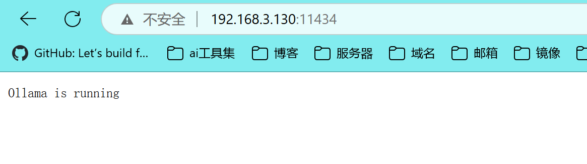

## linux ubuntu快速部署ai模型

### 一、实验目的

尝试学习部署ai模型，目的在有网的环境简单快速搭建，如今ai遍地开花，预计可能后期在离线环境进行部署

预测步骤：

1. 安装ollama
2. 下载ai模型
3. 使用客户端进行win系统测试
4. 安装docker
5. 使用开源open-webui进行服务端测试

### 二、实验环境

| IP            | 服务       | 端口  | 系统           |
| ------------- | ---------- | ----- | -------------- |
| 192.168.3.130 | ollama     | 11434 | ubuntu 22.04.5 |
|               | open-webui | 3000  |                |


### 三、实验实操

#### 3.1 安装ollama

```
ollama官网:https://ollama.com/
```

```
github压缩包:https://github.com/ollama/ollama
```

```
linux一键安装:curl -fsSL https://ollama.com/install.sh | sh
```

推荐github 下载压缩包

```
tar -zxvf ollama-linux-amd64.tgz -C /usr
ollama --help
ollama --version
```

创建用户和组

```
sudo useradd -r -s /bin/false -U -m -d /usr/share/ollama ollama
sudo usermod -a -G ollama $(whoami)
```

创建systemd服务文件

```
cat > /etc/systemd/system/ollama.service << EOF
[Unit]
Description=Ollama Service
After=network-online.target

[Service]
ExecStart=/usr/bin/ollama serve
User=ollama
Group=ollama
Restart=always
RestartSec=3
Environment="PATH=$PATH"
Environment="OLLAMA_HOST=0.0.0.0"
Environment="OLLAMA_ORIGINS=*"

[Install]
WantedBy=multi-user.target
EOF
```


加载配置

```
chmod +x /etc/systemd/system/ollama.service
systemctl daemon-reload
systemctl enable ollama --now  #加now说明顺便启动
netstat -nultp |grep 11434
```




#### 3.2下载模型

```
ollama模型官网:https://ollama.com/search
```


这里我选择deespeek-R1 7b模型进行部署

```
ollama run deepseek-r1:7b
```


#### 3.3 使用chatbox 客户端

```
下载⽂件：
 https://chatboxai.app/zh
```

配置ollama模型地址


设置对话


#### 3.4 安装docker

1. **安装依赖**
   
   ```
   apt install -y apt-transport-https ca-certificates curl gnupg lsb-release
   ```
   
2. **信任阿里云 Docker 源**
   添加阿里云的 GPG 密钥以验证软件包合法性：

   ```
   curl -fsSL https://mirrors.aliyun.com/docker-ce/linux/ubuntu/gpg | sudo apt-key add -
   ```

3. **添加阿里云 Docker 源**
   配置系统从阿里云获取 Docker 安装包（自动匹配系统版本）：

   ```
   add-apt-repository "deb [arch=amd64] https://mirrors.aliyun.com/docker-ce/linux/ubuntu $(lsb_release -cs) stable"
   ```

4. **更新软件列表**
   刷新软件源信息：

   ```
   apt update
   ```

5. **安装 Docker**
   安装 Docker 社区版（安装后自动启动并开机自启）：

   ```
   apt install -y docker-ce
   ```

6. **配置镜像加速**
   使用网易（163）镜像加速器加速国内 Docker 镜像下载：

   ```
   echo '{"registry-mirrors": ["http://hub-mirror.c.163.com"]}' > /etc/docker/daemon.json
   ```

7. **重启 Docker**
   使配置生效并检查服务状态：

   ```
   systemctl daemon-reload && systemctl restart docker && systemctl status docker
   ```

#### 3.5 Open-WebUi 工具

```
使⽤docker ⽅式安装客户端⼯具：
docker pull ghcr.mirrorify.net/open-webui/open-webui:main
 
vim docker-openwebui.sh  #编写运行文件
---
docker run -d \
  -p 3000:8080 \
  -e OLLAMA_BASE_URL=http://192.168.3.130:11434 \
  --privileged=true \
  -v open-webui:/app/backend/data \
  --name open-webui \
  --restart always \
  ghcr.mirrorify.net/open-webui/open-webui:main
---
chmod +x docker-openwebui.sh
./docker-openwebui.sh
```


开始需要注册管理员账号


设置的账号密码

```
账号:理想乡
密码:admin4321.
```


搭建成功


