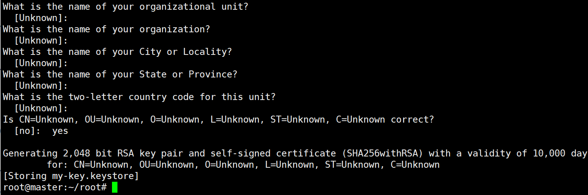
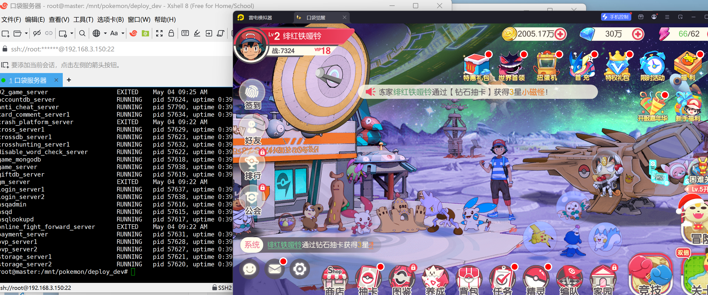
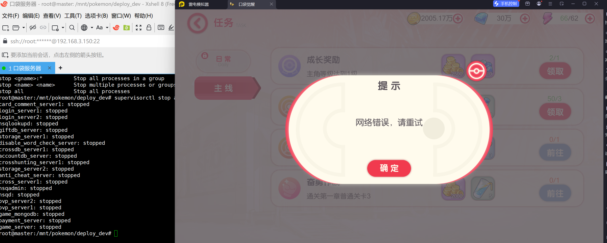

每个端有所差异具体以实际配套的文字教程为准


系统：ubuntu 18.04

连接服务器
1、执行设置密码

sudo passwd root

修改阿里云源

/etc/apt/sources.list

```
deb http://mirrors.aliyun.com/ubuntu/ bionic main restricted
deb http://mirrors.aliyun.com/ubuntu/ bionic-updates main restricted
deb http://mirrors.aliyun.com/ubuntu/ bionic universe
deb http://mirrors.aliyun.com/ubuntu/ bionic-updates universe
deb http://mirrors.aliyun.com/ubuntu/ bionic multiverse
deb http://mirrors.aliyun.com/ubuntu/ bionic-updates multiverse
deb http://mirrors.aliyun.com/ubuntu/ bionic-backports main restricted universe multiverse
deb http://mirrors.aliyun.com/ubuntu/ bionic-security main restricted
deb http://mirrors.aliyun.com/ubuntu/ bionic-security universe
deb http://mirrors.aliyun.com/ubuntu/ bionic-security multiverse
```


2、su root 执行输入刚刚设置的密码($是普通权限 #是管理员权限)

安装环境：


sudo apt-get update


curl bootstrap.pypa.io/pip/2.7/get-pip.py


sudo apt-get install expect subversion build-essential  lib32stdc++6 gcc-multilib  g++-multilib python-dev pypy-dev gdb python2.7-dbg libcurl4-openssl-dev graphviz openssl libssl-dev swig gawk iotop lsof iftop ifstat iptraf htop dstat iotop  ltrace strace sysstat bmon nethogs silversearcher-ag libsasl2-2 sasl2-bin libsasl2-modules python-setuptools luajit curl wget unzip  python-pip


pip install cython six lz4==0.8.2 numpy==1.16.0 xlrd xdot rpdb psutil fabric==1.7.3 pycurl pycrypto M2Crypto==0.36.0 objgraph msgpack-python backports.ssl-match-hostname Markdown toro pymongo pyrasite pyopenssl ThinkingDataSdk==1.4.0 tornado==4.4.2 Supervisor==3.3.0 cryptography==2.6 -i https://pypi.tuna.tsinghua.edu.cn/simple


apt-key adv --keyserver hkp://keyserver.ubuntu.com:80 --recv 2930ADAE8CAF5059EE73BB4B58712A2291FA4AD5

echo "deb http://repo.mongodb.org/apt/debian jessie/mongodb-org/3.6 main" | tee /etc/apt/sources.list.d/mongodb-org-3.6.list

-----------------------------------------------------------------------
安装宝塔：
wget -O install.sh http://download.bt.cn/install/install-ubuntu_6.0.sh && sudo bash install.sh

密码


```
【云服务器】请在安全组放行 33689 端口
 外网面板地址: https://223.104.78.251:33689/c7c21d39
 内网面板地址: https://192.168.3.150:33689/c7c21d39
 username: jobteqhk
 password: 55caf66c
```


Nginx 1.18
Mysql 5.6
Php 5.6
redis
php安装扩展redis

安装mongodb 4.0.10

安装golang  1.13.1


宝塔-安全-放行端口：1-65535
关闭防火墙
sudo ufw disable

将服务端kdjx.zip上传到服务器根目录并解压
cd /
unzip kdjx.zip

给文件打上权限
chmod 777 -R /mnt
chmod 777 -R /www/wwwroot
chmod 777 -R /root/sk


设置数据库密码  123456
导入数据库
cd /root
./sk


去/etc/profile文件
增加：
export GOROOT=/usr/local/go
export GOPATH=$HOME/gowork
export GOBIN=$GOPATH/bin
export PATH=$GOPATH:$GOBIN:$GOROOT/bin:$PATH

执行命令
source /etc/profile


------------------------------------------------------------------------

替换IP    改你的服务器ip再执行命令

find /mnt/pokemon/release/ -type f -name '*.py' | xargs sed -i 's/192.168.0.102/192.168.3.150/g'
find /mnt/pokemon/release/ -type f -name '*.json' | xargs sed -i 's/192.168.0.102/192.168.3.150/g'
find /www/wwwroot/game/pokemon/patch/ -type f -name '*.plist' | xargs sed -i 's/192.168.0.102/192.168.3.150/g'
find /www/wwwroot/game/pokemon/patch/ -type f -name '*.game_app' | xargs sed -i 's/192.168.0.102/192.168.3.150/g'
find /www/wwwroot/game/pokemon/patch/ -type f -name '*.view' | xargs sed -i 's/192.168.0.102/192.168.3.150/g'
find /www/wwwroot/dl/ -type f -name '*.php' | xargs sed -i 's/192.168.0.102/192.168.3.150/g'
find /www/wwwroot/dl/ -type f -name '*.js' | xargs sed -i 's/192.168.0.102/192.168.3.150/g'
find /www/wwwroot/pay/SDK/ -type f -name '*.php' | xargs sed -i 's/192.168.0.102/192.168.3.150/g'

修改热更配置

md5sum /www/wwwroot/game/pokemon/patch/8/res/version.plist
ls -l /www/wwwroot/game/pokemon/patch/8/res/version.plist

md5sum /www/wwwroot/game/pokemon/patch/8/src/app.game_app
ls -l /www/wwwroot/game/pokemon/patch/8/src/app.game_app

md5sum /www/wwwroot/game/pokemon/patch/8/src/app.views.login.view
ls -l /www/wwwroot/game/pokemon/patch/8/src/app.views.login.view

md5sum /www/wwwroot/game/pokemon/patch/8/x64/src/app.game_app
ls -l /www/wwwroot/game/pokemon/patch/8/x64/src/app.game_app

md5sum /www/wwwroot/game/pokemon/patch/8/x64/src/app.views.login.view
ls -l /www/wwwroot/game/pokemon/patch/8/x64/src/app.views.login.view


修改/mnt/pokemon/release/login/patch/cn/8.json
找到对应上面5个  的size和md5 都改

------------------------------------------------------------------

修改数据库 root密码：123456
导入数据库
cd /root && ./sk

新建网站
IP:81
网站根目录/www/wwwroot/game

127.0.0.2:82
网站根目录/www/wwwroot/pay

127.0.0.3:83
网站根目录/www/wwwroot/sdk

127.0.0.4:84
网站根目录/www/wwwroot/dl    设置运行目录 /public     伪静态：thinkphp


------------------------------------------------------------------


添加权限

```
chmod +x /mnt/pokemon/release/bin/*
chmod +x /mnt/pokemon/deploy_dev/nsq/nsqd
chmod +x /mnt/pokemon/deploy_dev/nsq/nsqadmin
chmod +x /mnt/pokemon/deploy_dev/nsq/nsqlookupd
chmod +x /mnt/pokemon/release/online_fight_forward

chown -R www:www /www/wwwroot/dl/runtime/temp
```


启动游戏
cd /mnt/pokemon/deploy_dev
rm supervisor.sock
supervisord -c supervisord.conf 
supervisorctl start all

停止
supervisorctl reload

查看启动
cd /mnt/pokemon/deploy_dev
supervisorctl status

重启命令
cd /mnt/pokemon/deploy_dev
supervisorctl restart all

-------------------------------------------------------------------

客户端打包

```
wget https://bitbucket.org/iBotPeaches/apktool/downloads/apktool_2.7.0.jar -O apktool.jar

mv apktool_2.11.1.jar apktool

apt install openjdk-11-jdk

java -jar ./apktool d kdjx.APK -o output-apk

cd output-apk/assets/res

sed -i 's/192.168.0.102/192.168.3.150/g' ./version.plist

#重新打包
java -jar apktool b output-apk -o  kdjx_m.apk

#生成密钥
keytool -genkey -v -keystore my-key.keystore -alias alias_name -keyalg RSA -keysize 2048 -validity 10000
#然后设置密码123456，全部回车，到最后输入yes
```




然后签名

```
jarsigner -verbose -sigalg SHA1withRSA -digestalg SHA1 -keystore my-key.keystore kdjx_m.apk alias_name
```

然后把apk拉到手机模拟器进行安装







修改客户端：将下方文件中的IP修改为你的服务器公网IP地址

安卓：

assets\res\version.plist


苹果：

paylod/口袋觉醒.app/res/version.plist


总代理注册地址：http://192.168.3.150:84/admin_login/login_account/player?agency_user_id=2&game_type=2


运营后台：http://IP:39666 （如果访问不了，GM授权后台发不了 就重启服务器重新启动游戏命令）
账号：admin 密码：pokemon123cn456.


GM授权后台：http://IP:81/gm/gm.php  GM码：www.is1.top
玩家后台：http://IP:81/gm

代理后台：http://IP:84
账户admin  密码：123123

PS:
关后门：宝塔 - 安全   添加端口规则 27159 端口禁止放行！


跨服时间开启
/mnt/pokemon/release/bin
/mnt/pokemon/release

crossdata.json两个目录的这个文件，修改时间

对应的服务
crossarena跨服竞技场
crosscraft跨服石英
crossgym跨服道馆
onlinefight对战竞技场
crossmine跨服商业街
crossunionfight跨服公会战

注意事项
跨服石英需要同步golang导表，不然会崩跨服服务，没有同步的情况下，默认不开启即可。（功能没问题，也即需要自己导表才能用）
跨服竞技场开启后需要半个小时左右生成机器人。

修改区名：
mnt\pokemon\release\login\conf\serv.json
修改公告：
mnt\pokemon\release\login\conf\notice.json


----------------------------------------------------------------
搭建愉快
----------------------------------------------------------------

----------------------------------------------------------------
附：
   根据二○○二年一月一日《计算机软件保护条例》规定：为了学习和
   研究软件内含的设计思想和原理，通过安装、显示、传输或者存储软
   件等方式使用软件的，可以不经软件著作权人许可，不向其支付报酬
   鉴于此，也希望大家按此说明研究软件

本站所有源码都来源于网络收集修改或者交换!如果侵犯了您的权益,请及时告知我们,我们即刻删除

