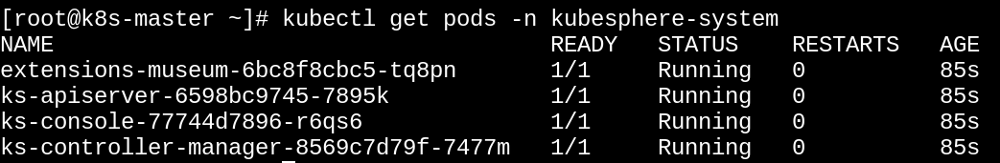
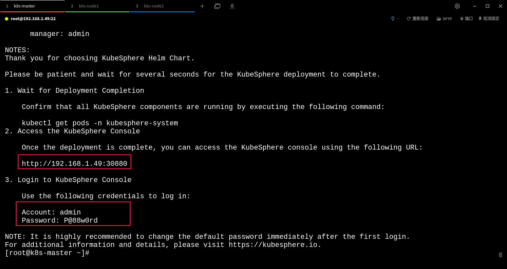
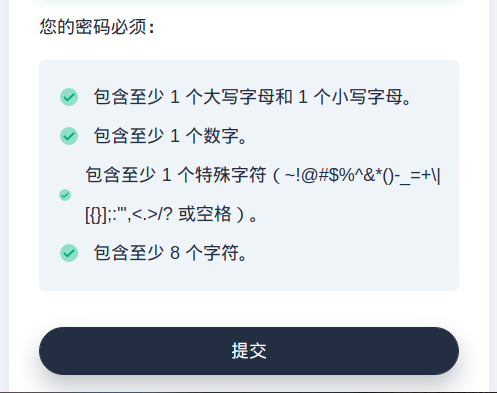
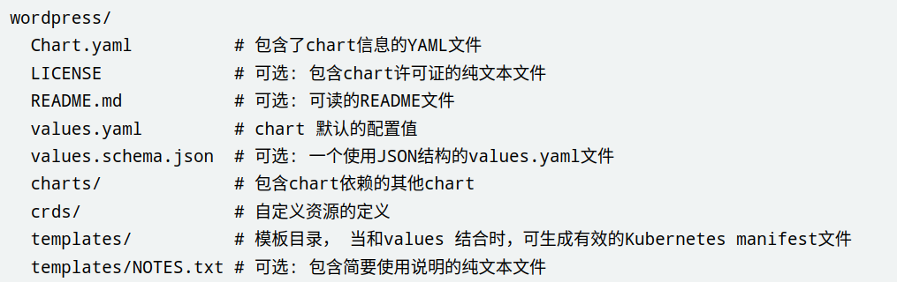

# 提升Kubernetes管理效率

## 1. 命令行管理工具

### 1.1 别名关联

每次都输入完整命令有点麻烦，所以可针对命令指定自定义别名。

~~~markdown
# 查看所有别名
alias
# 创建别名
alias 别名=完整命令
# 删除别名
unalias 别名
# 注意：以上配置，在每次系统重启后会失效，永久有效的做法如下：
	vim ~/.bashrc
		文件中添加别名设置，例如：alias k=kubectl。保存退出
	source ~/.bashrc	
~~~

~~~markdown
# kubectl系列命令的常用别名
alias k=kubectl
alias kprd=‘kubectl get pod -nprd’
alias kaf=‘kubectl apply -f’
alias kca=‘_kca(){ kubectl “$@” --all-namespaces; unset -f _kca; }; _kca’
alias kccc=‘kubectl config current-context’
alias kcdc=‘kubectl config delete-context’
alias kcgc=‘kubectl config get-contexts’
alias kcn=‘kubectl config set-context --current --namespace’
alias kcp=‘kubectl cp’
alias kcsc=‘kubectl config set-context’
alias kcuc=‘kubectl config use-context’
alias kdcj=‘kubectl describe cronjob’
alias kdcm=‘kubectl describe configmap’
alias kdd=‘kubectl describe deployment’
alias kdds=‘kubectl describe daemonset’
alias kdel=‘kubectl delete’
alias kdelcj=‘kubectl delete cronjob’
alias kdelcm=‘kubectl delete configmap’
alias kdeld=‘kubectl delete deployment’
alias kdelds=‘kubectl delete daemonset’
alias kdelf=‘kubectl delete -f’
alias kdeli=‘kubectl delete ingress’
alias kdelno=‘kubectl delete node’
alias kdelns=‘kubectl delete namespace’
alias kdelp=‘kubectl delete pods’
alias kdelpvc=‘kubectl delete pvc’
alias kdels=‘kubectl delete svc’
alias kdelsa=‘kubectl delete sa’
alias kdelsec=‘kubectl delete secret’
alias kdelss=‘kubectl delete statefulset’
alias kdi=‘kubectl describe ingress’
alias kdno=‘kubectl describe node’
alias kdns=‘kubectl describe namespace’
alias kdp=‘kubectl describe pods’
alias kdpvc=‘kubectl describe pvc’
alias kds=‘kubectl describe svc’
alias kdsa=‘kubectl describe sa’
alias kdsec=‘kubectl describe secret’
alias kdss=‘kubectl describe statefulset’
alias kecj=‘kubectl edit cronjob’
alias kecm=‘kubectl edit configmap’
alias ked=‘kubectl edit deployment’
alias keds=‘kubectl edit daemonset’
alias kei=‘kubectl edit ingress’
alias keno=‘kubectl edit node’
alias kens=‘kubectl edit namespace’
alias kep=‘kubectl edit pods’
alias kepvc=‘kubectl edit pvc’
alias kes=‘kubectl edit svc’
alias kess=‘kubectl edit statefulset’
alias keti=‘kubectl exec -ti’
alias kga=‘kubectl get all’
alias kgaa=‘kubectl get all --all-namespaces’
alias kgcj=‘kubectl get cronjob’
alias kgcm=‘kubectl get configmaps’
alias kgcma=‘kubectl get configmaps --all-namespaces’
alias kgd=‘kubectl get deployment’
alias kgda=‘kubectl get deployment --all-namespaces’
alias kgds=‘kubectl get daemonset’
alias kgdsw=‘kgds --watch’
alias kgdw=‘kgd --watch’
alias kgdwide=‘kgd -o wide’
alias kgi=‘kubectl get ingress’
alias kgia=‘kubectl get ingress --all-namespaces’
alias kgno=‘kubectl get nodes’
alias kgns=‘kubectl get namespaces’
alias kgp=‘kubectl get pods’
alias kgpa=‘kubectl get pods --all-namespaces’
alias kgpall=‘kubectl get pods --all-namespaces -o wide’
alias kgpl=‘kgp -l’
alias kgpn=‘kgp -n’
alias kgpvc=‘kubectl get pvc’
alias kgpvca=‘kubectl get pvc --all-namespaces’
alias kgpvcw=‘kgpvc --watch’
alias kgpw=‘kgp --watch’
alias kgpwide=‘kgp -o wide’
alias kgrs=‘kubectl get rs’
alias kgs=‘kubectl get svc’
alias kgsa=‘kubectl get svc --all-namespaces’
alias kgsec=‘kubectl get secret’
alias kgseca=‘kubectl get secret --all-namespaces’
alias kgss=‘kubectl get statefulset’
alias kgssa=‘kubectl get statefulset --all-namespaces’
alias kgssw=‘kgss --watch’
alias kgsswide=‘kgss -o wide’
alias kgsw=‘kgs --watch’
alias kgswide=‘kgs -o wide’
alias kl=‘kubectl logs’
alias kl1h=‘kubectl logs --since 1h’
alias kl1m=‘kubectl logs --since 1m’
alias kl1s=‘kubectl logs --since 1s’
alias klf=‘kubectl logs -f’
alias klf1h=‘kubectl logs --since 1h -f’
alias klf1m=‘kubectl logs --since 1m -f’
alias klf1s=‘kubectl logs --since 1s -f’
alias kpf=‘kubectl port-forward’
alias krh=‘kubectl rollout history’
alias krsd=‘kubectl rollout status deployment’
alias krsss=‘kubectl rollout status statefulset’
alias kru=‘kubectl rollout undo’
alias ksd=‘kubectl scale deployment’
alias ksss=‘kubectl scale statefulset’
~~~

### 1.2 bash-completion

bash-completion 是Linux系统中的一个非常实用的工具插件，由 Red Hat 开发。

~~~markdown
# 查看是否安装(CentOS Minimal版本未安装)
yum list installed | grep bash-completion
# 安装bash-completion
yum install bash-completion -y
# 赋权自动补全的脚本
chmod +x /usr/share/bash-completion/bash_completion
# 写入bashrc文件
echo 'source <(kubectl completion bash)' >> ~/.bashrc 
# 如果 kubectl 有关联的别名，你可以扩展 Shell 补全来适配此别名
echo 'complete -o default -F __start_kubectl k' >> ~/.bashrc
# 立即生效
source /usr/share/bash-completion/bash_completion
source ~/.bashrc
~~~

### 1.3 kube-shell

[kube-shell](https://github.com/cloudnativelabs/kube-shell) 提供一个交互式的 shell 环境，用户可以直接在其中使用 kubectl 命令。

kube-shell 依赖于 Python 和 pip，需要确保系统中已安装 Python 和 pip。

~~~markdown
# 查看是否安装
yum list installed | grep kube-shell
# 安装 Python 和 pip
yum install python3-pip -y
# 安装 kube-shell
pip3 install kube-shell
# 启动 kube-shell
kube-shell
~~~

## 2. 可视化管理工具

集群管理工具提供了一个可视化的界面，通过图形化的方式来进行集群的安装和管理操作。各类的可视化管理工具基本面大同小异，侧重点略有区别。可根据实际需要选用。

~~~markdown
1. K8S Dashboard
K8S官方提供的，简洁而直观，与原生K8S兼容性最好。
官网：https://kubernetes.io/docs/tasks/access-application-cluster/web-ui-dashboard/
2. KubeSphere
KubeSphere生态全面，支持多云、多集群管理，整合DevOps,更适合开发。
官网：https://kubesphere.io/zh/
3. Rancher
Rancher支持混合云，支持多集群管理，成熟稳定侧重原生K8s，更适合运维。 推荐 v2.8.5
官网：https://www.rancher.cn/
4. Kubernetic
Kubernetic是一款桌面客户端，支持windows、linux和mac。同时在多台计算机上使用个人许可证：60欧/年
官网：https://www.kubernetic.com/
5. Portainer
老牌提供可视化管理工具，支持管理Docker和K8S集群。
……
~~~

[官网](https://kubesphere.io/zh/) 对 KubeSphere 的安装，分 " *K8s* 上安装" 和 " *Linux* 上安装" 两种情况，区别是有、无现成的 *K8s* 集群。本视频针对"K8s"上的安装。

### 2.1.1 安装 helm

[helm](https://helm.sh/zh/docs/intro/install/) (舵轮) 是 K8s 的包管理工具，helm的打包格式为 chat(后面会详解)。helm 有点类似于 Ubuntu 中的 "apt" 或 CentOS 中的 "yum"。

helm 的版本选择非常重要，以确保与 K8s 的兼容性和稳定性，本视频采用 v3.13.0。

~~~markdown
# github地址
https://github.com/helm/helm/releases
# 下载二进制包
curl -O https://get.helm.sh/helm-v3.13.0-linux-amd64.tar.gz
# 解压
tar -zxvf helm-v3.13.0-linux-amd64.tar.gz
# 移动 helm 到 /usr/local/bin/
mv linux-amd64/helm /usr/local/bin/helm
# 查看版本
helm version
~~~

### 2.1.2 安装KubeSphere

版本要求：KubeSphere v4 全面支持 K8s 集群版本 1.19 及以上，扩展组件对 K8s 版本会有不同的要求。

系统要求：KubeSphere v4.1.2 对系统的[要求](https://kubesphere.io/zh/docs/v4.1/03-installation-and-upgrade/01-preparations/01-supported-k8s/)

~~~markdown
# 安装ks-core(KubeSphere Core)核心组件，即可访问 KubeSphere 的 Web 控制台
helm upgrade --install -n kubesphere-system --create-namespace ks-core https://charts.kubesphere.io/main/ks-core-1.1.3.tgz --debug --wait
# 访问 Docker Hub 受限，请在命令后添加如下配置，修改默认的镜像拉取地址(华为云)
--set global.imageRegistry=swr.cn-southwest-2.myhuaweicloud.com/ks 
--set extension.imageRegistry=swr.cn-southwest-2.myhuaweicloud.com/ks
# 当 Pod 状态都为 Running 时，表示安装成功
kubectl get pods -n kubesphere-system
~~~

 

输出信息会显示 Web 控制台的 IP 地址和端口号，默认的 NodePort 是 30880。

### 2.1.3 修改密码

首次登录后，会立即出现修改密码的界面，如下：

 

后面使用过程中，还可以在 "用户设置" 中修改密码。

### 2.1.4 创建应用并部署

kuectl 命令

~~~markdown
# 创建deployment
kubectl create deployment nginx-deploy --image=nginx
# 查看pod
kubectl get pod  -o wide
# 暴露deployment
kubectl expose deployment nginx-deploy --port=80 --type=NodePort
# 查看service
kubectl get service nginx-deploy
# 删除deployment
kubectl delete deployment nginx-deploy
# 删除service
kubectl delete service nginx-deploy
~~~

kubesphere 操作

~~~markdown
# 新建或选择已有项目(视频选择系统项目default)
# 项目中创建deployment(自动创建pod)
# 创建service
# 选择任意节点输入"IP+端口"访问nginx首页
~~~

## 3. Chart仓库

chart 就是描述一组 K8s 资源的文件集合(类似 Dockerfile)，chart 按特定格式组织目录结构。

 

chart 可以将 K8s 的资源文件打包成到一个文件(tgz压缩格式)，然后进行部署。chart 仓库是用来存放和共享 chart 的地方，制作并测试完成的 chart 将保存在 chart 仓库进行存储和分发。

~~~markdown
# 添加仓库(helm官方、bitnami、阿里云的仓库)
helm repo add stable https://charts.helm.sh/stable && \
helm repo add bitnami https://charts.bitnami.com/bitnami && \
helm repo add aliyun https://kubernetes.oss-cn-hangzhou.aliyuncs.com/charts
# 查看所有仓库
helm repo list
# 更新仓库和搜索chart
helm repo update [仓库]
helm search repo [仓库] | [grep chat名]
# 删除仓库
helm repo remove aliyun
~~~

类似于"GitHub"、"DokcerHub"等，Charts 也有自己的"Hub"，就是 CNCF 托管的"[Artifact Hub](https://artifacthub.io/)"。

~~~markdown
helm install my-nginx bitnami/nginx --version 18.2.4
~~~

