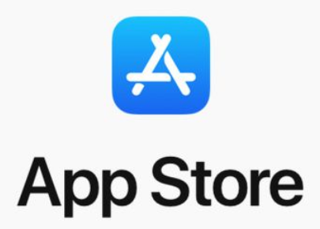
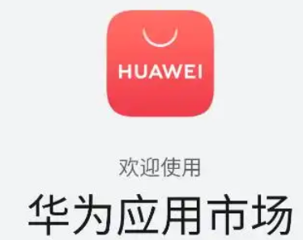
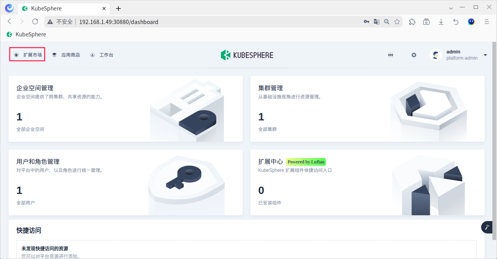
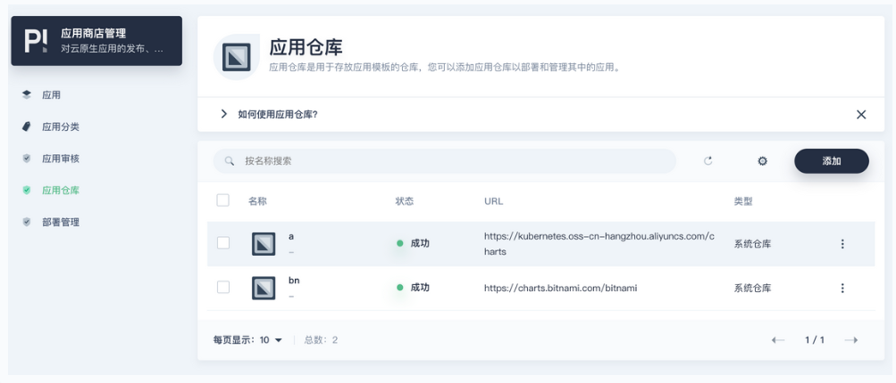

# KubeSphere V 4.x 应用商店

## 1. 应用商店简介

KubeSphere 的应用商店是全局的"应用程序池"。它提供了一个高效的集成系统，能够一站式上传、测试、安装、发布、升级和下架应用，只需点击几下即可完成这些操作‌。

  

## 2. 应用商店管理扩展组件

KubeSphere V 4.x 默认启用应用商店，之前的 KubeSphere V 3.4  需要手动启用应用商店，方法可参看 [官方文档](https://kubesphere.io/zh/docs/v3.4/pluggable-components/app-store/) 。

KubeSphere 4.x 为了保持核心的简洁，默认移除了内置商店内的应用，因此默认商店会一个应用也没有。

KubeSphere V 4.x 的应用商店可以通过从"扩展市场"中提供的"应用商店管理"这个扩展组件来管理(例如：添加应用仓库)。

## 3. 添加应用仓库

点击 KubeSphere 首页的  省略号，可找到所有已经添加过的扩展组件，选择"应用商店管理"扩展组件即可添加应用仓库。

常用的应用仓库地址：

~~~markdown
bitnami - https://charts.bitnami.com/bitnami
aliyun - https://kubernetes.oss-cn-hangzhou.aliyuncs.com/charts
~~~

添加过程中若出现如下报错：

~~~markdown
Get "https://charts.bitnami.com/bitnami/index.yaml": dial tcp: lookup charts.bitnami.com on 10.96.0.10:53: server misbehaving
~~~

排查和解决方法：

第一步，查看 kube-dns 和 coreDNS ，kube-dns 实现服务发现和域名解析，coreDNS 是 K8s 专用的 DNS 服务器。

~~~markdown
# 查看名为 "kube-dns" 的serice
# 查看名为 "coredns" 的deploy
# 查看名为 "coredns" 的配置
kubectl describe cm coredns -n kube-system
- DNS 端口号为 53
- forward . /etc/resolv.conf
  将未能解析的 DNS 请求转发给 /etc/resolv.conf 文件中配置的DNS服务器。
~~~

第二步，查看所有节点的 DNS配置

~~~markdown
# 检测每个节点的 resolv.conf 文件
cat /etc/resolv.conf

- 显示"nameserver fe80::1%enp0s3"，其中fe80::1是本地IPv6链路地址，enp0s3是网卡配置文件。K8s的calico网络插件默认仅支持IPV4的IP。
yum install bind-utils -y
dig +short baidu.com -4
~~~

第三步，修改节点的 resolv.conf 文件 

~~~sh
# 手动修改每个节点的 resolv.conf 文件
vim /etc/resolv.conf
nameserver 114.114.114.114
	
# 改完后极有可能在重启后又被自动修改成初始状态。
vim /etc/sysconfig/network-scripts/ifcfg-enp0s3
# 脱离 network 服务的管理(network是CentOS 6及更早版本使用的网络管理方式)
PEERDNS=no
# 脱离 NetworkManager 服务的管理 (NetworkManager是CentOS 7之后版本使用的网络管理方式)	
NM_CONTROLLED=no
# 重启网络服务
service network restart 
~~~

第四步，重启 coreDNS。

~~~markdown
kubectl rollout restart deploy coredns -n kube-system
~~~

## 4. 导入应用到商店

这里说的导入应用到商店，指的是将公用的 repo 源中的 chat 应用存储到应用商店，真正实现让 "应用商店" 不再空白！[app-tool](https://github.com/kubesphere-extensions/app-tool) 工具可帮助我们实现这个效果。

app-tool 的安装需要先配置好 GO 的环境，如下：

~~~markdown
# 下载安装包
https://golang.google.cn/dl/
# 解压缩
sudo tar -C /usr/local -xzf go1.23.2.linux-amd64.tar.gz
# 环境变量
echo 'export PATH=$PATH:/usr/local/go/bin' >> ~/.bash_profile && \
echo 'export GOPATH=$HOME/go' >> ~/.bash_profile && \
source ~/.bash_profile
# 测试
go version
~~~

app-tool 的安装，如下：

~~~markdown
# 创建service account
kubectl apply -f token.yaml
# 获取token
token=$(kubectl get secrets $(kubectl get serviceaccounts.kubesphere.io app-tool -n default -o "jsonpath={.secrets[].name}") -n default -o jsonpath={.data.token} | base64 -d)
# 执行导入
go run main.go --server=http://192.168.1.56:30880 \
--token=${token}  \
--repo=https://kubernetes.oss-cn-hangzhou.aliyuncs.com/charts
# 导入时发生"go包管理代理网址无法访问"时，执行如下代码：
go env -w GOPROXY=https://goproxy.cn
~~~

最后请注意：如果只是要从 repo 源使用 chat 应用，配置仓库地址即可, 不必用这个工具！

