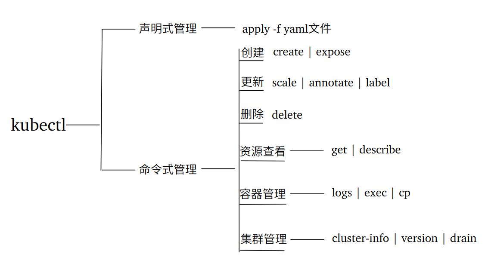

# Kubectl 命令指南

## 1. 认识kubectl

kubectl 是 kubernetes 集群的**命令行工具**。
kubectl 用于跟 apiserver(集群访问的入口) 进行通信，将用户的命令组织并转化为 apiserver 能识别的信息，进而实现管理 k8s 的各种资源。

~~~markdown
- 命令格式
kubectl [command] [type] [name] [flags]

- 命令说明
comand：指定要对资源执行的操作，例如create、get、delete等等
type：指定资源类型，比如deployment、pod、service，可以指定单数、复数和缩写形式
name：指定资源的名称，名称大小写敏感
flags：指定额外的可选参数

- 命令举例：
# 查看所有node
kubectl get nodes / kubectl get node / kubectl get no
# 查看某个pod
kubectl get pod pod名字
# 查看所有pod,以"宽屏"格式展示结果
kubectl get pod -o wide
~~~

## 2. 认识 kubernetes 资源

这一部分，针对 kubectl 命令的 "type" 部分展开讲解。
kubernetes 中所有的内容都抽象为资源，可以通过下面的命令进行查看:

~~~markdown
# 查看所有资源
kubectl api-resources
~~~

结果各个列的含义说明如下

| NAME       | SHORTNAMES     | APIVERSION | NAMESPACED         | KIND       |
| ---------- | -------------- | ---------- | ------------------ | ---------- |
| 资源的名称 | 资源的简写名称 | 资源的版本 | 可否用命名空间隔离 | 资源的类型 |

特别说明：用命名空间隔离的资源，操作该资源时需要增加 -n 参数指定所属的命名空间名字。

## 3. 对资源的操作

这一部分，针对 kubectl 命令的 "comand" 部分展开讲解。

###### 根据具体的资源管理办法，对资源的操作又可以分：

 

### 3.1 命令式管理

命令式管理，顾名思义即编写命令直接管理资源。学习和测试的场景下使用频繁。[社区中文文档](http://docs.kubernetes.org.cn/)

#### 3.1.1 创建

~~~markdown
# 定义一个Deployment(自动新建pod)来运行Nginx
kubectl create deploy my-nginx --image=nginx:latest
# 对外暴露Nginx(自动新建service)
kubectl expose deploy my-nginx --port=80 --type=NodePort
~~~

#### 3.1.2 资源查看

常用的包括 get 、describe。get用于查看资源当前的状态，describe用于查看资源的详细信息。

~~~markdown
# 查看my-nginx的pod状态
kubectl get pod | grep my-nginx
# 查看my-nginx的service状态
kubectl get svc my-nginx
# 查看my-nginx的pod详细信息
kubectl describe pod my-nginx
# 查看my-nginx的service详细信息
kubectl describe svc my-nginx
~~~

#### 3.1.3 容器管理

常用的包括 logs 、exec和cp。

~~~markdown
# logs 查看pod的容器日志，如果pod中仅一个容器，可省略容器名称
kubectl logs -f pod名 [-c container名]
# exec 进入nginx-container的容器内
kubectl exec -it pod名 [-c container名] -- /bin/bash

# cp 用于pod和外部的文件交换，该命令依赖于容器镜像中的“tar”命令
yum update && yum install tar -y
tar --version

# pod中容器的文件复制到本地(tar默认相对路径，而不是绝对路径；自动创建不存在的目录)
kubectl cp pod名:source local [-c container名] 
# 本地的文件复制到pod中容器
上一条命令交换 source 和 local 位置即可
~~~

### 3.2 声明式管理

声明式管理，是通过YAML文件直接配置和管理资源。YAML是一种简洁的非标记性语言，实战中多以此方式管理集群。

定义Deployment：

~~~yaml
# api的版本，通过 "kubectl api-versions" 查看当前K8s可用的版本列表
apiVersion: apps/v1
# 资源类型，通过 "kubectl api-resources" 可查看
kind: Deployment
# 资源的元数据
metadata:
  # 资源的标签
  labels:
    app: my-nginx
  # 资源名	
  name: my-nginx
  # 资源所在命名空间(默认default)
  namespace: default  
# 资源的规格(资源详细配置)	  
spec:
  # 副本数量(默认1)
  replicas: 1
  # 标签选择器
  selector:
    # 匹配标签，需与上面的标签定义的app保持一致
    matchLabels:
      app: my-nginx  
  # 模板
  template:
    # 模板元数据
    metadata:
      # 模板的标签
      labels:
        app: my-nginx
    # 模板详细配置
    spec:
      # Pod容器列表
      containers:
        # 容器名字
        - name: nginx-container
        # 容器镜像
          image: nginx:latest
        # 容器暴露的端口列表  
          ports:
          - containerPort: 80
~~~

暴露Nginx服务：

~~~yaml
# api的版本，通过 "kubectl api-versions" 查看当前K8s可用的版本列表
apiVersion: v1
# 资源类型，通过 "kubectl api-resources" 可查看
kind: Service
# 资源的元数据
metadata:
  # 资源名	
  name: my-nginx
  # 资源所在命名空间(默认default)
  namespace: default  
# 资源的规格(资源详细配置)	  
spec:
  # 服务类型
  type: NodePort
  # 标签选择器(据此与 my-nginx Deployment关联)
  selector:
    app: my-nginx  
  # 服务的端口列表
  ports:
    # 服务监听的容器端口
    - port: 80
    # 服务端口
      targetPort: 80  
    # 节点端口(默认在30000~32767自动分配)  
      nodePort: 30080     
~~~

使用命令快速生成YAML

~~~markdown
# 试运行
kubectl create deploy my-nginx --image=nginx:latest --dry-run=client -o yaml
kubectl expose deploy my-nginx --port=80 --type=NodePort --dry-run=client -o yaml
# 导出已运行
kubectl get deploy my-nginx -o yaml > nginx.yaml
~~~

