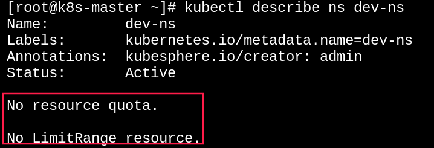
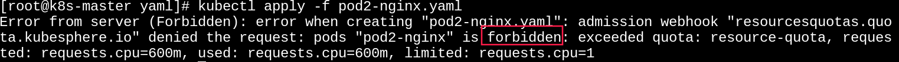

# K8s的资源配额与限制

## 1. 为什么需要资源限制

K8s 中的计算资源(CPU、内存)、存储资源(PV持久卷)等，都是有限的资源。这些有限资源在多用户共享的情况下，需要进行合理的规划，避免过度使用影响集群的性能和稳定。

~~~shell
kubectl describe ns <namespace>
# Kubesphere操作路径：当前集群 -> 项目 -> 指定项目 -> 配额
~~~

 

K8s提供了 **ResourceQuota** 和 **LimitRange** 两种资源限制机制。

## 2. 资源配额

ResourceQuota 是 K8s 中的"资源配额对象"，缩写为"quota"。用于限制命名空间（Namespace）中资源的使用量。如果请求的资源超过了配额限制，请求将会被拒绝，并返回" Forbidden "的错误。

需要注意的是：

~~~markdown
- 命名空间与ResourceQuota对象的关系可以是一对多关系，也可以是一对一关系。
- 对命名空间设置CPU、内存配额后,创建Pod时必须指定CPU和内存资源限制，否则出现Forbidden
- 事先创建的资源不受 ResourceQuota 的限制
~~~

ResourceQuota 的 YMAL 模板，例如：

~~~yaml
apiVersion: v1
kind: ResourceQuota
metadata: 
  name: resource-quota
  # 绑定的命名空间
  namespace: pro-ns
spec:
  hard: 
    # 命名空间中允许的最大Pod数量
    pods: "10"
    # 命名空间中允许的最大Service数量         
    services: "5" 

    # 命名空间中给所有Pod启动预留的CPU总量。核=1000m(m-毫核)，表示一个CPU内核被分成1000等份
    requests.cpu: "1"
    # 命名空间中给所有Pod启动预留的内存总量。1Gi=1024Mi，Gi、Mi表示字节单位
    requests.memory: "1Gi"
    # 命名空间中所有Pod运行使用的CPU上限，最佳实践：limits = requests * 2
    limits.cpu: "2"
    # 命名空间中所有Pod运行使用的内存上限          
    limits.memory: "2Gi"

    # 命名空间中允许的最大ReplicationControlle数量
    replicationcontrollers: "2"
    # 命名空间中允许的最大ResourceQuota数量
    resourcequotas: "1"
    # 命名空间中允许的最大Secret数量
    secrets: "10"
    # 命名空间中允许的最大PersistentVolumeClaim数量
    persistentvolumeclaims: "4" 
    # 允许的最大LoadBalancer类型的Service数量
    services.loadbalancers: "1"
~~~

~~~shell
# 将命名空间和ResourceQuota对象进行绑定
kubectl apply -f resource-quota.yaml
# 查看命名空间的资源配额
kubectl describe ns pro-ns
# 在命名空间中创建新的Pod(超限演示)
kubectl apply -f pod-nginx.yaml
      #容器资源配额
      resources:
        # 预留资源，默认则与上限的设置一致
        requests:
          memory: "400Mi"
          cpu: "600m"
        # 上限资源，默认则无限制  
        limits:
          memory: "600Mi"
          cpu: "800m"                  
# 删除命名空间和ResourceQuota对象的绑定
kubectl delete -f resource-quota.yaml
~~~

资源配额在 Kubesphere 的操作路径： 当前集群 -> 项目 -> 指定项目 -> 更多操作 -> 编辑项目配额

## 3. 默认配额

如果 Pod 的非常多，并且很多 Pod 的资源配额又是一致的情况下，像上面那样一个一个的添加 resources 就显得非常繁琐。这时候，我们可以通过 LimitRange(缩写为"limits") 对某个指定的命名空间的资源定义全局的、默认的限制规则。

值得注意的是

~~~markdown
- 命名空间与LimitRange对象的关系可以是一对多关系，也可以是一对一关系。
- LimitRange 的限制优先级低于资源中YAML中定义的 resources 限制
~~~

~~~yaml
apiVersion: v1
kind: LimitRange
metadata:
  name: limit-range
  # 绑定的命名空间
  namespace: pro-ns 
spec:
  limits:
  # 容器类型
  - type: Container     
    # 预留资源。对应容器里的resources.requests，只适用于Container
    defaultRequest:      
      memory: "500Mi"
      cpu: "500m"
    # 上限资源。对应容器里的resources.limits，只适用于Container
    default:
      memory: "1Gi"    
      cpu: "1"  
  # Pod类型      
  - type: Pod
    # pod中所有容器可用的资源最大值
    max:
      memory: "2Gi"
      cpu: "2"      
    # pod中所有容器可用的资源最小值
    min:
      memory: "1Gi"
      cpu: "1"   
~~~

~~~shell
# 将命名空间和LimitRange对象进行绑定
kubectl apply -f limit-range.yaml
# 查看命名空间的资源限制
kubectl describe ns pro-ns
# 在命名空间中创建新的Pod(min未达标、超过quota)
kubectl apply -f pod-nginx.yaml 
# 删除命名空间和LimitRange对象的绑定
kubectl delete -f limit-range.yaml
~~~

在 Kubesphere 的操作路径： 当前集群 -> 项目 -> 指定项目 -> 更多操作 -> 编辑默认容器配额。

