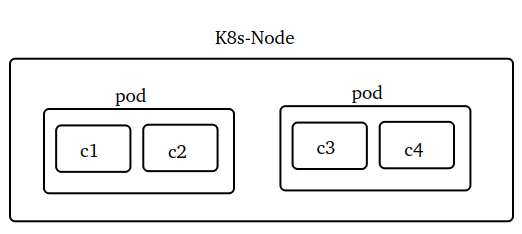
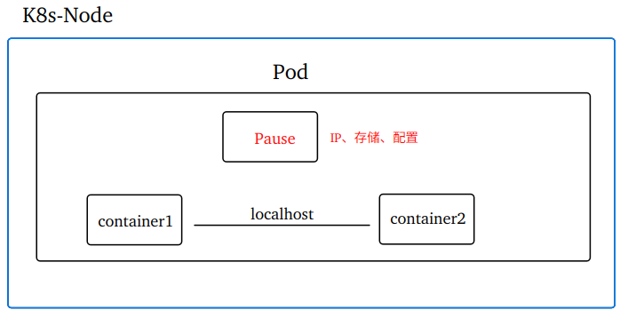
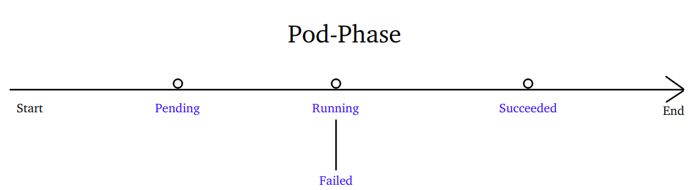
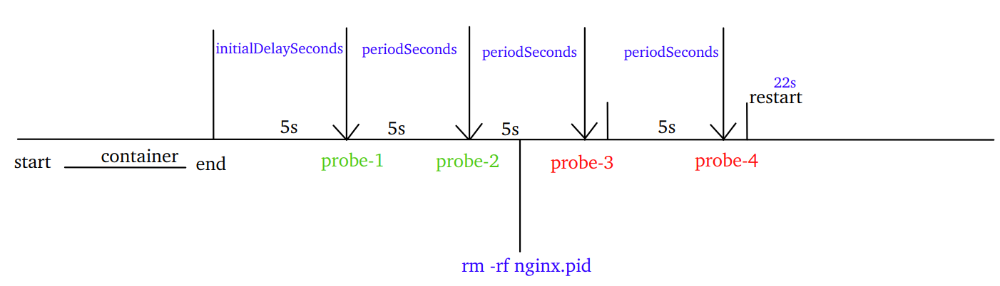
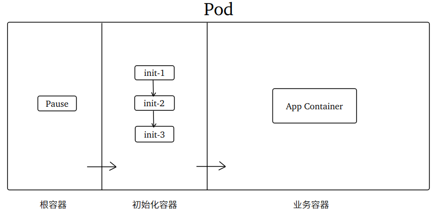

# Kubernetes  Pod

## 1. 什么是Pod

Pod，中文译作"豆荚"。Pod 是 k8s 中可以创建和管理的最小单元。k8s 直接编排和调度处理的是 Pod 而非 Container。

Pod 中可包含一个或多个 Container，Pod 里面定义的容器数量随场景而不同。一个 Pod 运行一个容器，常见于微服务场景；一个 Pod 运行多个容器，常见于日志收集、监控系统场景。

## 2. 为什么需要Pod

~~~shell
# 每个docker的容器都处于独立的进程
docker inspect mysql8 | grep Pid
# 每个docker的容器都会分配不同的IP
docker inspect mysql8 | grep IPAddress
~~~

Pod 中的所有 Container 可以共享存储、共享网络、共享配置等。这些共享都是依赖于一个叫做 "Pause" 的根容器实现的。Pause 容器永远是 Pod 中第一个创建的容器，为其他的容器提供基础设施(命名空间、挂载卷等等，因此也叫做 infra 容器），其他容器的进程作为 Pause 容器的子进程共享这些基础设施。

 

~~~shell
#查看dev-ns空间下的所有pod
kubectl get po -n dev-ns  
#进入pod的nginx容器，且查看容器的IP地址
kubectl exec -it pod-test -c container-nginx -n dev-ns -- hostname -i
#进入pod的alpine容器，且查看容器的IP地址
kubectl exec -it pod-test -c container-alpine -n dev-ns -- hostname -i
#进入alpine容器后安装curl命令，并访问本地的80端口
kubectl exec -it pod-test -c container-alpine -n dev-ns -- sh
apk add --no-cache curl -> curl localhost:80
~~~

## 3. Pod的生命周期

Pod 对象**从创建至终止**之间**的时间段**称为其生命周期。这段时间里的某个时间点，Pod 会处于某个特定的运行阶段( phase)，也叫相位 。包含5个相位，分别是：

 

~~~markdown
- Pending：悬决。Pod已被创建但尚未调度到具体Node上，或者仍处于下载镜像的过程
- Running：运行。Pod已经完成调度，其中至少有一个容器正处于启动、重启、运行状态之中
- Failed：失败。Pod中至少存在一个容器以非0状态码退出或已被系统终止
- Succeeded：成功。Pod中的所有容器都已经成功终止且不会再重启，常见于一次性Job的情况
- Unknown：未知。无法正常获取到Pod对象的状态信息(无法与所在节点的kubelet通信所致)
~~~

~~~shell
kubectl explain pod.status.phase
~~~

需要注意的是，相位仅是对 Pod 生命周期的概括性描述，它可以成为 Pod 某个时刻的 status。但是 status 并非仅仅是相位值，可以是其他的值。例如：

~~~markdown
- Terminating：当删除一个Pod或者缩容一个副本数大于1的Deployment时,Pod进入Terminating状态
- ErrImagePull：无法从配置的镜像仓库中拉取(pull)容器镜像
- ContainerCreating：Pod容器正在创建中
- CrashLoopBackOff：Pod可能会因为频繁的重启导致资源耗尽进入该状态
~~~

## 4. 定义Pod

Pod 按创建方式，划分为 "静态Pod" 和 "普通Pod"两种类型：
普通 Pod 是指使用诸如 Deployment 、Job 这类的工作负载创建的，也是最常用创建 Pod 的方式；

静态 Pod 由 kubelet 负责创建和管理，采用 YAML 方式定义的 Pod 就属于这种方式。

~~~yaml
apiVersion: v1
kind: Pod
metadata:
  name: Pod的名字,同一个namespace中应确保name唯一
  namespace: Pod的命名空间，缺省则为default
  labels: Pod的标签
    app: myapp
spec: Pod的规格(详细配置)
~~~

~~~shell
kubectl explain pod.metadata.name
~~~

## 5. Pod重启策略

Pod 重启策略应用于Pod内的所有容器，当某个容器异常退出或者健康检查失败时，将根据重启策略的设置来进行相应操作。

~~~yaml
spec: Pod的规格(详细配置)
  restartPolicy: 重启策略
~~~

~~~shell
kubectl explain pod.spec.restartPolicy
~~~

重启策略有三个可选的值，分别是：

~~~markdown
# Always
默认值。容器退出时(正常或异常)，总是自动重启该容器
# OnFailure
当容器终止运行且退出码不为0时(异常退出)，自动重启该容器
# Never
不论容器运行状态如何，都不重启该容器
~~~

~~~shell
docker stop container_id	# 正常停止容器
docker kill container_id    # 强制停止容器
docker ps -a 				# STATUS中反馈了退出容器的代码
~~~

## 6. Pod容器配置

Pod 中容器的相关配置项都包含在 `spec.containers` 中。

### 6.1 定义容器镜像

定义Pod 容器镜像的配置：

~~~yaml
spec:
  containers:
    - name: 容器名1,同一个pod中唯一
      image: 容器镜像1
      ...
    - name: 容器名2,同一个pod中唯一
      image: 容器镜像2
      ...  
~~~

~~~shell
kubectl explain pod.spec.containers.name | kubectl explain pod.spec.containers.image
~~~

### 6.2 镜像拉取策略

Pod 中的容器可以根据情况配置不同的镜像拉取策略，具体配置项如下：

~~~yaml
spec:
  containers:
    - name: 容器名
      image: 容器镜像:tag
      imagePullPolicy: 镜像拉取策略
~~~

~~~shell
kubectl explain pod.spec.containers.imagePullPolicy
~~~

镜像拉取策略有三个可选的值，分别是：

~~~markdown
# Always
每次创建Pod都只去远程仓库拉取镜像。默认值(tag:latest)。
# IfNotPresent
每次创建Pod先从本地拉取镜像，否则就去远程仓库拉取镜像。默认值(tag:not latest)。
# Never
每次创建Pod都只从本地仓库拉取镜像。
~~~

友情提示：

~~~markdown
# 生产环境不建议镜像的tag设为latest，因为拉取镜像的过程非常影响部署效率
~~~

### 6.3 容器端口

这个部分，必须先弄清楚容器端口的作用。以 Docker 容器端口举例：

~~~markdown
- Docker容器端口是简单一对一映射，主要用于将外部请求路由到特定容器
docker run -itd -p 80:80 --name=nginx nginx:1.26.2
~~~

Pod 中的容器则不依赖于宿主机的端口映射，可实现跨节点的 Pod 间通信。

~~~yaml
spec:
  containers:
    - name: 容器名
      image: 容器镜像
      ports: 容器端口(列表)
        - name: 端口名字
          containerPort: 端口的值
          protocol: 端口协议。默认TCP，可选TCP或UDP或SCTP(流控制传输协议)
#简写：  - containerPort: 端口的值        
~~~

~~~shell
kubectl explain pod.spec.containers.ports

# k8s-node1 Pod IP 10.244.36.106
# k8s-node2 上执行如下命令
curl 10.244.36.106:80
~~~

Pod 中的容器端口无法将外部请求直接路由到特定容器，需要依赖 Service 提供对外服务的统一入口。

### 6.4 环境变量

这部分与 Docker 环境变量类似，举例：

~~~yaml
spec:
  containers:
    - name: 容器名
      image: 容器名镜像
      env:
        #环境变量1
        - name: 环境变量名1
          value: 环境变量值1
        #环境变量2
        - name: 环境变量名2
          value: 环境变量值2
~~~

### 6.5 存储卷

存储卷(volumes)，是 Pod 中能够被多个容器访问的共享目录，与 Docker 中的数据卷概念比较类似，但二者不能等价。

~~~markdown
- 使用范围不同：Docker的volumes可供所有容器使用，Pod的volumes默认仅供本Pod中的容器使用
- 分类不同：Docker的volumes类型比较简单(命名卷、匿名卷、绑定挂载)，Pod的volumes分类较多，适合于不同场景使用
~~~

~~~yaml
spec:
  volumes: 存储卷
    - name: 存储卷的名字
      hostPath: 存储卷的类型。hostPath类似Docker的绑定挂载
        path: 节点路径
        type: 配置hostPath卷的字段，如：Directory、File、DirectoryOrCreate、FileOrCreate
  containers:
    - name: 容器名
      image: 容器镜像
      volumeMounts: 使用存储卷
        - name: 引用volumes.name
          mountPath: 容器路径
~~~

~~~shell
kubectl explain pod.spec.volumes
kubectl explain pod.spec.volumes.hostPath.type
~~~

### 6.6 自定义命令

某些容器没有指定"Entrypoint"(在容器启动时执行的命令)，导致没有一个可持续运行的前台程序，这样的容器启动后就会立即退出。

~~~shell
docker inspect alpine:3.7 | grep Entrypoint
docker run --name myalpine alpine:3.7
docker ps -a --format "table {{.Names}} {{.Status}}" | grep myalpine
~~~

command 用于指定进入容器后执行的自定义命令，可替代默认的容器命令。
举例：

~~~yaml
spec:
  containers:
    - name: 容器名
      image: 容器名镜像
      #容器自定义运行的命令
      command: ["/bin/sh","-c","while true; do sleep 1; done;"]
~~~

### 6.7 容器的资源配额

关于资源配额的基础知识，在前面的视频"**K8s的资源配额与限制**"已做过讲解，本节不再赘述

~~~yaml
spec:
  containers:
    - name: 容器名
      image: 容器名镜像
      #当前容器的资源配额
      resources:
        #启动时的资源配额预留
        requests:
          cpu: "200m"
          memory: "200Mi"
        #运行时的资源配额上限 
        limits:
          cpu: "400m"
          memory: "400Mi"
~~~

## 7. 容器探针

当 Pod 处于运行状态时，可以使用 **探针**(Probe) 对容器的健康状态进行检查，探针一词的由来，是借用了医学领域的"穿刺"诊断(刺入腔体提取腔液或注入检测液)，探针就是从容器外部对容器内部的应用程序进行诊断。

### 7.1 探针类型

探针分三种类型：

| 探针类型                          | 探测作用                 | 探测次数                   | 探测失败后的措施                    |
| --------------------------------- | ------------------------ | -------------------------- | ----------------------------------- |
| livenessProbe(存活探针或活性探针) | 容器是否运行正常         | 伴随容器的生命周期定期探测 | 据 restartPolicy 策略执行重启       |
| readinessProbe(就绪探针)          | 容器是否进入就绪状态     | 伴随容器的生命周期定期探测 | 把 Pod 从 Service 的Endpoint 中剔除 |
| startupProbe(启动探针)            | 容器内的应用是否成功启动 | 仅在容器启动时探测一次     | 据 restartPolicy 策略执行重启。     |

~~~markdown
- 注意1：Pod启动成功后(活性探针成功)，若Pod中的服务进程还未初始化完成，来自Service的外部流量就会请求失败。就绪探针就是解决这个问题的。
- 注意2：startupProbe 探测成功之前，其他探针被禁用。
~~~

每种探针的探测结果包含三种：

- Success：探测成功
- Failure：探测失败
- Unknown：无法探测
- 注意：若容器不提供任何探针，则三种探针的默认状态均为Success。

三种探针的各自使用场景：

- 存活探针：如果容器遇到问题时无法自行崩溃，例如：容器内部的应用发生死锁，而容器的状态仍然为正常，这时候是无法提供服务的，可以使用存活探针并指定restartPolicy不是Nerver。

- 就绪探针：如果希望仅在探测成功之后，才向Pod的容器发送流量，可以使用就绪探针。否则，Pod将在启动阶段就开始接收流量。

- 启动探针：如果容器中的应用初始化时间比较长(启动期间加载大型数据、配置文件或执行迁移)，为避免存活探针将容器错误的Kill掉，可以使用启动探针。

### 7.2 探测方式

每种探针的探测方式包含：

- exec：通过在容器内执行的Linux命令来进行探测，如果命令返回码为0，则认为探测成功，返回码非0则探测失败。`echo $?`
- httpGet：通过向容器的指定端口和路径发起HTTP GET请求，如果HTTP返回状态码为>=200且<400，则认为探测成功，返回状态码为4XX,5XX则探测失败。
- tcpSocket：通过向容器的指定端口发送tcp三次握手连接，如果端口正确却tcp连接成功，则认为探测成功，tcp连接失败则探测失败。

### 7.3 exec探测

~~~shell
# 创建probe-ns命名空间
kubectl create ns probe-ns
~~~

~~~yaml
apiVersion: v1
kind: Pod
metadata:
  name: liveness-exec
  namespace: probe-ns
  labels:
    app: myapp
spec:
  containers:
    - name: container-nginx
      image: nginx:1.26.2
      ports:
        - containerPort: 80        
      #存活探针
      livenessProbe:
        exec:
          #执行命令“cat /var/run/nginx.pid”对容器进行探测，命令成功会返回状态值0。
          command: ["cat","/var/run/nginx.pid"]
        #探测成功的最小次数，达到这个数值认为正常。默认值1，最小值1。存活和启动探测时值必须是1。 
        successThreshold: 1
        #探测失败的最小次数，达到这个数值会重启。默认值3，最小值1。
        failureThreshold: 2
        #首次探测前等待5秒，即首次探测是在容器启动后的第6秒开始。默认0秒，最小值0秒。
        initialDelaySeconds: 5
        #每5秒执行一次探测。默认10秒。最小值1秒。
        periodSeconds: 5
        #单次探测超时时间。默认1秒，最小值1秒。
        timeoutSeconds: 1
~~~

~~~shell
# 创建配置了存活探针的pod
kubectl apply -f liveness-exec.yaml
# 每隔1秒刷新watch的数据
watch -n 1 kubectl get po liveness-exec -n probe-ns

# 进入liveness-exec的container-nginx容器并手动删除/var/run/nginx.pid
kubectl exec -n probe-ns -it liveness-exec -c container-nginx -- rm -rf /var/run/nginx.pid
~~~

### 7.4 httpGet探测

~~~yaml
apiVersion: v1
kind: Pod
metadata:
  name: liveness-httpget
  namespace: probe-ns
  labels:
    app: myapp
spec:
  containers:
    - name: container-nginx
      image: nginx:1.26.2
      ports:
        - containerPort: 80      
      #存活探针
      livenessProbe:
        httpGet:
          #请求的主机。
          host: 默认Pod的IP
          #请求的路径。
          path: /index.html
          #请求的端口。
          port: 80
          #协议类型，支持HTTP和HTTPS，默认HTTP，注意大写。
          scheme: HTTP
        #探测成功的最小次数，达到这个数值认为正常。默认值1，最小值1。存活和启动探测时值必须是1。 
        successThreshold: 1
        #探测失败的最小次数，达到这个数值会重启。默认值3，最小值1。
        failureThreshold: 2
        #首次探测前等待5秒，即首次探测是在容器启动后的第6秒开始。默认0秒，最小值0秒。
        initialDelaySeconds: 5
        #每5秒执行一次探测。默认10秒。最小值1秒。
        periodSeconds: 5
        #单次探测超时时间。默认1秒，最小值1秒。
        timeoutSeconds: 1
~~~

~~~shell
# 创建配置了存活探针的pod
kubectl apply -f liveness-httpget.yaml
# 每隔1秒刷新watch的数据
watch -n 1 kubectl get po liveness-httpget -n probe-ns

# 进入liveness-httpget的container-nginx容器并手动删除 index.html
kubectl exec -n probe-ns -it liveness-httpget -c container-nginx -- rm -rf /usr/share/nginx/html/index.html
~~~

### 7.5 tcpSocket探测

~~~yaml
apiVersion: v1
kind: Pod
metadata:
  name: liveness-tcpsocket
  namespace: probe-ns
  labels:
    app: myapp
spec:
  containers:
    - name: container-nginx
      image: nginx:1.26.2
      ports:
        - containerPort: 80      
      #存活探针
      livenessProbe:
        tcpSocket:
          #请求的主机。
          host: 默认Pod的IP
          #请求错误的端口，引发重启。
          port: 81
        #探测成功的最小次数，达到这个数值认为正常。默认值1，最小值1。存活和启动探测时值必须是1。 
        successThreshold: 1
        #探测失败的最小次数，达到这个数值会重启。默认值3，最小值1。
        failureThreshold: 2
        #首次探测前等待5秒，即首次探测是在容器启动后的第6秒开始。默认0秒，最小值0秒。
        initialDelaySeconds: 5
        #每5秒执行一次探测。默认10秒。最小值1秒。
        periodSeconds: 5
        #单次探测超时时间。默认1秒，最小值1秒。
        timeoutSeconds: 1
~~~

~~~shell
# 创建配置了存活探针的pod
kubectl apply -f liveness-tcpsocket.yaml
# 每隔1秒刷新watch的数据
watch -n 1 kubectl get po liveness-tcpsocket -n probe-ns
~~~

## 8. init容器

init 容器称为"初始化"容器。一个 Pod 中可包含0个至多个 init 容器。

init 容器特点:

- init 容器不支持探针，因为 init 完成后就退出再也不运行了

- init 容器启动失败会不断重启Pod，直至 init 启动成功或被系统终止，除非restartPolicy=Never
- 多个 init 容器存在的话，它们会顺序执行而非同时执行，前一个必须在后一个启动前正常退出(退出码0)
- init 容器具有与业务容器分离的单独镜像，业务容器在 init 容器之后才启动。因此 init 容器可提供阻塞或延迟业务容器启动的方法，直到满足了某些先决条件

~~~yaml
apiVersion: v1
kind: Pod
metadata:
  # Pod名字:pod-init-container
  name: pod-init-container
  # Pod命名空间:init-ns
  namespace: init-ns
  labels:
    app: myapp
spec:
  restartPolicy: Always
  # 业务容器
  containers:    
    - name: container-nginx
      image: nginx:1.26.2
      ports:
        - containerPort:  80
  # 初始化容器  
  initContainers:
    - name: init-c1
      image: alpine:3.7
      # init 容器可提供阻塞或延迟
      command: ["/bin/sh","-c","while true;do sleep 300;done;"]
~~~

~~~shell
# 创建命名空间init-ns
kubectl create ns init-ns
# 应用init-container.yaml文件
kubectl apply -f pod-init-container.yaml
# 每隔1秒监视Pod的状态
watch -n 1 kubectl get po pod-init-container -n init-ns
~~~

init 容器的运用场景：

- 控制资源的前后运行顺序，例如：Pod 需要 Service 来为它分发外部流量、后端服务运行于数据库服务之后等等

  ~~~yaml
  # 初始化容器  
  initContainers:
    - name: init-c1
      image: alpine:3.7
      # 没有nginx-svc的service则无法退出init，导致业务容器也不会启动
      command: ["/bin/sh","-c","until nslookup nginx-svc;do sleep 5;done;"]
  ~~~
  
  ~~~yaml
  apiVersion: v1
  kind: Service
  metadata:
    name: nginx-svc
    namespace: init-ns
  spec:
    selector:
      app: myapp
    type: NodePort
    ports:
      - port: 80
        targetPort: 80
        nodePort: 30080
  ~~~
  
- 应用容器启动需要的相关依赖包，例如：Tomcat 容器启动需要发布的 WAR 包

  ~~~shell
  # 创建mydockerfile目录且进入该目录
  mkdir ./mydockerfile && cd ./mydockerfile
  # 在mydockerfile目录中创建Dockerfile
  vim Dockerfile
      FROM alpine:3.7
      WORKDIR /workdir
      COPY ./javaweb.war /workdir
  # 构建 tomcat/war 镜像
  docker build -t tomcat/war:1.0.0 .
  # 镜像保存和迁移
  docker save -o tomcat-war-1.tar tomcat/war:1.0.0
  scp tomcat-war-1.tar root@k8s-node1:/root/
  scp tomcat-war-1.tar root@k8s-node2:/root/
  # 加载镜像
  cd /root/ && docker load -i tomcat-war-1.tar
  ~~~

  ~~~yaml
  apiVersion: v1
  kind: Pod
  metadata:
    # Pod名字:pod-init-container
    name: pod-init-container
    # Pod命名空间:init-ns
    namespace: init-ns
    labels:
      app: myapp
  spec:
    restartPolicy: Always
    # Pod临时存储卷
    volumes:
      - name: vol-tomcat
        # 一个emptyDir就相当于Node上的一个空目录
        emptyDir: {}      
    # 业务容器
    containers:    
      - name: container-tomcat
        image: tomcat:9.0
        ports:
          - containerPort: 8080
        # 存储卷vol-tomcat  
        volumeMounts:
          - name: vol-tomcat
            mountPath: /usr/local/tomcat/webapps
    # 初始化容器  
    initContainers:
      - name: init-c1
        image: tomcat/war:1.0.0
        volumeMounts:
          - name: vol-tomcat
            mountPath: /war
        # 把init容器/workdir/javaweb.war 拷贝到 vol-tomcat 存储卷
        command: ["/bin/sh","-c","cp /workdir/javaweb.war /war;"]
  ~~~
  
  ~~~shell
  # 进入业务容器
  kubectl exec -n init-ns -it pod-init-container -c container-tomcat -- bash
  # 查看javaweb.war是否存在
  ls /webapps/javaweb.war
  # 创建一个Service对外暴露端口去测试访问
  apiVersion: v1
  kind: Service
  metadata:
    name: nginx-svc
    namespace: init-ns
  spec:
    selector:
      app: myapp
    type: NodePort
    ports:
      - port: 8080
        targetPort: 8080
        nodePort: 30088
  ~~~

## 9. 节点亲和性

节点亲和性表示可以指定节点去创建 Pod，而非 K8s 的默认调度。亲和性与多种因素有关，例如节点的剩余资源多寡、期望紧密相关的Pod落在同一个节点等等。

### 9.1 nodename

spec.nodename (节点的名字选择器) 可以让Pod在特定的节点上运行，若找不到匹配的节点，Pod将处于"Pending"状态(即无法被调度到节点上)。

~~~yaml
apiVersion: v1
kind: Pod
metadata:  
  name: node-name
  namespace: default
  labels:
    app: myapp
spec:
  # 节点的名字选择器
  nodeName: k8s-node1
  restartPolicy: Always  
  containers:    
    - name: container-nginx
      image: nginx:1.26.2
      ports:
        - containerPort: 80
~~~

### 9.2 nodeSelector

spec.nodeSelector (节点的标签选择器) 可以让Pod在具有特定 label 的节点上运行，若找不到匹配的节点，Pod将处于"Pending"状态(即无法被调度到节点上)。若多个节点都具有此特定的 label，最后的调度由 K8s来决定。

~~~shell
# 查看集群所有Node的labels
kubectl get nodes --show-labels
# 给指定节点增加一个自定义的labels(key=value)
kubectl label nodes k8s-node1 k8snode=node1
kubectl label nodes k8s-node2 k8snode=node2
# 删除指定节点自定义的labels
kubectl label nodes k8s-node1 k8snode-
kubectl label nodes k8s-node2 k8snode-
# 查看Pod运行在哪个节点上
kubectl get po node-selector -o wide
~~~

~~~yaml
apiVersion: v1
kind: Pod
metadata:  
  name: node-selector
  namespace: default
  labels:
    app: myapp
spec:
  # 节点的标签选择器
  nodeSelector:
    # 让Pod在特定label的节点上运行(key: value)，多个label关系是"并且"关系
    k8snode: node1
    author: laoli
  restartPolicy: Always  
  containers:    
    - name: container-nginx
      image: nginx:1.26.2
      ports:
        - containerPort: 80
~~~

### 9.3 affinity

affinity 即亲和性，分"Node亲和"与"Pod亲和"。affinity比前述的拥有更好的"表达"能力。

~~~yaml
apiVersion: v1
kind: Pod
metadata:  
  name: node-affinity
  namespace: default
  labels:
    app: myapp
spec:
  restartPolicy: Always  
  containers:    
    - name: container-nginx
      image: nginx:1.26.2
      ports:
        - containerPort: 80
  # 亲和性设定          
  affinity:
    # 节点亲和
    nodeAffinity:
      # 硬性策略(非指定的Node不可，不匹配则进入Pending)
      requiredDuringSchedulingIgnoredDuringExecution:
        # 节点的选择条件
        nodeSelectorTerms:
            # 匹配表达式，多个key之间是“并且”的关系
          - matchExpressions:
              - key: kubernetes.io/hostname
                # In(在内)、NotIn(不在内)、Exists、DoesNotExists、Gt、Lt
                operator: In
                values:
                  - k8s-node1
                  - k8s-node2
      # 软性策略(指定的Node最佳，其他Node也可以)
      preferredDuringSchedulingIgnoredDuringExecution:
          # 权重，1-100的范围。当存在多条软性规则时，权重代表着调度的优先级
        - weight: 1
          preference:
            matchExpressions:
              - key: kubernetes.io/hostname
                operator: In
                values:
                  - k8s-node3
~~~

~~~yaml
apiVersion: v1
kind: Pod
metadata:  
  name: node-affinity
  namespace: default
  labels:
    app: myapp
spec:
  restartPolicy: Always  
  containers:    
    - name: container-nginx
      image: nginx:1.26.2
      ports:
        - containerPort: 80
  # 亲和性设定          
  affinity:
    # Pod亲和
    podAffinity:
      # 硬性策略(非指定的Node不可，不匹配则进入Pending)
      requiredDuringSchedulingIgnoredDuringExecution:
          # Pod标签选择器
        - labelSelector:
            # 匹配表达式，多个key之间是“并且”的关系
            matchExpressions:
              - key: app
                operator: In
                values:
                  - myapp
           # 被调度到与亲和Pod有相同kubernetes.io/hostname标签的节点上        
           topologyKey: kubernetes.io/hostname            
      # 软性策略(指定的Node最佳，其他Node也可以)
      preferredDuringSchedulingIgnoredDuringExecution:
          # 权重，1-100的范围。当存在多个软性策略时，权重代表着调度的优先级
        - weight: 1
          # Pod选择条件
          podAffinityTerm:
            # Pod标签选择器
            labelSelector:
              # 匹配表达式，多个key之间是“并且”的关系
              matchExpressions:
                - key: app
                  # In(在内)、NotIn(不在内)、Exists、DoesNotExists、Gt、Lt
                  operator: In
                  values:
                    - myapp
            # 被调度到具有相同kubernetes.io/hostname标签的节点上        
            topologyKey: kubernetes.io/hostname
~~~

实战中，硬性策略和软性策略可结合使用，实现更准确的调度。例如：硬性策略定义调度到某个城市(北京、长沙)，软件策略调度到城市中的某个节点(长沙1节点、长沙2节点)。

### 9.4 反亲和

亲和性有助于保持相关工作负载的紧密耦合，比如将微服务的多个组件部署在一起以减少网络延迟。而反亲和性则避免在同一节点上部署两个"资源消耗大户"的应用实例。

前述提到的"NotIn"、"DoesNotExists"、"Gt和Lt"都是实现反亲和的手段，此处不再举例。

