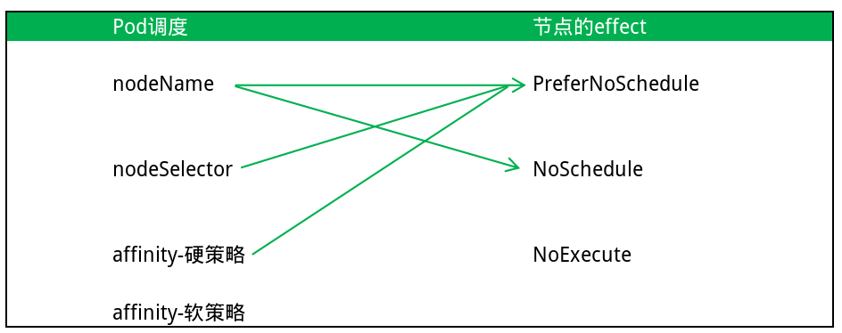

# Taint  &  Toleration

## 1. Taint

### 1.1 什么是Taint

taint，中文译作"污点"。taint 是 k8s 中用于标记 Node 局限性的，它可让 Pod 与 Node 产生排斥性。

~~~yaml
apiVersion: v1
kind: Pod
metadata:  
  name: pod-alpine
  namespace: default
  labels:
    app: myapp
spec:  
  restartPolicy: Always  
  containers:    
    - name: container-alpine
      image: alpine:3.7
      command: ["/bin/sh","-c","while true;do sleep 3600;done;"]
~~~

~~~shell
# 创建pod
kubectl apply -f pod-alpine.yaml
# 查看pod
kubectl get pod pod-alpine -o wide
# 查看node的taint
kubectl describe node <nodename> | grep Taints
~~~

### 1.2 创建和删除Taint

创建节点 taint 的格式为

~~~shell
kubectl taint node <nodename> key=[value]:effect
~~~

删除节点 taint 的格式为：

~~~shell
kubectl taint node <nodename> key=[value]:effect-
~~~

解释说明： 

~~~markdown
- key 污点的键
- value 污点的值(可设置为空)
- effect 污点的效果
- 创建 taint 的格式后，加一个"-"就表示删除
~~~

污点的效果：

~~~markdown
- PreferNoSchedule：尽量避免把Pod调度到具有该污点的Node上，除非没有其他节点可调度。"尽量不要来"
- NoSchedule：不会把Pod调度到具有该污点的Node上，但不影响Node上已存在的Pod。"不要来"
- NoExecute：不会把Pod调度到具有该污点的Node上，同时会将Node上已存在的Pod驱逐。"绝对不要来"
~~~

实验逻辑：

~~~markdown
- 1. 为k8s-node1定义污点： taint=:PreferNoSchedule
- 2. 创建pod并查看实际调度的节点
- 3. 为k8s-node2定义污点： taint=:NoSchedule
- 4. 重复第2步骤
- 5. 修改k8s-node1污点： taint=:NoExecute
- 6. 清除2个节点的所有污点 
~~~

参考代码：

~~~shell
1-
kubectl taint node k8s-node1 taint=:PreferNoSchedule
2-
kubectl apply -f pod-alpine.yaml
watch -n 1 kubectl get po pod-alpine -o wide
3-
kubectl taint node k8s-node2 taint=:NoSchedule
kubectl delete -f pod-alpine.yaml
5-
kubectl taint node k8s-node1 taint=:PreferNoSchedule-
kubectl taint node k8s-node1 taint=:NoExecute
6-
kubectl taint node k8s-node1 taint=:NoExecute- && kubectl taint node k8s-node2 taint=:NoSchedule-
~~~

### 1.3 Taint与Pod调度

通过诸如"nodeName"、"nodeSelector"、"affinity"等手段可以实现Pod的定向调度。定向调度代表Pod对节点的偏好，而taint代表着节点对Pod的偏好。当这两个设置出现冲突的时候，又是怎样的结果？

 

~~~yaml
apiVersion: v1
kind: Pod
metadata:  
  name: pod-alpine
  namespace: default
  labels:
    app: myapp
spec:  
  # 通过节点名定向调度到node1
  nodeName: k8s-node1
  restartPolicy: Always  
  containers:    
    - name: container-alpine
      image: alpine:3.7
      command: ["/bin/sh","-c","while true;do sleep 3600;done;"]
~~~

~~~shell
# node1污点：尽量不要来
kubectl taint node k8s-node1 taint=:PreferNoSchedule
# node1污点：不要来
kubectl taint node k8s-node1 taint=:NoSchedule
# node1污点：绝对要来
kubectl taint node k8s-node1 taint=:NoExecute
~~~

## 2.Toleration

### 2.1 什么是Toleration

toleration，中文译作"容忍"。与 taint 刚好相反，某些时候我们需要在有污点的节点上运行Pod，这种无视污点的调度方式称呼为容忍 (即使节点存在污点，也能容忍下来，依旧让其运行Pod)。

### 2.2 容忍的匹配策略

**精确匹配：**

~~~yaml
spec:
  # 定义容忍策略
  tolerations: 
      # Equal精确匹配，表示 key、value、effect必须写全
    - operator: Equal    
      # 污点的键。如果设置成 key: "" 代表任意的键值对
      key: taint     
      # 污点的值。
      value: ""          
      # 污点的效果，如果设置成 effect: "" 代表所有策略
      effect: NoSchedule 
~~~

**模糊匹配：**

~~~yaml
spec:
  # 定义容忍策略
  tolerations: 
      # Exists模糊匹配，表示 key、value、effect满足其中之一即可
    - operator: Exists    
      # 污点的键。如果设置成 key: "" 代表任意的键值对
      key: taint              
      # 污点的效果，如果设置成 effect: "" 代表所有效果
      effect: NoSchedule 
~~~

用于容忍测试的Pod

~~~yaml
apiVersion: v1
kind: Pod
metadata:  
  name: pod-alpine
  namespace: default
  labels:
    app: myapp
spec:  
  # 定义容忍策略
  tolerations:
    # Equal精确匹配
    - operator: Equal
      key: taint
      value: ""
      effect: NoSchedule
  restartPolicy: Always  
  containers:    
    - name: container-alpine
      image: alpine:3.7
      command: ["/bin/sh","-c","while true;do sleep 3600;done;"]
~~~

实验逻辑：

~~~markdown
- 1. 为k8s-node1定义污点： taint=:PreferNoSchedule
- 2. 为k8s-node2定义污点： taint=:NoSchedule
- 3. 创建pod并查看实际调度的节点
- 4. 修改pod 的容忍为： operator: Exists  effect: NoSchedule
     修改k8s-node2污点： taint=:PreferNoSchedule
- 5. 再次创建pod并查看实际调度的节点
- 6. 清除2个节点的所有污点
~~~

参考代码：

~~~shell
1-
kubectl taint node k8s-node1 taint=:PreferNoSchedule
2-
kubectl taint node k8s-node2 taint=:NoSchedule
3-
kubectl apply -f pod-alpine.yaml
watch -n 1 kubectl get po pod-alpine -o wide
kubectl delete -f pod-alpine.yaml
4-
kubectl taint node k8s-node2 taint=:NoSchedule- && kubectl taint node k8s-node2 taint=:PreferNoSchedule
6-
kubectl taint node k8s-node1 taint=:PreferNoSchedule- && kubectl taint node k8s-node2 taint=:PreferNoSchedule-
~~~

