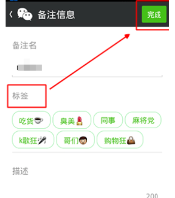
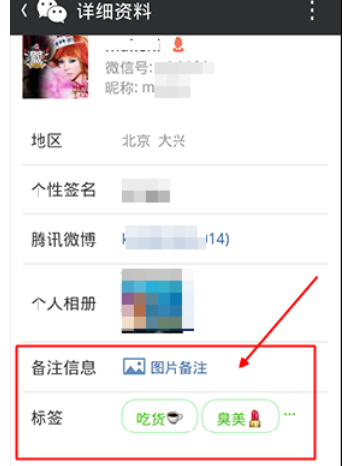
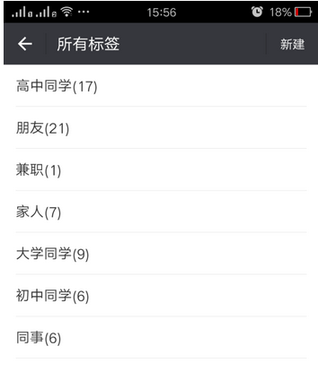

# Kubernetes Label

## 1. 什么是Label

标签，英文中叫"Label"。Label 是一种"键值对"信息， 用于**组织和筛选资源**。Label 可以被附加到 K8s 的资源对象上，它们之间是N：M的关系，即一个资源对象可以定义任意数量的 Label，同一个Label也可以被添加到任意数量的资源对象上。

  

## 2. Label的基本操作

### 2.1 创建和查看Label

以 Pod 资源为例，在YAML文件中可实现创建Label

~~~yaml
apiVersion: v1
kind: Pod
metadata:  
  name: nginx-pod
  namespace: default
  # 当前Pod的全部标签
  labels:
    # 应用标签
    app: myapp
    # 版本标签
    release: stable
    # 环境标签
    environment: prod
    # 架构标签
    tier: frontend
spec:  
  restartPolicy: Always  
  containers:    
    - name: nginx-container
      image: nginx:1.26.2
      ports: 
        - containerPort: 80
~~~

也可以为已经创建的资源对象添加Label

~~~shell
kubectl label <资源类型> <资源名> label_key1=label_value1,label_key2=label_value2……
# 添加分区标签
kubectl label pod nginx-pod partition=customerA
~~~

查看资源对象的Label

~~~shell
kubectl get <资源类型> <资源名> --show-labels
# 查看全部标签
kubectl get pod nginx-pod --show-labels
~~~

### 2.2 修改和删除Label

修改资源对象的Label，注意使用参数"--overwrite"

~~~shell
kubectl label <资源类型> <资源名> label_key=label_value --overwrite
# 修改分区标签
kubectl label pod nginx-pod partition=customerB --overwrite

# 注意：更新不存在的标签会处理成创建标签!
~~~

删除Label，注意加一个"-"符号。

~~~shell
kubectl label <资源类型> <资源名> label_key-
# 删除分区标签
kubectl label pod nginx-pod partition-
~~~

## 3. 标签选择器

标签选择器用于选择具有特定标签的资源。下面分别介绍在命令中和在YAML中使用标签选择器。

### 3.1 命令

在命令中可使用"--selector(或者-l)"参数，实现对标签的过滤。

~~~shell
# 查看具备特定标签的Pod，不考虑标签值
kubectl get po -l 'app'
# 查看具备特定标签的Pod，考虑标签值
kubectl get po -l 'app=myapp'
~~~

如果有多个过滤条件，每一个标签成为一个条件，它们之间是并且的关系。标签之间使用","分隔开。

~~~shell
# 查看具备标签 'app' 和 'environment' 的Pod
kubectl get pods -l 'app,environment'
# 查看具备标签 'environment=prod' 和 'app=nginx' 的Pod
kubectl get pods -l 'environment=prod,app=nginx'
~~~

还可以使用 in, notin, =, ==, !=, gt, lt 这四个操作符来选择具有特定标签的资源

~~~shell
# 查看具备标签 'environment=dev' 或 'environment=prod' 的Pod
kubectl get pods -l 'environment in(dev,prod)'
# 查看不具备标签 'environment=dev' 的Pod
kubectl get pods -l 'environment notin(dev)'
~~~

### 3.2 YAML

在YAML文件中可声明"标签选择器"实现对 Pod 的筛选，以 Deployment 资源为例：

~~~yaml
apiVersion: apps/v1
kind: Deployment
metadata:  
  name: nginx-deploy
  namespace: default
  # 当前Deployment的标签
  labels:
    app: myapp
spec:
  # 标签选择器，实现对 Pod 的筛选。多标签之间满足"并且"关系
  selector:
    # 精确匹配，指定的key和value
    matchLabels:
      author: laoli
      version: stable
    # 匹配表达式，可实现In、NotIn、Exists、DoesNotExist等匹配方式
    matchExpressions:
      - {key: author, operator: In, values: [laoli,alex]}
      - {key: version, operator: DoesNotExist}
  # Pod模板
  template: 
    metadata:
      # Pod模板的标签
      labels:
        author: laoli
        version: stable
    spec:
      containers:
        - name: nginx-container
          image: nginx:1.26.2
          ports: 
            - containerPort: 80 
~~~

## 4. 总结

Label 的使用场景非常之多，例如：在Pod调度技术中(节点亲和性基于Label去实现)、在服务发现和负载均衡中(Service使用标签选择器来确定哪些Pod接收流量)，均发挥着重要作用。
