# Pod 控制器

## 1. 什么是控制器

控制器，英文中叫"Controller"。Pod 控制器的作用是创建Pod并确保 Pod 符合"期望"的状态，在出现故障时会重启或重建 Pod，以维持 Pod 的数量与状态。

 

~~~yaml
apiVersion: apps/v1
kind: Deployment
metadata:
  name: my-deploy
  namespace: default
  labels:
    app: myapp
spec:
  selector:
    matchLabels:
      app: myapp      
  # 副本数3    
  replicas: 3
  # 模板，当Pod故障或副本数量不足时，或者会根据下面的模板创建pod副本
  template:
    metadata:
      labels:
        app: myapp
    spec:
      containers:
        - name: container-alpine
          image: alpine:3.7
          command: ["/bin/sh","-c","while true;do sleep 3600;done;"]
~~~

~~~shell
# 创建deploy
kubectl apply -f deploy.yaml
# 查看deploy创建的pod
watch -n 1 kubectl get pod -o wide
# 删除deploy创建的pod，--grace-period 参数代表删除的延迟时间(单位：秒。默认30)
kubectl delete pod <podname> --grace-period=3
~~~

Pod 控制器不仅用于维持状态和数量，还负责处理 Pod 的水平扩展、版本更新和滚动升级等运维任务。

## 2. Pod控制器分类

根据控制器管理的应用特点，Kubernetes 的控制器分为以下几类：

~~~markdown
- 无状态应用：由Deployment和ReplicaSet管理，适用于不需要持久化存储的应用。例如：Web服务器、缓存服务等。

- 有状态应用：由StatefulSet管理，适用于需要持久化存储和有序部署的应用。例如：数据库、消息队列、分布式存储系统等。

- 守护型应用：由DaemonSet管理，适用于需要在所有或特定Node上运行的服务，也叫“后台支撑”。例如：所有的node节点运行日志收集服务。

- 批处理应用：由Job和CronJob管理，适用于执行一次性或周期性任务。例如：一次性的数据库迁移。
~~~

## 3. ReplicaSet

ReplicaSet，中文叫做"副本集"，缩写为rs。ReplicaSet 的作用是：始终维持副本的数量与预期设定的值保持相同。此外，ReplicaSet 还会监控 Pod 的健康状态，如果某个 Pod 出现故障，ReplicaSet 会自动替换它。

### 3.1 YAML参考

~~~yaml
# api版本：apps/v1
apiVersion: apps/v1
# 资源类型：ReplicaSet
kind: ReplicaSet
metadata:
  name: my-rs
  namespace: default
  labels:
    app: myapp
spec:
  selector:
    matchLabels:
      app: myapp
  # 副本数量
  replicas: 3
  template:
    metadata:
      labels:
        app: myapp
    spec:
      containers:
        - name: container-alpine
          image: alpine:3.7
          command: ["/bin/sh","-c","while true;do sleep 3600;done;"]
~~~

~~~shell
# 创建replicaset
kubectl apply -f replicaset.yaml
# 查看replicaset
watch -n -1 kubectl get rs my-rs -o wide
# 查看replicaset创建的pod
watch -n -1 kubectl get pod -o wide
# 删除replicaset创建的pod
kubectl delete pod <podname>
~~~

### 3.2 水平扩展

ReplicaSet 支持通过动态的扩、缩容副本，可实现水平扩展。只需更改 replicas 数值，然后重新 "kubectl apply "一下即可。

### 3.3 版本更新

ReplicaSet 不支持镜像版本的动态更新，只能通过手动删除旧Pod，然后以新的镜像重建 Pod 的方式实现版本更新。

## 4. Deployment

Deployment (缩写为deploy)一般用来部署长期运行的、"无状态"的应用。

~~~yaml
# api版本：apps/v1
apiVersion: apps/v1
# 资源类型：Deployment
kind: Deployment
metadata:
  # 资源的名字mydeploy 
  name: mydeploy
  namespace: default
  labels:
    app: myapp
spec:
  selector:
    matchLabels:
      app: myapp
  # 副本数    
  replicas: 10
  # pod模板
  template:
    metadata:
      # pod标签
      labels:
        app: myapp
    spec:
      containers:
        - name: container-alpine
          image: alpine:3.7
          command: ["/bin/sh","-c","while true;do sleep 3600;done;"]
~~~

### 4.1 管理ReplicaSet

官方不推荐直接使用 ReplicaSet，而是使用 Deployment 取而代之，Deployment 是比 ReplicaSet 更高级的概念，除了具备对 Pod 副本的管理能力之外(动态的扩、缩容)，拥有许多ReplicaSet没有的特性，例如滚动升级和回滚。
 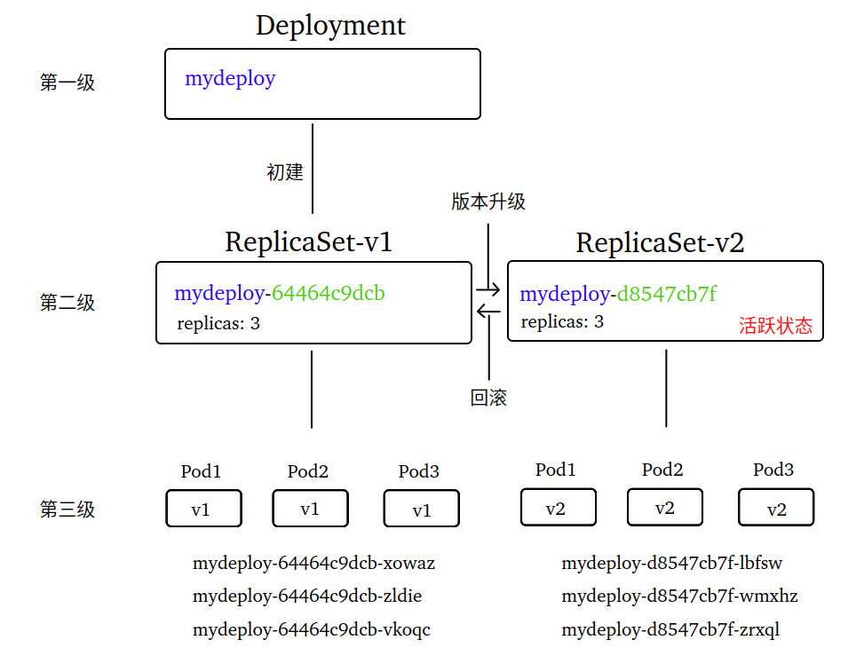

### 4.2 动态扩、缩容

动态扩、缩容与前面 ReplicaSet 视频讲解的一样，本视频快速演示演示效果，不再多做讲解。

### 4.3 动态更新和回滚

Deployment 支持版本的动态更新，需要的操作仅仅两步：1. 修改YAML	2.重新 apply 一次

~~~shell
# 进入pod中的alpine容器，并查看版本
kubectl exec -it <pod-name> -- cat /etc/alpine-release
# 观察pod的情况
watch -n 1 kubectl get pod -l app=myapp -o wide

# 修改deploy.yaml文件，更改alpine版本为3.8
# 重新apply
# 修改deploy.yaml文件，更改alpine的command内容
# 重新apply
# 修改deploy.yaml文件，更改副本数为10
# 重新apply

# 查看deploy的更新结果：READY-副本总数；UP-TO-DATE-已更新至预期状态的副本数
watch -n 1 kubectl get deploy mydeploy -o wide
# 查看deploy的replicaset
kubectl get rs -l app=myapp
# 查看deploy的历史版本(注意：修改副本数不会生成历史记录)
kubectl rollout history deploy mydeploy
~~~

Deployment 也支持版本的动态回滚

~~~shell
# 回滚到特定的版本，注意：回滚不触发副本数的修改，副本数维持当前值
kubectl rollout undo deploy mydeploy --to-revision=1
~~~

### 4.4 更新策略

Deployment 支持设置动态更新的策略。

~~~yaml
spec:
  # 预期副本数
  replicas: 10
  # 更新策略
  strategy:
    # 策略类型有RollingUpdate和Recreate两种，默认RollingUpdate
    # Recreate重建式更新(在创建新版pod前，将所有旧版的pod全部杀死)。不推荐
    # RollingUpdate滚动更新。推荐，也是默认值
    type: RollingUpdate     
    # type=RollingUpdate时的更新速率设置
    rollingUpdate:
      # 超过预期副本数的最大值(或最大比例)
      # 取值范围：[0,预期副本数] [0%,100%]，如果maxUnavailable为0，则该值不能为0
      # 百分比计数时，不足1个按1个计算，向上取整
      # 该值越大，更新速度越快
      maxSurge: 1
      # 不可用副本数的最大值(或最大比例)，Pod容器进入Terminating状态就不可用了
      # 取值范围：[0,预期副本数] [0%,100%]，如果maxSurge为0，则该值不能为0
      # 百分比计数时，不足1个按0个计算，向下取整
      # 该值越小，越能保证服务稳定，更新越平滑
      maxUnavailable: 1
~~~

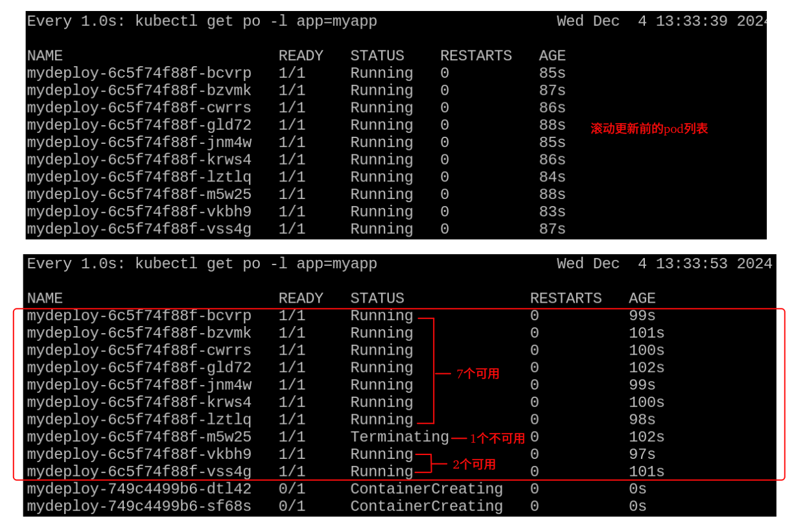

建议：滚动更新应结合"存活探针"和"就绪探针"的设置，确保新版容器在真正准备好之后再删除旧版容器。

### 4.5 金丝雀发布

金丝雀发布(*Canary Release*)，也称灰度发布。因早期煤矿工使用金丝雀探测井下瓦斯浓度而得名。
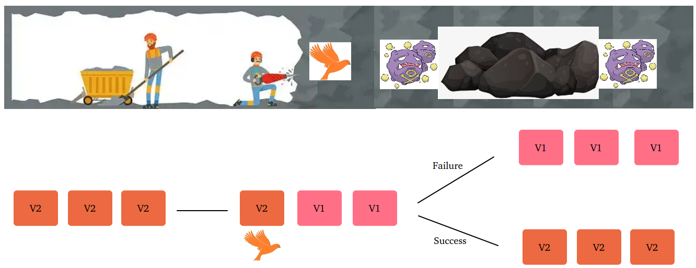

使用金丝雀方式发布应用的优势就在于：**降低部署风险‌**，一旦发现问题可以立即停止发布并回滚到旧版本。

金丝雀方式过程中，会存在新、旧版本共存的特殊时段，如何实现部分用户访问新版，部分用户访问旧版呢？可通过网关(如：Ingress)控制不同的流量访问新、旧版。


接下来，我们使用 Deployment 控制器模拟实现金丝雀发布应用

步骤一：创建测试所用 Deployment 控制器，并声明4个pod副本

~~~yaml
apiVersion: apps/v1
kind: Deployment
metadata:
  # Deployment的名字
  name: canary-deploy
  namespace: default
  labels:
    app: canary
spec:
  selector:
    matchLabels:
      app: canary
  # pod副本数
  replicas: 4
  template:
    metadata:
      labels:
        app: canary
    spec:
      containers:
        - name: container-nginx
          image: nginx:1.24.0
          ports:
              # 容器端口
            - containerPort: 80
~~~

步骤二：创建测试所用的 Service，为 Pod 提供流量

~~~yaml
apiVersion: v1
kind: Service
metadata:
  name: canary-service
  namespace: default
  labels:
    app: canary
spec:
  selector:
    app: canary
  type: NodePort
  ports:
      # 容器端口
    - port: 80
      # 服务端口
      targetPort: 80
      # 节点端口
      nodePort: 30080
~~~

步骤三：更新 Deployment 版本，并立即暂停 Deployment 的更新

~~~shell
kubectl set image deploy canary-deploy container-nginx=nginx:1.26.2 && kubectl rollout pause deploy canary-deploy
~~~

步骤四：测试 Service 是否把流量分配到新、旧版本的 nginx 上

~~~shell
# 查看此刻所有的 pod 情况(重点观察pod-template-hash，以此区分新、旧版本)
kubectl get pod -l app=canary --show-labels
curl podIP:80 -I
# -I参数可输出响应头信息(不含响应体)，其中包含了nginx的版本信息
curl 192.168.1.50:30080 -I
~~~

步骤五：流量控制。这一步将会使用 Service 模拟实现新、旧版本的 Pod 流量隔离。

删除旧 Service 创建新 Service，新的 Service 仅为旧版本的 nginx 分配流量

~~~yaml
apiVersion: v1
kind: Service
metadata:
  name: canary-service-24
  namespace: default
  labels:
    app: canary
spec:
  selector:
    # 重点1：使用pod-template-hash作为标签选择的key，筛选旧版的nginx
    pod-template-hash: <旧版的pod-template-hash>
  type: NodePort
  ports:
    - port: 80x
      targetPort: 80
      # 重点2：与旧Service保持相同节点端口，避免该端口下的nginx断流
      nodePort: 30080
~~~

再次创建一个新 Service，这个 Service 仅为新版本的 nginx 分配流量

~~~yaml
apiVersion: v1
kind: Service
metadata:
  name: canary-service-26
  namespace: default
  labels:
    app: canary
spec:
  selector:
    # 重点1：使用pod-template-hash作为标签选择的key，筛选新版的nginx
    pod-template-hash: <新版的pod-template-hash>
  type: NodePort
  ports:
    - port: 80x
      targetPort: 80
      # 重点2：与旧版区分不同的节点端口
      nodePort: 30081
~~~

~~~shell
# 删除之前的Service
kubectl delete -f canary-service.yaml
# 创建新的Service为旧版nginx提供流量
kubectl apply -f canary-service-24.yaml
# 创建新的Service为新版nginx提供流量
kubectl apply -f canary-service-26.yaml
# 通过节点端口分别访问旧版的nginx、新版的nginx
curl 192.168.1.50:30080 -I && curl 192.168.1.50:30081 -I
~~~

步骤六：恢复 Deployment 的更新，让流量全部推送到新版的 nginx 上

~~~shell
# 恢复 Deployment 的更新
kubectl rollout resume deploy canary-deploy
# 查看此刻所有的 pod 情况(重点观察pod-template-hash，以此区分新、旧版本)
kubectl get pod -l app=canary --show-labels
# 再次通过节点端口分别访问新版的nginx、旧版的nginx
curl 192.168.1.50:30081 -I && curl 192.168.1.50:30080 -I
~~~

步骤七：回滚 Deployment 的版本，让流量全部重回旧版的 nginx 上

~~~shell
# 查看可回滚的历史版本
k rollout history deploy canary-deploy
# 回滚 Deployment 的版本
kubectl rollout undo deploy canary-deploy --to-revision=1
# 查看此刻所有的 pod 情况(重点观察pod-template-hash，以此区分新、旧版本)
kubectl get pod -l app=canary --show-labels
# 再次通过节点端口分别访问旧版的nginx、新版的nginx
curl 192.168.1.50:30080 -I && curl 192.168.1.50:30081 -I
~~~

发布策略：除了"金丝雀发布"以外，还有"蓝绿发布"等等策略。限于篇幅限制和使用的频率，后面遇到再做详细介绍。

## 5. HPA

hpa 是 ***H**orizontal **P**od **A**utoscaler* 的缩写，翻译为"Pod水平自动扩缩"控制器。水平扩缩对工作负载而言，意味着部署更多的 Pod。垂直扩缩意味着将更多资源（例如：内存或 CPU）分配给已经为工作负载运行的 Pod。hpa 能够根据 CPU 、内存或其他度量指标来**自动伸缩**  Pod 的数量，从而实现**削峰填谷**。
hpa 不适用于无法扩缩的对象，如：DaemonSet。

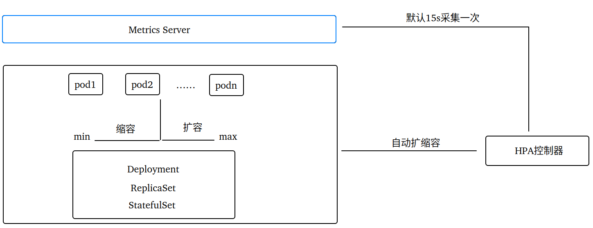

### 5.1 Metrics Server

Metrics Server 是 Kubernetes 中一个核心的指标收集器(默认不安装)，可以提供资源利用率相关的重要指标信息。主要用于实时监控和自动化任务。

 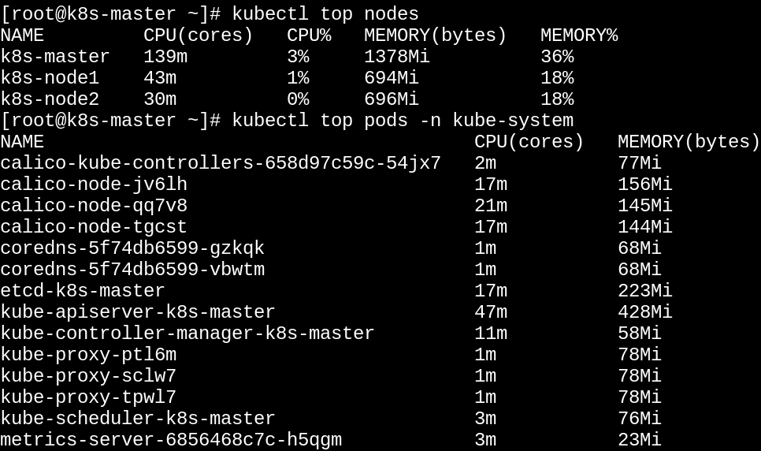

**选择 Metrics Server 版本**：
	 [GitHub官网](https://github.com/kubernetes-sigs/metrics-server) 查看与 K8s的版本对照关系

 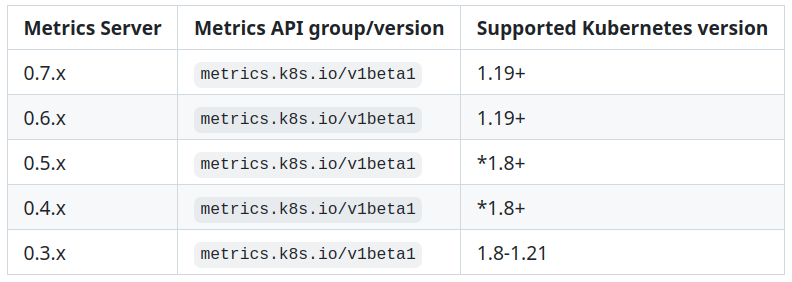

**安装 Metrics Server** ：

~~~shell
# 下载yaml清单
curl -o metrics-server.yaml https://github.com/kubernetes-sigs/metrics-server/releases/latest/download/components.yaml
# 修改yaml清单
 - 将唯一Deployment中的image换成阿里云镜像
     image: registry.aliyuncs.com/google_containers/metrics-server:v0.6.4
 - args添加如下两行
     # 允许使用不安全的TLS连接来与kubelet通信，生产环境谨慎！！！
 	 - --kubelet-insecure-tls
 	 # 与 API Server 通信时首选的IP和端口
     - --kubelet-preferred-address-types=InternalDNS,InternalIP,ExternalDNS,ExternalIP,Hostname
# 安装metrics-server
kubectl apply -f metrics-server.yaml
# 查看deploy
watch -n 1 kubectl get deploy metrics-server -n kube-system
# 查看节点资源使用情况
kubectl top node
# 查看pod资源使用情况(kube-system命名空间)
kubectl top pod -n kube-system
~~~

### 5.2 AB压测工具

AB 压测工具是由 Apache 提供的一个非常方便的命令行程序，用于测试 HTTP 服务的性能。

~~~shell
# 安装httpd(Apache服务器)包含AB压测工具 - CentOS
sudo yum update && sudo yum install httpd -y
# 安装httpd(Apache服务器)包含AB压测工具 - Ubuntu
sudo apt update && sudo apt install apache2 -y
~~~

基本命令格式：

~~~shell
# x表示总的请求数；y表示并发发起的请求数；
ab -n x -c y <压测地址>
~~~

创建测试所用的 deployment 和 service：

~~~yaml
apiVersion: apps/v1
kind: Deployment
metadata:
  name: ab-deploy
  namespace: hpa-ns
  labels:
    app: ab
spec:
  selector:
    matchLabels:
      app: ab
  replicas: 1
  template:
    metadata:
      labels:
        app: ab
    spec:
      # 定向调度到node1上
      nodeName: k8s-node1
      containers:
        - name: container-nginx
          image: nginx:1.26.2
          ports:
            - containerPort: 80
---
apiVersion: v1
kind: Service
metadata:
  name: ab-service
  namespace: hpa-ns
  labels:
    app: ab
spec:
  selector:
    app: ab
  type: NodePort
  ports:
    - port: 80
      targetPort: 80
      nodePort: 30080
~~~

~~~shell
# 创建命名空间
kubectl create ns hpa-ns
# 创建资源
kubectl apply -f ab.yaml
# 监视node和pod的资源使用情况
watch -n 1 kubectl top node k8s-node1
watch -n 1 kubectl top pod -n hpa-ns
# AB压力测试
ab -n 10000 -c 100 http://192.168.1.50:30080/index.html
~~~

### 5.3 hpa命令参考

hpa 控制器要求 pod 必须设定cpu或memory的资源配额(资源配额详情搜索"**莲城的老李 资源配额与限制**")

~~~yaml
spec:
  containers:
    - name: container-nginx
      image: nginx:1.26.2
      ports:
        - containerPort: 80
      # 资源配额
      resources:
        requests:
          cpu: 100m
          memory: 100Mi
        limits:
          cpu: 200m
          memory: 200Mi
~~~

通过命令管理 hpa 控制器

~~~shell
# 查看hpa
kubectl get hpa -n hpa-ns
# apply -f ab.yaml
kubectl apply -f ab.yaml
# 创建hpa
# --min代表pod最小数量；--max代表pod最大数量；--cpu-percent代表cpu的使用率阈值
kubectl autoscale deploy ab-deploy --min=1 --max=10 --cpu-percent=20 --name=my-hpa -n hpa-ns
# 删除hpa
kubectl delete hpa my-hpa -n hpa-ns
~~~

AB压测实验

~~~shell
# 查看hpa(参数-w可观察监控数据的连续变化)
kubectl get hpa -n hpa-ns -w
# 启动压力测试
ab -n 10000 -c 1000 http://192.168.1.50:30080/index.html
~~~

### 5.4 YAML参考

创建 hpa 控制器的yaml文件前，先查阅一下该类型的资源版本

~~~shell
# 查看hpa资源
kubectl api-resources | grep hpa
# 查看api版本(v1-仅支持基于CPU指标的自动扩缩；v2-支持基于CPU、内存和自定义指标的自动扩缩)
kubectl api-versions | grep autoscaling
~~~

~~~yaml
# api版本
apiVersion: autoscaling/v2
# 资源类型
kind: HorizontalPodAutoscaler
metadata:
  name: my-hpa
  # 所在命名空间
  namespace: hpa-ns
spec:
  # hpa的目标资源(要求目标资源中的pod必须设定cpu或memory的资源配额)
  scaleTargetRef:
    apiVersion: apps/v1
    kind: Deployment
    name: ab-deploy
  # pod最小值
  minReplicas: 3
  # pod最大值
  maxReplicas: 10
  # 度量指标
  metrics:
      # 指标的类型(Resource、External、Object、Pods、ContainerResource其中之一)
        # Resource - CPU和内存利用率指标
        # Pods - 网络利用率和流量
        # Object - 特定对象的指标，如：Ingress按每秒使用请求数来扩展容器
    - type: Resource
      resource:
        # resource名字
        name: cpu
        # 目标值
        target:
          # 度量类型(Utilization-利用率、AverageValue-平均值、Value-值其中之一)
          type: Utilization
          # 度量的阈值(<50%缩容、>50%扩容)
          averageUtilization: 50
    - type: Resource
      resource:
        # resource名字
        name: memory
        # 目标值
        target:
          # 度量类型(Utilization-利用率、AverageValue-平均值、Value-值其中之一)
          type: AverageValue
          # 度量的阈值(<600Mi缩容、>600Mi扩容)
          averageValue: 600Mi
~~~

### 5.5 扩缩容速度

```yaml
spec:
  # 精确控制扩缩容的速度
  behavior:     
  
    # 扩容速度
    scaleUp:                        
      # 稳定窗口期。即增加或减少Pod数量后保持不变的时间(单位：秒)，默认0s
      stabilizationWindowSeconds: 0 
      policies:
          # 策略类型(相对数)
        - type: Percent 
          # 百分比数值
          value: 100
          # 该值必须处于(0s,1800s]
          periodSeconds: 15  
          
          # 策略类型(绝对数)
        - type: Pods                
          value: 4
          periodSeconds: 15
          
    # 缩容速度          
    scaleDown:
      # 稳定窗口期(单位：秒)，默认300s
      stabilizationWindowSeconds: 300
      policies:          
        - type: Percent             
          value: 100
          periodSeconds: 15
        - type: Pods                
          value: 4
          periodSeconds: 15
```

~~~shell
# apply
kubectl apply -f my-hpa.yaml
# 查看hpa
kubectl get hpa my-hpa -n hpa-ns -w
# 启动压力测试
ab -n 50000 -c 1000 http://192.168.1.50:30080/index.html
~~~

## 6. StatefulSet

StatefulSet (缩写为sts) ，用来部署有序启动、"有状态"的应用。例如：持久化的数据库、消息队列(RabbitMQ 、Kafka)等等。有状态与无状态的区别：

~~~markdown
- StatefulSet创建的每个Pod都有一个"持久标识符"，重新调度时也会保留该标识符
- StatefulSet创建的Pod使用Headless Service(无头服务，没有ClusterIP)进行通信
~~~

### 6.1 YAML参考

~~~yaml
apiVersion: v1
kind: Service
metadata:
  name: redis-svc
  namespace: sts-ns
  labels:
    app: redis
spec:
  selector:
    app: redis
  ports:
      # 容器端口
    - port: 6379    
      # 服务端口(clusterIP=None时，服务端口要么省略，要么等于容器端口)
      targetPort: 6379
      # 节点端口(clusterIP=None时，节点端口不能使用)
      #nodePort: 30379
  # 集群IP设置None即为"无头服务"
  clusterIP: None
---
apiVersion: apps/v1
kind: StatefulSet
metadata:
  name: redis-sts
  namespace: sts-ns
spec:
  selector:
    matchLabels:
      app: redis
  # sts对象使用的无头服务对象
  serviceName: "redis-svc"
  replicas: 2
  template:
    metadata:
      labels:
        app: redis
    spec:
      containers:
        - name: container-redis
          image: redis:6.2
          ports:
            - containerPort: 6379
~~~

~~~shell
# 创建命名空间
kubectl create ns sts-ns
# 创建statefulset
kubectl apply -f statefulset.yaml
# 查看sts-ns命名空间下的所有pod
kubectl get pod -n sts-ns
~~~

### 6.2 稳定的唯一标识

StatefulSet 创建的 Pod 拥有保持不变的"网络唯一标识"，格式：StatefulSet控制器的名字+序号(0开始)。

~~~shell
# 删除statefulset创建的某个pod
kubectl delete pod redis-sts-0 -n sts-ns
~~~

对比由 Deployment 控制器创建的 Pod

~~~shell
# 创建Deployment
kubectl apply -f depolyment.yaml
# 删除deployment创建的某个pod
watch -n 1 kubectl get pod
kubectl delete pod <pod-name>
~~~

稳定的网络唯一标识在某些场景下是十分关键的，例如：redis的主、从集群。主节点与各从节点进行的配置是截然不同的，作为主节点的Pod具有无法替换的地位，如果该Pod的标识总是变来变去，那么将导致集群无法正常运行。

### 6.3 无头服务的通信

Headless Service 不分配集群的虚拟IP，也不像普通 Service 那样对外暴露端口(nodePort)，因此不需要通过负载均衡来分配流量，从集群外部也是无法直接访问该服务的。集群内部，Headless Service 是通过DNS直接访问每个Pod。如果必须从集群外部访问StatefulSet创建的Pod，那么创建普通的Service 并通过标签选择器关联Pod是一种实现方式。
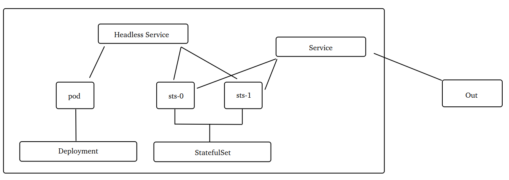

~~~markdown
# 集群内访问无头服务
	<service-name>.<namespace>.svc.cluster.local
# 集群内访问无头服务并指定Pod	
	<pod-name>.<service-name>.<namespace>.svc.cluster.local
~~~

~~~shell
# 进入集群中某个Pod的容器，作为访问发起者
kubectl exec -it <pod-name> -- sh
# 解析集群中是否存在redis服务
nslookup redis-svc.sts-ns
# 解析集群中特定的Pod是否存在redis服务
nslookup redis-sts-0.redis-svc.sts-ns
~~~

### 6.4 动态扩缩容

StatefulSet 控制器支持动态扩缩容和使用HPA自动扩缩容。由于StatefulSet 创建的是有状态服务，副本数不建议随便修改。

~~~shell
# 扩容
kubectl scale --replicas=5 sts redis-sts -n sts-ns
# 缩容
kubectl scale --replicas=3 sts redis-sts -n sts-ns
~~~

### 6.5 更新策略

StatefulSet 控制器的更新策略通过 "spec.updateStrategy" 配置

~~~yaml
spec:
  # 更新策略
  updateStrategy:
    # 更新类型(OnDelete、RollingUpdate其中之一)
    # OnDelete-手动删除旧Pod来更新
    # RollingUpdate-滚动更新类型，默认值
    type: RollingUpdate
    # 滚动更新配置
    rollingUpdate:
      # 不可用副本数的最大值(或最大比例)，默认1.
      maxUnavailable: 1
      # 分区升级。即指定一个序号(默认0)，大于等于此序号的Pod会全部被升级
      partition: 1
~~~

~~~shell
# 查看redis版本
kubectl exec -n sts-ns -it redis-sts-0 -- redis-server -v
# 升级redis版本
kubectl set image sts redis-sts container-redis=redis:7.0 -n sts-ns
# 手动删除Pod
kubectl delete pod redis-sts-0 -n sts-ns
~~~

## 7. DaemonSet

DaemonSet 即"后台支撑型"服务，缩写为 ds 。主要是用来部署守护进程，例如：日志收集、监控代理、网络代理和安全代理等系统服务。

```markdown
# DaemonSet控制器的特点：
- 每当向集群中添加一个节点时，DaemonSet-Pod也将添加到该节点上(有且仅有一个)
- 当节点从集群中移除时，DaemonSet-Pod会被垃圾回收
```

~~~shell
# 查看k8s安装后自带的DaemonSet
kubectl get ds -n kube-system
# 查看kube-proxy创建的Pod
kubectl get pod -n kube-system -o wide | grep kube-proxy


# k8s-master上查看加入新节点的命令
kubeadm token create --print-join-command
# 集群中加入新节点
kubeadm join 192.168.1.49:6443 --token 3c4df6.8m8bg3rpqwfsci69 --discovery-token-ca-cert-hash sha256:795033149fd6fb523d0cc6b89437ab8afddb022b09c797e37dadc9fc139a66c8 --cri-socket=unix:///var/run/cri-dockerd.sock

# 移除集群中的节点
# 1.将节点标记为不可调度
kubectl cordon k8s-node3 
# 2.驱逐节点上的Pod到其他可用的节点上(--force代表强制驱逐；--ignore-daemonsets代表忽略)
kubectl drain k8s-node3 --force --ignore-daemonsets
# 3.移除节点
kubectl delete node k8s-node3
# 4.整合命令
kubectl cordon k8s-node3 && kubectl drain k8s-node3 --force --ignore-daemonsets && kubectl delete node k8s-node3
~~~

### 7.1 YAML参考

YAML 配置跟 Deployment 控制器基本类似,一个显著的区别是 DaemonSet 不需要指定副本数，因为它的副本数取决于工作节点数。

~~~yaml
# api版本
apiVersion: apps/v1 
# 资源类型
kind: DaemonSet 
metadata:
  name: mydaemonset
  namespace: default
  labels: 
    app: daemonset
spec:   
  # 标签选择器
  selector: 
    matchLabels:      
      app: daemonset
    matchExpressions:
      - {key: app, operator: In, values: [daemonset]}
  # Pod模板    
  template: 
    metadata:
      labels:
        app: daemonset
    spec:
      containers:
      - name: container-nginx
        image: nginx:1.24.0
        ports:
        - containerPort: 80
~~~

~~~shell
# 创建daemonset
kubectl apply -f daemonset.yaml
# 查看pod
kubectl get pod -l app=daemonset
~~~

### 7.2 节点调度

DaemonSet 支持将 Pod 通过 "nodeName"、"nodeSelector"和 "affinity"调度到特定的节点上。

~~~yaml
spec: 
  # Pod模板    
  template: 
    spec:
      nodeName: k8s-node1
      nodeSelector:
        kubernetes.io/hostname: k8s-node2
      affinity:
        nodeAffinity:
          requiredDuringSchedulingIgnoredDuringExecution:
            nodeSelectorTerms:
              - matchExpressions:
                - {key: kubernetes.io/hostname, operator: In, values: [k8s-node1]}
~~~

~~~shell
# 查看daemonset创建的pod
watch -n 1 kubectl get pod -o wide -l app=daemonset
# 修改daemonset.yaml文件，将Pod调度到不同Node，查看监控数据的变化
~~~

### 7.3 更新和回滚

DaemonSet 像 Deployment 那样，也支持动态更新和回滚。

~~~yaml
spec: 
  # 保留历史版本个数(默认10个)，前面讲过的Deployment和StatefulSet控制器也有这个配置
  revisionHistoryLimit: 10
  # 更新策略
  updateStrategy:    
    type: RollingUpdate(默认) | OnDelete    
    rollingUpdate:  
      # 可超出现有DaemonSet-Pod的最大数或最大百分比，默认0
      maxSurge: 0
      # 更新期间不可用的DaemonSet-Pod最大数或最大百分比。默认1
      maxUnavailable: 1
# 注意：  maxSurge和maxUnavailable不能同时设置0!
~~~

~~~shell
# 建议删除之前创建的ds对象，并删除节点调度代码，然后重新apply
# 查看daemonset创建的pod
watch -n 1 kubectl get pod -o wide
# 查看镜像的版本
kubectl exec -it <pod-name> -- nginx -v
# 升级镜像的版本
kubectl set image ds mydaemonset container-nginx=nginx:1.26.2 --record
# 查看ds的历史版本
kubectl rollout history ds mydaemonset
# 回滚到ds的历史版本
kubectl rollout undo ds mydaemonset --to-revision=1
~~~

### 7.4  Fluentd

EFK 是 K8s 平台上一个典型的"日志收集"技术方案，包含了 **E**lasticsearch、**F**luentd或**F**ilebeat、**K**ibana的组合。EFK 之前还有一个 ELK 日志收集技术栈(包含**E**lasticsearch, **L**ogstash, **K**ibana) ，由于 Logstash 占用资源较大，ELK  逐渐被 EFK 取代。

~~~markdown
- Elasticsearch 用于日志数据的存储
- Fluentd 用于日志数据的收集
- Kibana 用于日志数据的展示
~~~

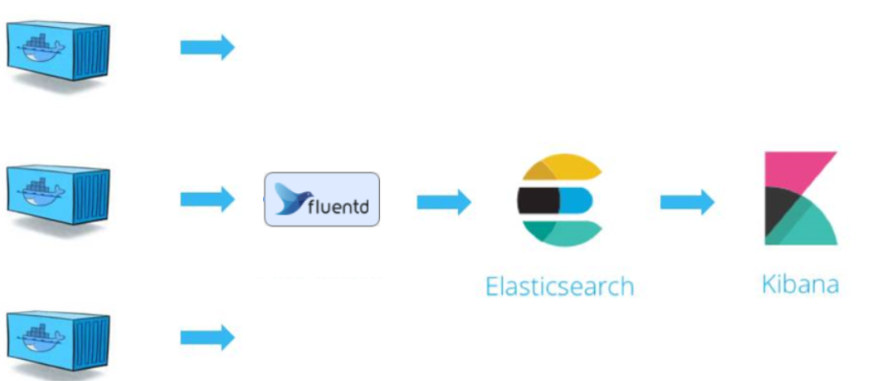

Fluentd 是一个开源的、轻量级的数据收集器，由 Fluentd 社区维护。K8s中可使用它收集每个节点的日志信息(使用 DaemonSet 控制器部署)。

Fluentd 配置文件(ConfigMap对象)

~~~yaml
apiVersion: v1
kind: ConfigMap
metadata:
  # ConfigMap对象名
  name: fluentd-config
data:
  # 配置文件名
  fluent.conf: |
    <source>
      @type http
      port 8080
      bind 0.0.0.0
    </source>
    <match logserver>
      @type stdout
    </match>
~~~

DaemonSet的YAML文件

~~~yaml
apiVersion: apps/v1
kind: DaemonSet
metadata:
  name: fluentd-daemonset
  labels:
    app: fluentd
spec:
  selector:
    matchLabels:
      app: fluentd
  template:
    metadata:
      labels:
        app: fluentd
    spec:
      # 存储卷设置
      volumes:
      - name: vol-config
        configMap:
          name: fluentd-config
      - name: timezone
        hostPath:
          path: /etc/localtime
      containers:
      - name: fluentd
        image: fluentd
        resources:
          # 容器的资源上限
          limits:
            cpu: 100m
            memory: 200Mi
        # 容器的存储卷    
        volumeMounts:
          # 挂载配置文件
        - name: vol-config
          mountPath: /fluentd/etc/fluent.conf
          subPath: fluent.conf
          # 与节点时间同步
        - name: timezone
          mountPath: /etc/localtime
          readOnly: true
~~~

~~~shell
# 查看DaemonSet创建的Pod
kubectl get pod -o wide -l app=fluentd
# 查看某个Pod的日志
kubectl logs <pod-name> -f
# 发起模拟的登录请求(-d参数表示发送的模拟数据，-i参数返回响应信息)
curl -i -d 'json={"action":"login"}' http://<pod-ip>:8080/logserver 
~~~

## 8. Job

Job 控制器，主要用于 "批量处理任务" 和短暂的"一次性任务"。

~~~markdown
- 批量处理任务：一次处理指定数量的任务，例如：处理工作队列
- 一次性任务：创建一个Pod仅运行一次就结束的任务，例如：数据库迁移
~~~

Job 会跟踪创建的 Pod，还能够对比**实际成功完成**的 Pod 数量与**预期成功完成**的 Pod 数量，当两者一致时即视为任务成功。一旦 Job 完成，K8s 可清理与该 Job 相关的所有资源。如果失败，则根据重启策略决定是否创建一个新的 Pod 来替换失败的 Pod，再次重试任务直至成功。Job 还支持并行处理任务。 

### 8.1 串行执行

parallelism 设置为1，或者不设置的情况下，Job 采用串行方式执行任务。

~~~yaml
# api版本
apiVersion: batch/v1
# 资源类型
kind: Job
metadata:
  name: myjob
  namespace: default
  labels:
    app: job
spec:
  # 成功执行的预期数量，默认1。
  completions: 3
  # 并行执行的数量，默认1。
  parallelism: 1
  # pod模板  
  template:  
    metadata:
      labels:
        app: job
    spec:
      # 重启策略(仅允许Never或OnFailure，不允许Always。常用OnFailure)
      restartPolicy: OnFailure
      # 存储卷(可选)
      volumes:
        - name: timezone
          hostPath:
            path: /etc/localtime
      containers:
        - name: container-alpine
          image: alpine:3.7
          # 任务内容：打印开始时间，休眠20秒，打印结束时间
          command: ["/bin/sh","-c","echo ‘$(date +%H:%M:%S) Job Start’;sleep 20;echo ‘$(date +%H:%M:%S) Job End’;"]          
          volumeMounts:
            # 与节点时间同步
            - name: timezone
              mountPath: /etc/localtime
              readOnly: true
~~~

~~~shell
# 监视job和pod的变化(每隔1秒)
watch -n 1 kubectl get job,pod -o wide -l app=job
# 监视pod的输出日志(每隔1秒)
kubectl logs <pod-name>
~~~

### 8.2 并行执行

在上述"串行执行"的YAML文件中，增加如下的配置

~~~yaml
spec:  
  # 并行执行的pod数量，默认1。
  parallelism: 2
~~~

### 8.3 任务时间限制

某些 Job 执行时可能出现死锁，为避免反复重试 Job 导致资源耗费，可设置 Job 的作业时间限制，一旦达到了该时限，K8s会终止Job执行。

~~~yaml
spec:
  # 允许job的作业时限(单位：秒)，超时会被K8s终止
  activeDeadlineSeconds: 25
~~~

### 8.4 关联Pod

Job 支持使用选择器指定该哪些pod去完成任务。如果有确定的意图可以设置，否则建议采取默认。

~~~yaml
spec:
  # 可否使用selector选择器选择pod，默认是false
  manualSelector: true
  # 选择器指定该管理哪些pod
  selector:
    matchLabels:      
      app: job
    matchExpressions:
      - {key: app, operator: In, values: [job]}  
~~~

### 8.5 自动删除

默认情况下，Job 完成后(成功或失败)并不会自动删除，保留的原因是方便查看Pod日志。如需自动删除可以配置如下：

~~~yaml
spec:
  # job成功完成后10秒自动删除，设置0则立即删除
  ttlSecondsAfterFinished: 10
~~~

### 8.6 自动重建

Job 执行过程中遇到Pod被删除或者节点故障，那么未执行完的Pod会自动重建并重新调度到可用的节点。

## 9. CronJob

CronJob 控制器用于"周期性"执行任务的一种控制器，缩写为 **cj**。它基于 Job 控制器来创建和管理作业。
 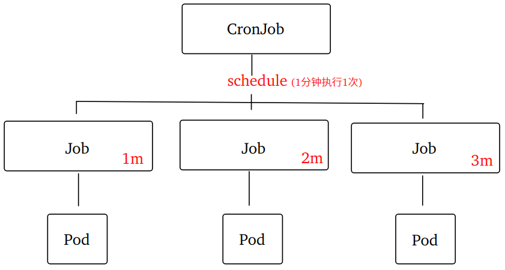

### 9.1 YAML参考

~~~yaml
# api版本(与Job控制器一样)
apiVersion: batch/v1
# 资源类型
kind: CronJob 
metadata: 
  name: mycronjob
  namespace: default
  labels: 
    app: cronjob
spec: 
  # 调度器(cron表达式，每分钟执行一次)
  schedule: '0/1 * * * *'
  # 并发策略(Allow-允许并发，默认；Forbid-禁止并发；Replace-用新的job替换当前正在运行的job)
  concurrencyPolicy: Allow
  
  # 为失败的任务保留的历史记录数，默认为1。
  failedJobHistoryLimit: 1
  # 为成功的任务保留的历史记录数，默认为3。
  successfulJobHistoryLimit: 3  
  # 启动截止时间。如果Pod在截止时间内没有成功启动，则会被标记为失败。单位：秒
  startingDeadlineSeconds: 30
  
  # job控制器模板(CronJob基于Job实现)
  jobTemplate: 
    spec:
      # 预期(目标)成功次数
      completions: 1
      # 并行的Pod个数
      parallelism: 1
      # 允许job的作业时限(单位：秒)，超时会被K8s终止
      activeDeadlineSeconds: 30
      # 可否使用selector选择器选择pod，默认是false
      manualSelector: false
      # 完成后10秒自动删除，设置0则立即删除
      ttlSecondsAfterFinished: 10      
      # Pod模板
      template:
        metadata:
          labels:
            app: cronjob
        spec:
          # 重启策略
          restartPolicy: OnFailure
          volumes:
            - name: timezone
              hostPath:
                path: /etc/localtime
          containers:
          - name: container-alpine
            image: alpine:3.7
            # 任务内容：输出当前任务执行的时间(时分秒)
            command: ["bin/sh", "-c", "echo 'CronJob Run：'$(date +%H:%M:%S)"]
            volumeMounts:
              # 与节点时间同步
              - name: timezone
                mountPath: /etc/localtime
                readOnly: true
~~~

### 9.2 Cron 表达式

schedule 用于配置 Cron 表达式， Cron 表达式定义了任务的执行计划。Cron 表达式由五个域(部分)组成。
 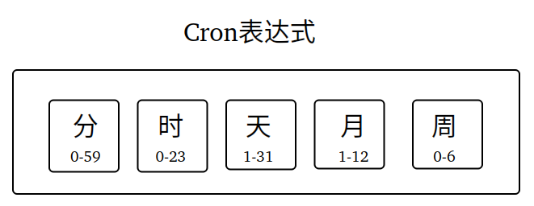

~~~markdown
- 注意：K8s中的Cron表达式不支持"秒级别"和"年级别"的调度
~~~

Cron 表达式的特殊字符

~~~markdown
- 星号(*)：表示匹配该域的任意值
- 斜杠(/)：表示起始时间开始触发，然后每隔固定时间触发一次，例如：'0/1 * * * *'
- 短杠(-)：表示范围，例如分钟域设置1-5，表示从第1分钟到第5分钟
- 逗号(,)：表示分隔的多个值，例如分钟域设置1,5，表示第1分钟和第5分钟
~~~

[在线Cron表达式生成工具](https://cron.ciding.cc/)

~~~shell
# 创建CronJob
kubectl apply -f cronjob.yaml
# 查看CronJob生成的Pod
watch -n 1 kubectl get pod -l app=cronjob
# 查看Pod完成任务的情况
kubectl logs <pod-name>
~~~

### 9.3 定时备份nginx日志

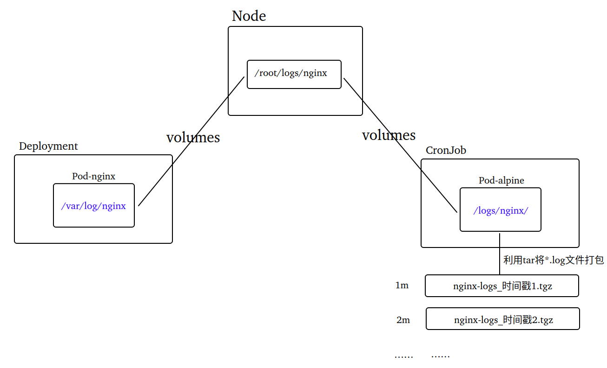

~~~shell
# 查看deploy生成的Pod
kubectl get pod -l app=nginx -o wide
# 查看cronjob生成的Pod
watch -n 1 kubectl get pod -l app=cronjob-nginx-logs -o wide
# 查看cronjob生成的日志备份
ls /root/logs/nginx
~~~

