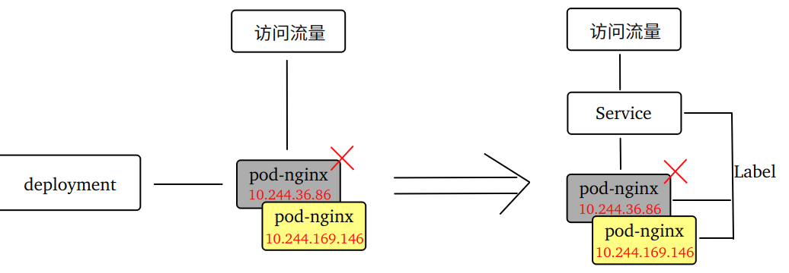
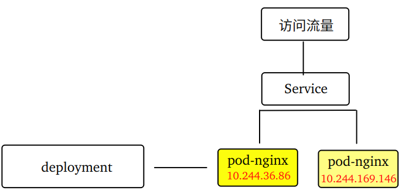
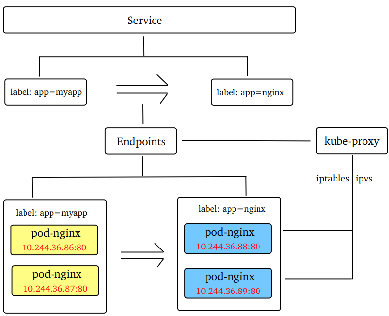
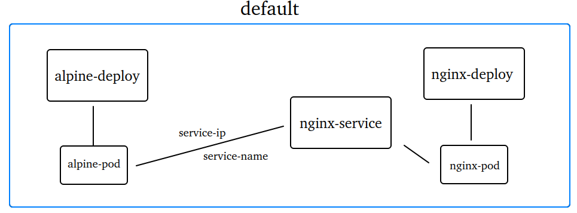
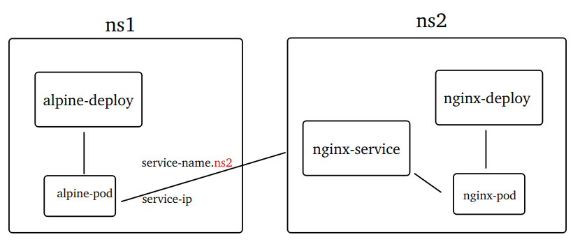
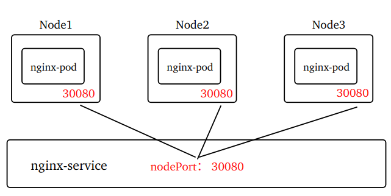
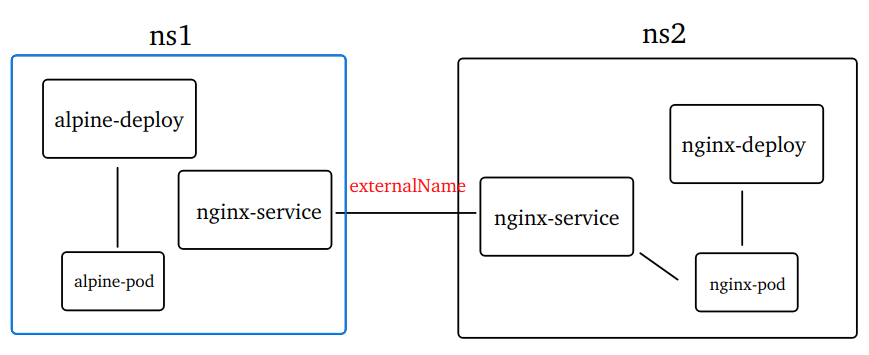
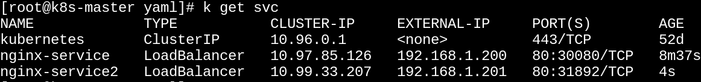

# K8s-Service

## 1. 为什么需要Service

之所以需要Service，基于两个原因：

**其一，稳定的访问地址** 

由于 K8s 基于 Pod 实现应用程序的部署，因此访问应用程序就是去访问应用的 Pod ，访问方式就是通过 Pod 的 IP 地址。而 Pod 存在很大的不确定性，因多种原因 Pod 会被控制器被删除而后重建，这将导致应用程序的访问也变得不确定。

 

~~~shell
# 创建Deployment
kubectl apply -f deploy.yaml
# 查看Pod
kubectl get pod -l app=nginx -o wide
# 创建Service
kubectl apply -f service.yaml
# 查看Service
kubectl get svc -l app=nginx -o wide
# 访问Service
curl <service-ip>:<port>
# 删除Pod后再次测试访问Service
~~~

**其二，负载均衡**

集群中的应用程序通常会存在多个副本。Service 能为 Pod 提供负载均衡，将访问流量分摊到多个Pod上。

 

小结：Service 即服务，缩写是 `svc`。Service 为一个或相关的一组 Pod 提供网络访问的服务。通过 Service，客户端和 Pod 之间的依赖关系被解耦。

## 2. Service工作原理

Service 的工作原理涉及到几个概念：

~~~markdown
# Endpoints：Service端点，缩写ep。保存Service后端Pod的IP和Port，并实时监控和更新这些数据
  kubectl api-resources | grep endpoints
  kubectl get ep
# kube-proxy：Service代理。提供集群内部的服务发现和负载均衡功能的DaemonSet(kube-system空间)
  kubectl get ds -n kube-system -l k8s-app=kube-proxy
  kubectl get pod -n kube-system -l k8s-app=kube-proxy -o wide
~~~

 

~~~shell
# 查看Pod
kubectl get pod -l app=nginx -o wide
# 查看Endpoints
kubectl get ep -l app=nginx
kubectl get ep -l app=nginx -o yaml
# 修改Service的selector为myapp，重新apply，或者删除某个pod，然后再次查看
~~~

## 3. Service负载均衡

### 3.1 kube-proxy

kube-proxy 在每个节点上运行，并实现了 Service 代理的功能，代理的目的就是负载均衡。kube-proxy 可以使用两种不同的模式来实现负载均衡，即"Iptables"和"Ipvs"。对比而言，Ipvs有着更大的优势(更大的吞吐量、更多的负载均衡算法、更好的性能)。 

~~~markdown
# 注意： Kubernetes v1.2开始，将 iptables 作为 kube-proxy 的默认模式
~~~

查看 kube-proxy 默认工作模式

~~~shell
# Kube-proxy在端口10249上运行
curl localhost:10249/proxyMode
~~~

修改为 ipvs 模式，前提是安装 K8s 集群时安装了 ipvsadm 且已载入 ipvs 所需的模块。

~~~shell
# 修改代理模型为ipvs
kubectl edit cm kube-proxy -n kube-system
   将 mode: "" 修改为 mode: "ipvs"
# 重启kube-proxy(删除旧pod，重建新pod)
kubectl get pod -n kube-system | grep kube-proxy |awk '{system("kubectl delete pod "$1" -n kube-system")}'
watch -n 1 kubectl get pod -n kube-system -l k8s-app=kube-proxy -o wide
# 再次查看工作模式
curl localhost:10249/proxyMode
~~~

### 3.2. ipvs模式

创建实验所用的deploy和service

~~~shell
# 创建
kubectl apply -f nginx.yaml
# 查看deployment
kubectl get deploy -l app=nginx
~~~

不断访问 Service，通过pod日志查看负载均衡的效果

~~~shell
# 查看svc,pod
kubectl get svc,pod -l app=nginx -o wide
# 将每个pod加以区分
kubectl exec -it <pod-name> -- bash
echo 'nginx-1' > /usr/share/nginx/html/index.html
echo 'nginx-2' > /usr/share/nginx/html/index.html
echo 'nginx-3' > /usr/share/nginx/html/index.html
# 反复访问Service，查看输出结果
for i in {1..10};do echo '第'$i'次:';curl <service-ip>;sleep 1;done;
~~~

默认采用轮询(rr)的负载均衡，除此之外还有最少连接(lc)、源地址哈希(sh)等等

~~~shell
# 修改代理模型为ipvs
kubectl edit cm kube-proxy -n kube-system
   将 scheduler: "" 修改为 scheduler: "sh"
# 重启kube-proxy(删除旧pod，重建新pod)
kubectl get pod -n kube-system | grep kube-proxy |awk '{system("kubectl delete pod "$1" -n kube-system")}'  
# 反复访问Service，查看输出结果
for i in {1..10};do echo '第'$i'次:';curl <service-ip>;sleep 1;done;
~~~

## 4. Service的类型

service 的类型通过 `spec.type` 设置，有如下几个值：

~~~markdown
1. ClusterIP: 默认的类型，只能在群集内部访问服务。
2. NodePort: 节点端口。通过在集群的所有节点上开放一个端口，外部可以通过任意节点的IP加上这个端口号来访问服务。端口范围默认是 30000-32767。
3. ExternalName: 表示服务只包含对外部名称的引用，不涉及任何Pod的公开或代理
4. LoadBalancer: 简称“LB”。表示服务采用外部的负载均衡器。在大多数云服务商平台上创建的K8s，可创建该类型的服务，云服务商都提供了负载均衡器。
~~~

### 4.1 ClusterIP

YAML配置参考如下：

~~~yaml
spec:
  type: ClusterIP      # service的类型
  clusterIP: ""        # service的IP，可设置""(自动分配)、None(无头服务)、特定IP(手工指定) 
  ports:
    - name: nginx-port # 端口项配置的名字
      protocol: TCP    # 支持TCP(默认)、UDP、STCP
      port: 80		   # 容器端口
      targetPort: 80   # 服务端口
~~~

在群集内部访问服务可使用如下三种方式：

~~~markdown
- 通过 Service-ip 访问
- 通过 Service-name 访问
- 通过环境变量访问
# 注意：同一个命名空间的Pod可直接访问Service，不同命名空间还需指定<空间名>去访问
~~~

 

~~~shell
# 创建nginx、alpine
kubectl apply -f nginx.yaml,alpine.yaml
# 查看pod
kubectl get pod -l app=alpine
# 进入alpine-pod访问service
kubectl exec -it <pod-name> -- sh
curl <service-ip> 或者 curl <service-name>
~~~

 

~~~shell
# 删除之前创建的所有
kubectl delete -f nginx.yaml,alpine.yaml
# 修改alpine.yaml和nginx.yaml，将命名空间加以区分
kubectl create ns ns1 && kubectl create ns ns2
kubectl apply -f nginx.yaml,alpine.yaml
# 进入alpine-pod访问service
kubectl exec -it <pod-name> -n ns1 -- sh
curl <service-ip> 或者 curl <service-name>.<namespace>
~~~

~~~shell
# 修改alpine.yaml,加入环境变量如下
  env:
    - name: NGINX
      value: nginx-service.ns2
# 重新apply一次      
kubectl apply -f alpine.yaml      
# 进入pod安装curl
kubectl exec -it <pod-name> -n alpine-ns -- sh
apk add curl
# 使用环境变量访问service
curl $NGINX
~~~

### 4.2 NodePort

通过在集群的所有节点上开放一个端口来接收外部的访问。

YAML配置参考如下：

~~~yaml
spec:
  type: NodePort       # service的类型
  ports:
    - name: nginx-port # 端口项配置的名字
      protocol: TCP    # 支持TCP(默认)、UDP、STCP
      port: 80		   # 容器端口
      targetPort: 80   # 服务端口
      nodePort: 30080  # 节点端口范围默认是 30000-32767
~~~

~~~yaml
# 修改nginx.yaml，将service类型改为NodePort，然后重新apply
# 集群外的机器通过节点IP+Port访问
~~~

### 4.3 ExternalName

ExternalName 将当前服务映射到其他的服务(内部或外部)，也被称作"别名服务"。

别名服务不需要指定selector来选择 pod 实例。 

~~~yaml
spec:
  type: ExternalName   # service的类型
  externalName: nginx-service.ns2.svc.cluster.local
~~~

~~~shell
# 新建service-alias.yaml，将service类型设定为ExternalName，成为上一个案例的别名服务
# 查看2个命名空间下的service
kubectl get svc -n ns1 && kubectl get svc -n ns2
# 进入alpine容器，查看别名服务
kubectl exec -it <pod-name> -- sh
# 分别访问源服务和别名服务
curl nginx-service.ns2
curl nginx-service
~~~

### 4.4 LoadBalancer

实现 LoadBalancer 类型的 Service，需要借助第三方的工具([MetalLB](https://metallb.io/)，一个开源的负载均衡器)。MetalLB 配置的地址池 可为 LoadBalancer 类型的 Service 分配一个外部 IP 。

**启用严格的ARP模式**

如果你在IPVS模式下使用 kube-proxy，那么使用 metallb 必须启用严格的 ARP 模式。

~~~shell
# 修改kube-proxy，启用严格的ARP模式
kubectl edit cm kube-proxy -n kube-system
  将 "ipvs.strictARP=false" 改为 "ipvs.strictARP=true"
# 重启kube-proxy
kubectl get pod -n kube-system | grep kube-proxy |awk '{system("kubectl delete pod "$1" -n kube-system")}' 
~~~

**安装 MetalLB**
下载 [资源清单](https://raw.githubusercontent.com/metallb/metallb/v0.14.9/config/manifests/metallb-native.yaml) 

~~~shell
# 查看所需镜像
grep image metallb.yaml
# 提前在worker-node上准备好镜像
docker load -i metallb_controller.tar && docker load -i metallb_speaker.tar
# 执行安装
kubectl apply -f metallb.yaml
# 查看metallb-system命名空间
kubectl get all -n metallb-system
~~~

**配置地址池**
下载 [资源清单](https://metallb.io/configuration/)

~~~yaml
apiVersion: metallb.io/v1beta1
kind: IPAddressPool
metadata:
  name: my-pool
  namespace: metallb-system
spec:
  addresses:
   - 192.168.1.200-192.168.1.210  # 与集群节点同一个网段
~~~

~~~shell
# 创建地址池
kubectl apply -f ippool.yaml
# 查看地址池
kubectl get IPAddressPool -n metallb-system
~~~

**配置L2Advertisement**

想要成功实现访问还需配置 L2Advertisement，它负责通过将可用的 IP 地址广播给集群中的其他节点。

~~~yaml
apiVersion: metallb.io/v1beta1
kind: L2Advertisement
metadata:
  name: my-advertisement
  namespace: metallb-system
spec:
  ipAddressPools:
    - my-pool  
~~~

~~~shell
# 创建 advertisement
kubectl apply -f advertisement.yaml
# 查看 advertisement
kubectl get L2Advertisement -n metallb-system
~~~

**创建 LoadBalancer 类型的 Service**

~~~yaml
apiVersion: v1
kind: Service
metadata:
  name: nginx-service
  namespace: default
  labels:
    app: nginx
spec:
  type: LoadBalancer  # Service类型
  selector:
    app: nginx
  ports:
    - port: 80		  # 容器端口	
      targetPort: 80  # 服务端口
---
apiVersion: apps/v1
kind: Deployment
metadata:
  name: nginx-deploy
  namespace: default
  labels:
    app: nginx
spec:
  selector:
    matchLabels:
      app: nginx
  replicas: 1
  template:
    metadata:
      labels:
        app: nginx
    spec:
      containers:
        - name: container-nginx
          image: nginx:1.26.2
          ports: 
            - containerPort: 80
~~~

集群外部通过 `http://<EXTERNAL-IP>:服务端口` 直接访问。

