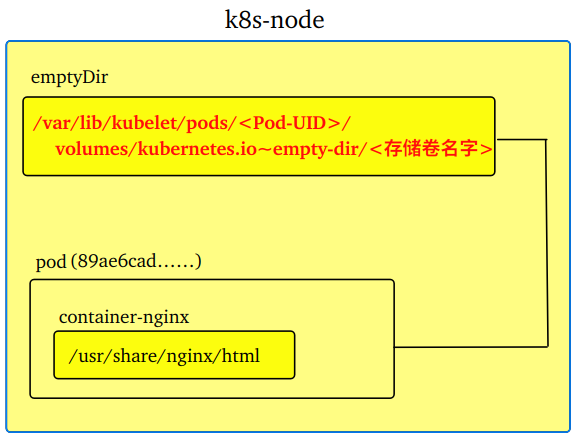
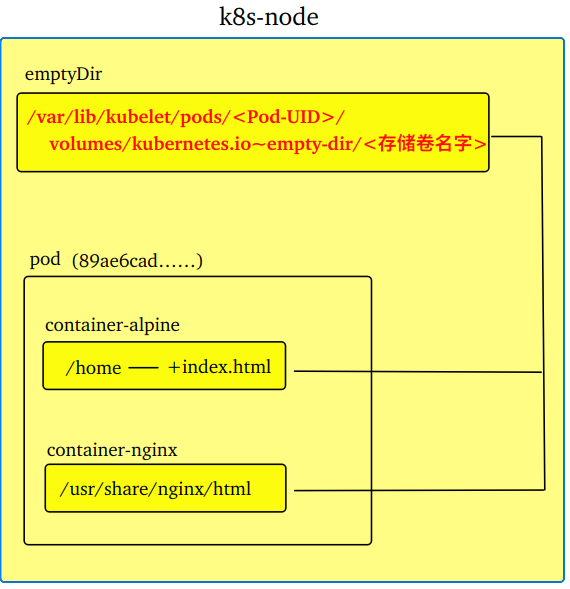
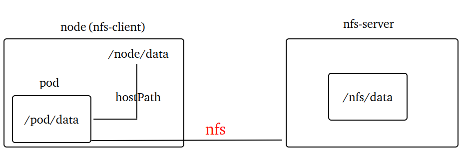
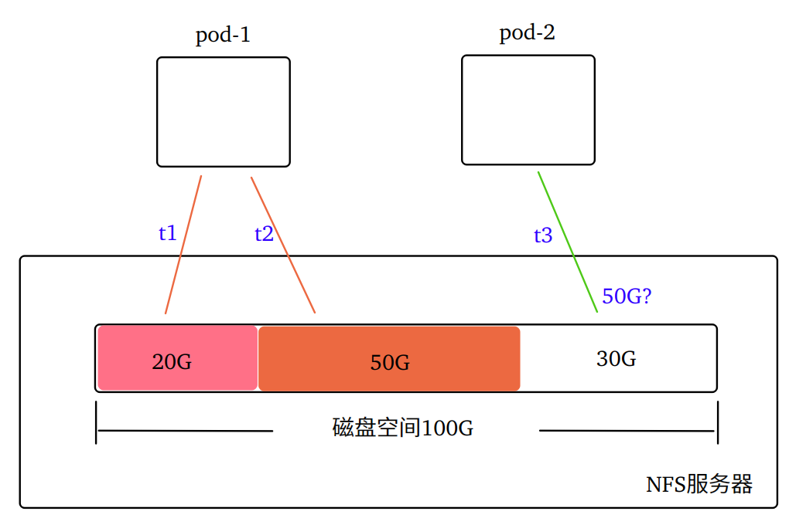
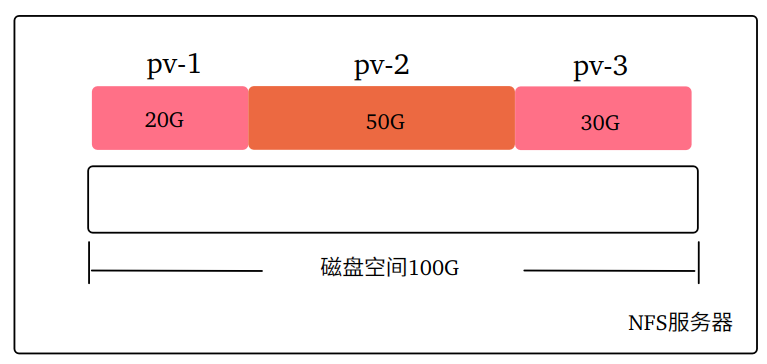
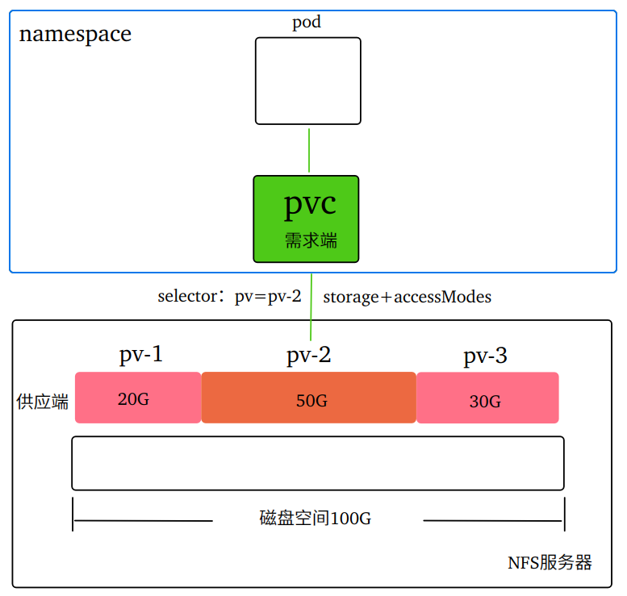
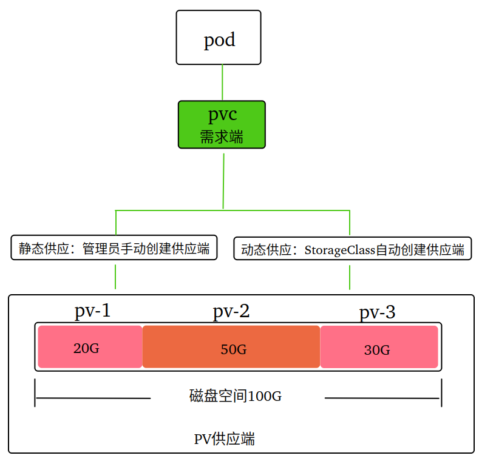
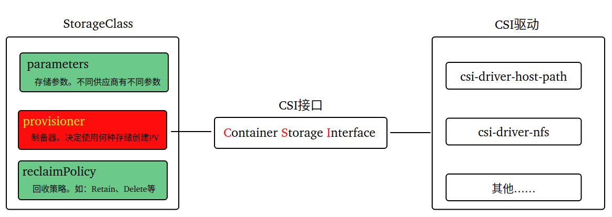
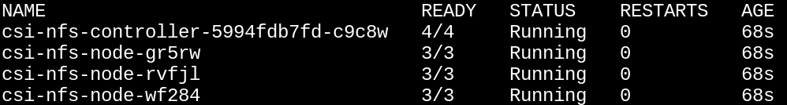

# K8s数据持久化

## 1. 为什么需要持久化

K8s 以 Pod 作为应用的部署形式，很多的应用都有数据持久化存储的需求，例如：mysql、redis等等。

使用 Pod 的文件系统保存数据并不可靠，因为 Pod 可能会被删除或重启，从而导致数据丢失。

~~~shell
# 创建deploy
kubectl apply -f deploy.yaml
kubectl get pod -o wide
# 进入pod
kubectl exec -it <pod-name> -- bash
# 改写index.html文件的内容
echo 'laoli' > /usr/share/nginx/html/index.html
# 退出后访问pod，测试改写效果
curl <pod-ip>
# 重启pod
kubectl rollout restart deploy deploy-nginx
# 再次访问pod，测试改写效果是否保留
~~~

## 2. 持久化的类型

Pod 通过 `spec.volumes` 配置存储卷。可通过如下命令查看 Pod 支持的存储卷类型：

~~~shell
kubectl explain pod.spec.volumes
~~~

## 3. emptyDir

emptyDir 是一种共享 pod 生命周期的"临时存储 "类型(pod被删除的话，临时目录里面数据也会被删除)。

~~~yaml
spec:
  volumes:
    - name: vol-emptydir   # 存储卷名字，必须
      emptyDir: 		   # emptyDir类型的存储卷，必须
        sizeLimit: 200Mi   # 存储卷的容量限制，非必须
  containers:
    volumeMounts:
      - name: vol-emptydir  				# 引用的存储卷名字
        mountPath: /usr/share/nginx/html  	# 容器挂载路径
~~~

emptyDir 可用于在一个 Pod 中实现多个容器之间的数据共享。 

~~~shell
# 创建deploy并查看pod调度的节点信息
kubectl apply -f emptyDir.yaml
kubectl get pod -o wide
# 查看pod的UID(UID是Pod实例的唯一标识符)
kubectl get pod <pod-name> -o yaml
# 在pod调度的节点上查看
ls /var/lib/kubelet/pods/<Pod-UID>/volumes/kubernetes.io~empty-dir/<存储卷名字>

# 进入nginx容器，查看挂载路径
kubectl exec -it <pod-name> -c container-nginx -- ls /usr/share/nginx/html
# 进入alpine容器，查看挂载路径
kubectl exec -it <pod-name> -c container-alpine -- sh
ls /home
# alpine容器的挂载路径下新增index.html
echo 'laoli' > /home/index.html
# 退出容器查看nginx首页
curl <pod-ip>
# 查看pod调度的节点存储卷
ls /var/lib/kubelet/pods/<Pod-UID>/volumes/kubernetes.io~empty-dir/<存储卷名字>
# 删除pod
kubectl delete -f emptyDir.yaml 或者 kubectl delete pod <pod-name>
# 查看pod调度的节点存储卷
ls /var/lib/kubelet/pods/<Pod-UID>
~~~

## 4. hostPath

hostPath 这种类型的存储卷，允许将节点的文件系统上的文件或目录挂载到 Pod 中。与上一节讲的 emptyDir 其实存在相似之处，都属于"local级别"的数据持久化方案。两者不同的地方在于：

~~~markdown
- hostPath类型即使Pod被删除，数据也持久地保存在节点上
- hostPath类型可挂载单个文件或整个目录，而emptyDir只能挂载目录
~~~

~~~yaml
spec:
  volumes:
    - name: vol-hostpath
      hostPath:
        # 挂载卷的类型：包含""(默认值)、Directory、File、DirectoryOrCreate(权限设置为755)、FileOrCreate(权限设置为644)等。
        type: DirectoryOrCreate
        # hostPath卷的节点路径
        path: /root/nginx      
  containers:
    volumeMounts:
        # 引用的hostPath卷的名字
      - name: vol-hostpath
        # 容器中的挂载路径
        mountPath: /usr/share/nginx/html
~~~

~~~shell
# 创建hostPath.yaml
kubectl apply -f hostPath.yaml
# 查看创建的pod
kubectl get pod -o wide
# 查看pod挂载路径
kubectl exec -it <pod-name> -- ls /usr/share/nginx/html

# 节点上创建index.html
echo 'laoli' > /root/nginx/index.html
# 查看pod挂载路径下的index.html
kubectl exec -it <pod-name> -- cat /usr/share/nginx/html/index.html

# 进入pod修改index.html文件内容
kubectl exec -it <pod-name> -- sh
echo 'hello' > /usr/share/nginx/html/index.html
# 返回节点上查看index.html的内容
cat /root/nginx/index.html
~~~

注意：hostPath 类型的存储卷高度依赖节点，一旦调度到不同的节点或者节点发生故障，数据会丢失！

## 5. NFS

NFS 即 "网络文件系统"，全称是 **N**etwork  **F**ile **S**ystem。它将文件系统挂载到远程服务器上，客户端和服务器之间通过 RPC (**R**emote **P**rocedure **C**all)  协议实现访问。NFS 独立于 K8s 集群 ，即使整个集群崩溃数据也不受影响。NFS 基于TCP/IP协议且独立于操作系统，可以跨平台使用，这使得不同系统的计算机可以共享文件。

 

### 5.1 nfs服务器

~~~shell
# 安装rpcbind和nfs-utils(基于CentOS)
yum install rpcbind nfs-utils  -y 
# 创建nfs服务器的共享数据目录
mkdir -p /root/nfs/data
# 编辑exports配置文件，参数含义：
  0. *代表所有客户端地址，也可以指定，例如：192.168.1.50
  1. insecure-使用1024以上的端口，secure则使用1024以下的端口
  2. rw-可读写,ro只读    
  3. sync-数据同步写入内存和硬盘(效率低不丢数据)，async数据先缓存到内存，待硬盘空闲再写入硬盘
  4. no_root_squash-客户端用root访问共享文件夹时不压缩root权限。root_squash则将root访问转为匿名访问。all_squash则将所有用户转为匿名。
echo "/root/nfs/data *(insecure,rw,sync,no_root_squash)"  > /etc/exports   
# 启动rpcbind、nfs服务
systemctl start rpcbind && systemctl start nfs-server
# 开机自启rpcbind、nfs服务
systemctl enable rpcbind && systemctl enable nfs-server
# 若修改配置文件，需要重载nfs服务使其生效
systemctl reload nfs-server
~~~

### 5.2 nfs客户端

~~~shell
# 安装客户端(安装后可只启动rpcbind服务不需要启动nfs服务，所有节点执行)
yum install rpcbind nfs-utils -y
systemctl start rpcbind && systemctl enable rpcbind
# 查看服务器的共享资源列表
showmount -e <nfs服务器ip>
# 客户端挂载到nfs服务器
mkdir -p /root/nfs
mount -t nfs <nfs服务器ip>:/root/nfs/data /root/nfs
# 查看挂载点
mount | grep nfs 或者 df -t nfs4
# 客户端上创建文件hello.txt
echo 'laoli' > /root/nfs/hello.txt
# nfs服务器上查看hello
cat /root/nfs/data/hello.txt
~~~

注意：客户端上的挂载目录不允许直接删除，除非卸载(解除挂载)。

~~~shell
# 卸载(-f表示强制卸载)
umount -f /root/nfs
# 查看挂载点
df -t nfs4
# 删除客户端上的挂载目录
rm -rf /root/nfs
# nfs服务器上查看hello
cat /root/nfs/data/hello.txt
~~~

### 5.3 使用nfs

~~~yaml
spec:
  volumes:
      # 存储卷的名字
    - name: vol-nfs
      nfs:
        # nfs-server的IP地址
        server: 192.168.1.52 
        # nfs-server的共享目录路径
        path: /root/nfs/data      
  containers:
    volumeMounts:
        # 引用的nfs卷的名字
      - name: vol-nfs
        # 容器中的挂载路径
        mountPath: /usr/share/nginx/html
~~~

~~~shell
# 创建
kubectl apply -f nfs.yaml
# 查看pod
kubectl get pod -o wide
# 查看节点的nfs挂载点
df -t nfs4
# nfs服务器的共享目录创建index.html
echo 'laoli' > /root/nfs/data/index.html
# 查看nginx首页
curl <pod-ip>
# 删除然后返回节点再次查看挂载点
kubectl delete -f nfs.yaml
df -t nfs4
~~~

小结：NFS简单易用，支持跨平台，数据集中存储，这些都是它的优点。不足之处体现在

~~~markdown
- 在高并发场景下性能不佳
- 未提供数据备份需要额外配置
- pod可以任意的向NFS写数据，存储资源的使用不可控，可能导致NFS服务端崩溃
- ……
~~~

## 6. PV & PVC

总起概括：PV、PVC都是 K8S 用来做存储管理的资源对象，它们让存储资源的使用变得可控，从而保障系统的稳定性、可靠性。

### 6.1 PV

PV 即 **P**ersistent **V**olume，中文叫做"持久化卷"。PV 是集群级别的存储资源(即不支持命名空间的资源)。

~~~shell
# 查看pv资源类型
kubectl api-resources | grep pv 
~~~

PV 由集群管理员手动创建或者使用存储类 (StorageClass) 自动创建。PV 类似于对服务器的磁盘进行分区，每个PV对象都预设了容量大小，体现了对存储资源的"合理规划"。
 

~~~yaml
apiVersion: v1
kind: PersistentVolume
metadata:
  name: nfs-pv1
  labels:
    pv: nfs-pv1
spec:
  # 1.存储能力
  capacity:
    # 存储大小(Mi、Gi)
    storage: 200Mi
    
  # 2.访问模式(HostPath仅支持ReadWriteOnce，NFS除ReadWriteOncePod外的都支持)  
  # https://kubernetes.io/docs/concepts/storage/persistent-volumes/#access-modes
  accessModes:
      # RWO访问模式。只允许被单个节点读写挂载
    - ReadWriteOnce
      # RWOP访问模式。只允许被单个Pod读写挂载
    - ReadWriteOncePod
      # ROX访问模式。允许被多个节点只读挂载
    - ReadOnlyMany
      # RWX访问模式。允许被多个节点读写挂载
    - ReadWriteMany
    
  # 3.回收策略
    # Retain 保留。删除PVC不会同步删除PV，等管理员手动去处理PV里的数据。NFS、HostPath都支持该项
    # Delete 删除。删除PVC同步删除PV。NFS、HostPath都不支持该项
    # Recycle 回收。删除PVC同步删除PV且重回可用状态。K8s v1.9后该回收策略标记为过时
  persistentVolumeReclaimPolicy: Retain
  
  # nfs服务器设置
  nfs:
    path: /root/nfs/data/pv1 # 确保/root/nfs/data/pv1事先存在
    server: 192.168.1.52
~~~

~~~shell
# nfs-server上创建相应共享目录
mkdir /root/nfs/data/{pv1,pv2} -p
# 创建pv
kubectl apply -f pv.yaml
# 查看pv
kubectl get pv 
~~~

### 6.2 PVC

PVC 即 **P**ersistent **V**olume **C**laim，中文叫做"持久化卷声明"。Pod 通过 PVC 向 PV 申请磁盘空间。如果 PVC 一直无法寻找到匹配的 PV 对象，则 PVC 进入"Pending"状态。

值得注意的是：PVC 支持命名空间，Pod 在使用 PVC  时必须与 PVC 在同一个 namespace 中。

 

创建 PVC 资源

~~~yaml
apiVersion: v1
kind: PersistentVolumeClaim
metadata:
  name: nfs-pvc
  namespace: default
  labels:
    pv: nfs-pvc
spec:
  resources:
    requests:
      storage: 500Mi # 小于等于PV对象的容量
  accessModes:
    - ReadOnlyMany   # 匹配PV对象的访问模式
  selector:
    matchLabels:
      pv: nfs-pv1    # 匹配PV对象的标签
~~~

~~~shell
# 创建pvc
kubectl apply -f pvc.yaml
# 查看pv和pvc
watch -n 1 kubectl get pv,pvc
# 在nfs-server上创建文件
echo 'I am pv2' > /root/nfs/data/pv1/index.html
cat /root/nfs/data/pv1/index.html

# 删除pvc(pv对象进入Released状态)
kubectl delete pvc nfs-pvc
# 重新创建pvc(无法与Released状态的pv对象绑定)
kubectl apply -f pvc.yaml
# 删除pv
kubectl delete pv nfs-pv1
# 重新创建pv
kubectl apply -f pv.yaml
~~~

创建 pod 使用 PVC

~~~yaml
……
spec:
  volumes:
    - name: vol-pvc
      persistentVolumeClaim: 
        claimName: nfs-pvc  # pod中指定pvc对象的名字
  containers:
    - name: container-nginx
      image: nginx:1.26.2
      ports:
        - containerPort: 80
      volumeMounts:
        - name: vol-pvc
          mountPath: /usr/share/nginx/html
~~~

~~~shell
# 创建pod
kubectl apply -f deploy.yaml
# 查看pod
kubectl get pod -o wide
# 访问pod
curl <pod-id>
# 查看节点上nfs挂载信息
df -t nfs4

# 注意：卷访问模式不会在存储已经被挂载的情况下为其实施写保护！
# 进入pod修改index.html内容
kubectl exec -it <pod-ip> -- sh
echo 'hello' > /usr/share/nginx/html/index.html
# 再次测试访问pod，并查看nfs-server共享目录下的文件
cat /root/nfs/data/pv1/index.html
~~~

~~~markdown
"Volume access modes do not enforce write protection once the storage has been mounted. Even if the access modes are specified as ReadWriteOnce, ReadOnlyMany, or ReadWriteMany, they don't set any constraints on the volume." - 摘自官网
# 一旦装载了存储，卷访问模式就不会强制执行写保护。即使访问模式被指定为ReadWriteOnce、ReadOnlyMany或ReadWriteMany，它们也不会对卷设置任何限制。
~~~

## 7. StorageClass

K8s 的存储资源有两种供应模式：静态模式和动态模式。静态模式下，管理员预先创建许多各种各样的PV，等待PVC申请使用。动态模式下，管理员无须预先创建PV，而是通过 **StorageClass** 自动完成PV的创建以及与PVC的绑定。

StorageClass 中文叫做"存储类"，缩写是 sc ，属于集群级别的资源(不支持命名空间)。StorageClass 与 PV 的关系，好比面向对象编程中"类和对象"的关系。StorageClass 定义了 PV 对象的创建规范，可视作 PV 的模板。

**安装针对NFS的CSI驱动**

~~~shell
# 添加helm repo仓库(管理节点操作)
helm repo add csi-driver-nfs https://raw.githubusercontent.com/kubernetes-csi/csi-driver-nfs/master/charts
# 更新仓库(管理节点操作)
helm repo update csi-driver-nfs
# 拉取csi-driver-nfs(--untar 下载时将压缩包解压到本地目录,管理节点操作)
helm pull csi-driver-nfs/csi-driver-nfs --untar
~~~

~~~shell
# 修改value.yaml的镜像地址(默认镜像地址无法下载)
# 提前准备镜像(所有节点操作)
docker load -i csi-driver-nfs-4.6.0.tar
# 安装(管理节点操作)
helm install csi-derver-nfs ./csi-driver-nfs -n kube-system
# 查看安装结果
kubectl get pods -n kube-system -l app.kubernetes.io/instance=csi-derver-nfs
~~~

 

**定义 StorageClass**

~~~yaml
apiVersion: storage.k8s.io/v1 
kind: StorageClass
metadata:
  name: nfs-csi  
  
# 1.csi-driver的名称(要和values.yaml文件中的driver.name保持一致)    
provisioner: nfs.csi.k8s.io  

# 2.存储参数
parameters:  
  # nfs-server的IP  
  server: 192.168.1.52 
  # nfs-server上的存储目录
  share: /root/nfs/data  
  
# 3.回收策略(支持Delete和Retain，默认Delete)  
reclaimPolicy: Retain # nfs不支持Delete

# 4.卷的绑定模式(Immediate模式-默认值、WaitForFirstConsumer模式)
volumeBindingMode: Immediate # 创建PVC时就立即绑定到PV

# 5.挂载选项
mountOptions:  
  - hard         # 服务器异常客户端会一直发请求直到服务器正常
  - nfsvers=4.1  # nfs的版本
  - nolock       # 禁用文件锁，并发时提高性能
  
# 6.允许动态扩容，默认false。nfs不支持动态扩容  
allowVolumeExpansion: true
~~~

**实验一**(手动创建 pvc && StorageClass 自动创建pv)

~~~yaml
apiVersion: v1
kind: PersistentVolumeClaim
metadata:
  name: nfs-pvc         # 定义nfs-pvc对象
  namespace: default
  labels:
    pv: nfs-pvc
spec:
  resources:
    requests:
      storage: 500Mi
  accessModes:
    - ReadOnlyMany
  storageClassName: nfs-csi  # 引用nfs-csi对象
---  
apiVersion: apps/v1
kind: Deployment
metadata:
  name: mydeploy
  namespace: default
  labels:
    app: nginx
spec:
  selector:
    matchLabels:
      app: nginx
  replicas: 1
  template:
    metadata:
      labels:
        app: nginx
    spec:
      volumes:
        - name: vol-pvc
          persistentVolumeClaim: 
            claimName: nfs-pvc    # 引用nfs-pvc对象
      containers:	
        - name: container-nginx
          image: nginx:1.26.2
          ports:
            - containerPort: 80
          volumeMounts:
            - name: vol-pvc
              mountPath: /usr/share/nginx/html  # 容器的挂载路径
~~~

**默认的StorageClass**：pvc 中若没有指定"storageClassName"字段，则使用默认的 StorageClass 对象，下面是设置默认 StorageClass 的YAML参考。

~~~yaml
apiVersion: storage.k8s.io/v1 
kind: StorageClass
metadata:
  name: nfs-csi
  # 默认StorageClass(注意使用引号括起true)
  annotations:
    storageclass.kubernetes.io/is-default-class: "true"
~~~

**手动删除pv对象**：由于回收策略设置为Retain，所以删除pvc后不会级联删除pv，此时pv对象需要手动删除。

~~~shell
# finalizers-"对象终结器"为空时，pv才可被删除
kubectl patch pv <pv_name> -p '{"metadata":{"finalizers":null}}'
# 删除pv
kubectl delete pv <pv_name>
~~~

**实验二**(StatefulSet自动创建 pvc && StorageClass 自动创建pv)

~~~yaml
apiVersion: apps/v1
kind: StatefulSet
metadata:
  name: mystatefulset
  namespace: default
  labels:
    app: nginx
spec:
  selector:
    matchLabels:
      app: nginx
  # 1.pvc模板
  volumeClaimTemplates:
    - metadata:
        # pvc对象的名字
        name: nfs-pvc
      spec:
        resources:
          requests:
            storage: 500Mi
        accessModes:
          - ReadWriteOnce
        # 引用的存储类名字  
        storageClassName: nfs-csi 
  #2.pod模板      
  template:
    metadata:
      labels:
        app: nginx
    spec:
      containers:       
        - name: container-nginx
          image: nginx:1.26.2
          ports:
            - containerPort: 80
          volumeMounts:
            # 直接引用pvc模板中定义的pvc对象名字
            - name: nfs-pvc
              mountPath: /usr/share/nginx/html
~~~

