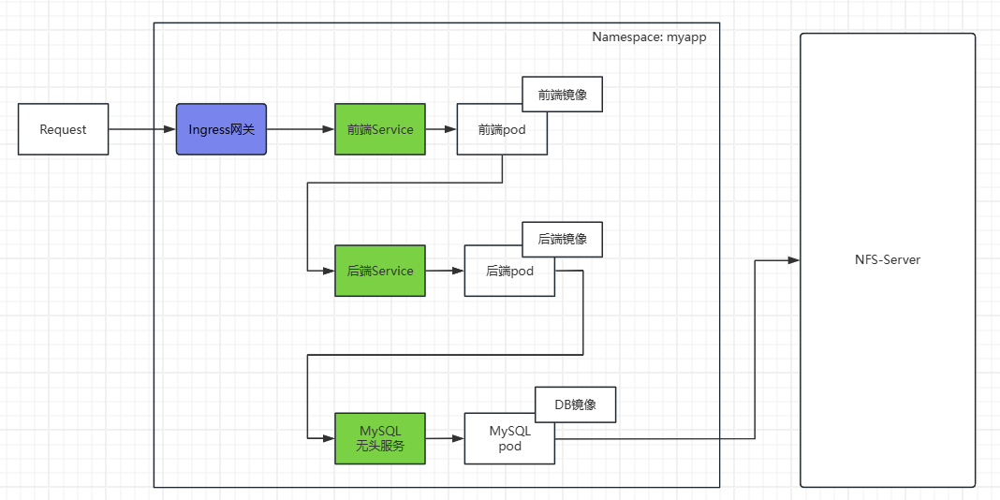

# K8s部署前后端分离的项目

## 1. 前言

本次实战基于以下两个前置技术：

~~~markdown
1. 《Docker容器技术，从零入门全面掌握》
2. 《Kubernetes容器编排技术》
~~~

概要介绍 

实验环境

~~~markdown
1. Centos操作系统(Centos 7.9 + Kernel 5.4.278)
2. Docker环境(docker-engine 26.1.4)
3. Kubernetes集群环境(Kubernetes 1.28.2)
~~~

## 2. 准备项目镜像

### 2.1  上传镜像文件

~~~markdown
1. mysql镜像
   文件名：myappdb.tar 
   基础镜像：mysql:8.0.27
   备注：内含初始化SQL脚本，运行容器后自动建库建表
2. SpringBoot项目镜像
   文件名：myappbackend.tar
   基础镜像： openjdk:17-jdk-alpine   
3. Vue3项目镜像
   文件名：myappfrontend.tar
   基础镜像： nginx:1.26.2
注意：所有工作节点操作！   
~~~

### 2.2 导入镜像文件

~~~shell
# 导入镜像
find . -name "myapp*.tar" | xargs -n 1 docker load -i
# 检查镜像
docker images | grep myapp
注意：所有工作节点操作！
~~~

## 3.安装nfs服务

安装nfs服务，保存 mysql 的数据

~~~shell
# 1. nfs服务器
mkdir -p /root/nfs/mysql
yum install rpcbind nfs-utils  -y 
echo "/root/nfs/mysql *(insecure,rw,sync,no_root_squash)"  > /etc/exports
systemctl start rpcbind && systemctl start nfs-server
systemctl enable rpcbind && systemctl enable nfs-server
# 2. nfs客户端
yum install rpcbind nfs-utils -y
systemctl start rpcbind && systemctl enable rpcbind
~~~

## 4. 部署项目

### 4.1 专用命名空间

~~~shell
# 创建专用命名空间
kubectl create ns myapp
~~~

### 4.2 部署mysql

创建yaml资源清单

~~~yaml
apiVersion: v1
kind: Service
metadata:
  name: myappdb-service
  namespace: myapp
spec:
  clusterIP: None               # 1. "无头"服务类型
  selector:
    app: myappdb
  ports:
    - port: 3306
      targetPort: 3306
---
apiVersion: apps/v1
kind: StatefulSet
metadata:
  name: myappdb-sts
  namespace: myapp
  labels:
    app: myappdb
spec:
  serviceName: myappdb-service  # 2.使用前面的"无头"服务
  selector:
    matchLabels:
      app: myappdb
  replicas: 1
  template:
    metadata:
      labels:
        app: myappdb
    spec:
      volumes:     				
        - name: vol-nfs         
          nfs:                   # 3.使用nfs存储
            server: 192.168.1.88
            path: /root/nfs/mysql
      containers:
        - name: container-myappdb
          image: myappdb         # 4.使用自定义镜像myappdb
          imagePullPolicy: IfNotPresent
          env:
            - name: TZ
              value: Asia/Shanghai
            - name: MYSQL_ROOT_PASSWORD
              value: '123456'
          ports:
            - containerPort: 3306  # 5.暴露mysql容器端口3306
          volumeMounts:
            - name: vol-nfs
              mountPath: /var/lib/mysql
~~~

~~~shell
# 创建资源
k apply -f myappdb.yaml
# 查看资源
k get svc,pod -o wide -n myapp
# 检查nfs服务器上面的数据挂载
ls /var/lib/mysql
~~~

### 4.3 部署后端

创建yaml资源清单

~~~yaml
apiVersion: v1
kind: Service
metadata:
  name: myappbackend-service
  namespace: myapp
spec:  
  selector:
    app: myappbackend
  ports:
    - port: 8899
      targetPort: 8899
---
apiVersion: apps/v1
kind: Deployment
metadata:
  name: myappbackend-dp
  namespace: myapp
  labels:
    app: myappbackend
spec:
  selector:
    matchLabels:
      app: myappbackend
  replicas: 1
  template:
    metadata:
      labels:
        app: myappbackend
    spec:
      containers:
        - name: container-myappbackend
          image: myappbackend             #1. 使用自定义镜像myappbackend
          imagePullPolicy: IfNotPresent
          ports:
            - containerPort: 8899         #2. 暴露后端容器端口8899
~~~

~~~shell
# 创建资源
k apply -f myappbackend.yaml
# 查看资源
k get svc,pod -o wide -n myapp
# 测试后端pod
curl <pod-ip>:8899/users
~~~

### 4.4 部署前端

创建yaml资源清单

~~~yaml
apiVersion: v1
kind: ConfigMap
metadata:
  name: nginx-config  
  namespace: myapp
data:
  default.conf: |
    upstream myapp.com{
	  server myappbackend-service.myapp.svc.cluster.local:8899;
    }
    server{
	  location / {
	      root   /usr/share/nginx/html;
	      index  index.html index.htm;
	      try_files $uri /index.html;
	  }	
	  location /apis/ {
	      rewrite ^.+apis/?(.*)$ /$1 break;
	      proxy_pass http://myapp.com;
	      proxy_redirect off;
	      proxy_set_header Host $host;
	      proxy_set_header X-Real-IP $remote_addr;
	      proxy_set_header X-Forwarded-For $proxy_add_x_forwarded_for;
	  }
    }
---
apiVersion: v1
kind: Service
metadata:
  name: myappfrontend-service
  namespace: myapp
spec:  
  selector:
    app: myappfrontend
  ports:
    - port: 80
      targetPort: 80               # 1.暴露服务端口80
---
apiVersion: apps/v1
kind: Deployment
metadata:
  name: myappfrontend-dp
  namespace: myapp
  labels:
    app: myappfrontend
spec:
  selector:
    matchLabels:
      app: myappfrontend
  replicas: 1
  template:
    metadata:
      labels:
        app: myappfrontend
    spec:
      volumes:  
        - name: config-nginx           
          configMap:                    # 2.使用configMap
            name: nginx-config          
      containers:
        - name: container-myappfrontend
          image: myappfrontend          # 3.使用自定义镜像myappfrontend
          imagePullPolicy: IfNotPresent
          ports:
            - containerPort: 80         # 4.暴露前端容器端口80
          volumeMounts:
            - name: config-nginx
              mountPath: /etc/nginx/conf.d
~~~

~~~shell
# 创建资源
k apply -f myappfrontend.yaml
# 查看资源
k get svc,pod -o wide -n myapp
~~~

## 5. Ingress网关

### 5.1 安装Ingress-Controller

本次 ingress 控制器选用K8s官方提供的 "ingress-nginx"，已提供安装资料包。

~~~shell
# 上传nginx-ingress_image_1.12.0.tar至所有工作节点，然后"docker load"
# 上传部署文件ingress-deploy.yaml至管理节点，然后"kubectl apply"  
~~~

检查安装的结果并记录 http 协议端口(80) 所映射的节点端口

~~~shell
kubectl get svc -n ingress-nginx
kubectl get pod -n ingress-nginx -o wide
~~~

### 5.2 创建Ingress代理Service

~~~yaml
apiVersion: networking.k8s.io/v1
kind: Ingress
metadata:
  name: myapp-ingress
  namespace: myapp
spec:
  ingressClassName: nginx
  # 1.路由规则
  rules:
      # 2.自定义域名
    - host: www.myapp.com
      http:
        # 3.域名下的具体路径
        paths:
          - path: / 
            backend:
              service:              
                # 前端service名字
                name: myappfrontend-service
                # 前端service端口
                port: 
                  number: 80
            # 路径匹配类型      
            pathType: Prefix
~~~

修改主机hosts：由于域名`www.myapp.com`属于测试域名，需要在发起访问的主机上配置该域名与IP的映射

~~~shell
1. Linux系统
   echo '192.168.1.56 www.myapp.com' >> /etc/hosts
   echo '192.168.1.57 www.myapp.com' >> /etc/hosts
2. Windows系统
   找到 'C:\Windows\System32\drivers\etc\hosts' 路径，复制hosts到桌面修改后替换原位置文件
~~~

注意：`192.168.1.56`  和 `192.168.1.57` 是运行了 ingress-nginx 的虚拟主机IP。
