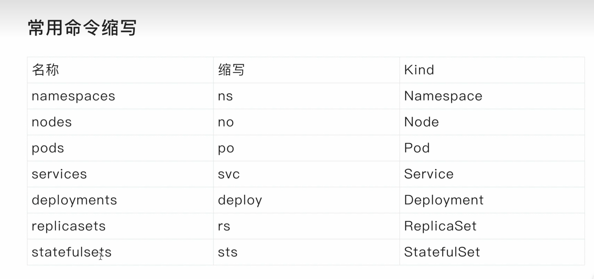
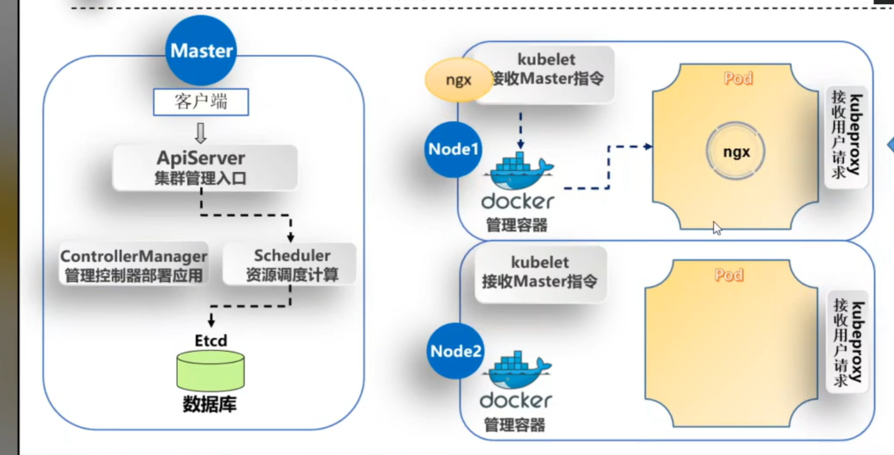

# Kubernetes介绍

> kubernetes（k8s）是2014年由Google公司基于Go语言编写的一款开源的容器集群编排系统，用于自动化容器的部署、扩缩容和管理；
>
> kubernetes（k8s）是基于Google内部的Borg系统的特征开发的一个版本，集成了Borg系统大部分优势；
>
> 官方地址：https://Kubernetes.io
>
> 代码托管平台：https://github.com/Kubernetes

# kubernetes具备的功能

> + 自我修复：k8s可以监控容器的运行状况，并在发现容器出现异常时自动重启故障实例；
> + 弹性伸缩：k8s可以根据资源的使用情况自动地调整容器的副本数。例如，在高峰时段，k8s可以自动增加容器的副本数以应对更多的流量；而在低峰时段，k8s可以减少应用的副本数，节省资源；
> + 资源限额：k8s允许指定每个容器所需的CPU和内存资源，能够更好的管理容器的资源使用量；
> + 滚动升级：k8s可以在不中断服务的情况下滚动升级应用版本，确保在整个过程中仍有足够的实例在提供服务；
> + 负载均衡：k8s可以根据应用的负载情况自动分配流量，确保各个实例之间的负载均衡，避免某些实例过载导致的性能下降；
> + 服务发现：k8s可以自动发现应用的实例，并为它们分配一个统一的访问地址。这样，用户只需要知道这个统一的地址，就可以访问到应用的任意实例，而无需关心具体的实例信息；
> + 存储管理：k8s可以自动管理应用的存储资源，为应用提供持久化的数据存储。这样，在应用实例发生变化时，用户数据仍能保持一致，确保数据的持久性；
> + 密钥与配置管理：Kubernetes 允许你存储和管理敏感信息，例如：密码、令牌、证书、ssh密钥等信息进行统一管理，并共享给多个容器复用；

# kubernetes集群角色

> k8s集群需要建⽴在多个节点上，将多个节点组建成一个集群，然后进⾏统⼀管理，但是在k8s集群内部，这些节点⼜被划分成了两类⻆⾊：
>
> + 一类⻆⾊为管理节点，叫Master，负责集群的所有管理工作；
> + ⼀类⻆⾊为⼯作节点，叫Node，负责运行集群中所有用户的容器应用 ； 

# Master管理节点组件

> - API Server：作为集群的管理入口，处理外部和内部通信，接收用户请求并处理集群内部组件之间的通信；
>
> - Scheduler：作为集群资源调度计算，根据调度策略，负责将待部署的 Pods 分配到合适的 Node 节点上；
>
> - Controller Manager：管理集群中的各种控制器，例如 Deployment、ReplicaSet、DaemonSet等，管理集群中的各种资源；
>
> - etcd：作为集群的数据存储，保存集群的配置信息和状态信息；

# Node工作节点组件

> - Kubelet：负责与 Master 节点通信，并根据 Master 节点的调度决策来创建、更新和删除 Pod，同时维护 Node 节点上的容器状态；
>
> - 容器运行时（如 Docker、containerd 等）：负责运行和管理容器，提供容器生命周期管理功能。例如：创建、更新、删除容器等；
>
> - Kube-proxy：负责为集群内的服务实现网络代理和负载均衡，确保服务的访问性；

# 非必须的集群插件

> - DNS服务：严格意义上的必须插件，在k8s中，很多功能都需要用到DNS服务，例如：服务发现、负载均衡、有状态应用的访问等；
>
> - Dashboard： 是k8s集群的Web管理界面；
>
> - 资源监控：例如metrics-server监视器，用于监控集群中资源利用率；

# kubernetes集群类型

> - 一主多从集群：由一台Master管理节点和多台Node工作节点组成，生产环境下Master节点存在单点故障的风险，适合学习和测试环境使用； 
>
> - 多主多从集群：由多台Master管理节点和多Node工作节点组成，安全性高，适合生产环境使用； 