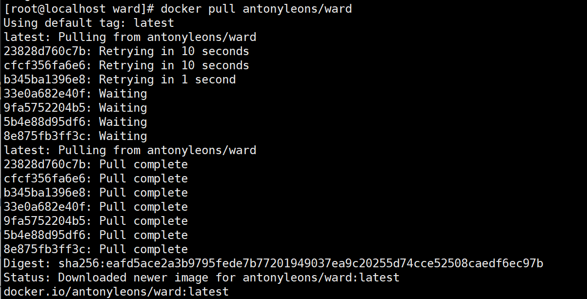

# 使用Docker部署Ward服务器监控工具

#### Ward介绍

##### Ward简介

>Ward 监控工具是一款专门用于监控Linux 日系统的工具。它可以实时监测系统的 CPU9、内存、I/0等资源的使用情况，以及系统的网络状态和服务运行状态等。

##### Ward特点

> Ward 支持自适应设计系统。
> Ward还支持深色主题。
> Ward只显示服务器的主要信息。
> Ward 在所有流行的操作系统上运行良好。

Ward使用场景

```
1.性能监控与优化:在大型企业或互联网公司的服务器集群中，Ward监控工具可以持续监控每一台Linux服务器的CPU使用率、内存占用、磁盘I/0等关键性能指标。当这些指标超过预设阈值时，它能立即发送警报，帮助运维团队快速定位到性能瓶颈所在，及时进行调优或扩容，确保业务平稳运行

2.故障预警与排查:对于需要高可用性只的在线服务，如电子商务平台、金融交易系统等，Ward能够实时)监测服务的状态和网络连接情况。一旦发现服务异常终止、响应时间过长或是网络中断等问题，立即触发报警机制，帮助运维人员迅速介入，缩短故障处理时间，减少服务中断带来的损失，

3.资源利用率分析:在数据中心或云环境中，通过Ward长期收集和分析系统资源的使用数据，可以帮助管理员了解资源的分配和利用效率。这对于合理规划资源、避免资源浪费、优化成本结构十分关键。例如通过分析报告可以决定是否需要调整虚拟机,四的配置，或者是否有必要将某些服务迁移到其他负载较低的服务器上。

4.容量规划:随着业务量的增长，提前预测并准备足够的系统资源变得尤为重要。Ward提供的历史监控数据和趋势分析功能，能够帮助企业进行准确的容量规划。通过分析高峰期的资源使用情况，预测未来可能需要的资源增长量，从而提前进行硬件升级或云资源的扩容，确保业务的持续扩展能力。

5.安全审计与合规性检查:虽然Ward主要聚焦于性能和状态监控，但其对系统活动的跟踪能力也能辅助进行安全审计。例如，通过监控异常的网络流量、不明的系统访问记录等，可以及早发现潜在的安全威胁配合其他安全工具为系统的安全性提供多一层保障。
```


#### 开始搭建

##### 检查docker和docker compose版本


##### 开启流量转发

```txt
[root@localhost ~]# echo "net.ipv4.ip_forward=1" >>  /etc/sysctl.conf
[root@localhost ~]# systemctl restart network
[root@localhost ~]# sysctl net.ipv4.ip_forward
net.ipv4.ip_forward = 1
```

##### 拉取镜像

```
docker pull ward
```



使用docker compose 方式部署

> ward.yaml

```
[root@localhost ward]# cat ward.yaml 
version: '3.3'
services:
  run: 
        restart: unless-stopped
        container_name: ward
        ports:
            - '4000:4000'
        environment:
            - WARD_ROOT=4000
            - WARD_THEME=dark
            - WARD_NAME=leons-server
        privileged: true
        image: antonyleons/ward
```


查看日志


查看web界面

> 输入 IP:4000 查看

