# rocky linux 部署zabbix

# zabbix7.0安装

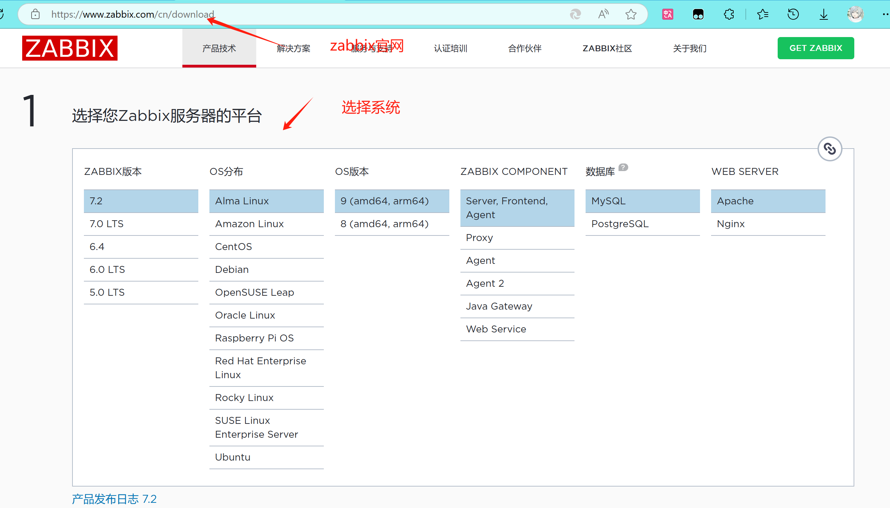

>注意centos 7 好像只能安装5.0版本 LTS表示长期支持版本 

>安装zabbix7.0仓库

```
[root@zabbix-server~]# rpm -Uvh https://repo.zabbix.com/zabbix/7.0/rocky/9/x86_64/zabbix-release-7.0-5.el9.noarch.rpm
```

>安装zabbix相关安装包

```
[root@zabbix-server ~]# dnf install -y zabbix-server-mysql zabbix-web-mysql zabbix-nginx-conf zabbix-sql-scripts zabbix-selinux-policy zabbix-agent gd-devel
```

> 添加mysql8.0 仓库

```
tee /etc/yum.repos.d/mysql-8.0.repo <<EOF
[mysql80-community]
name=MySQL 8.0 Community Server
baseurl=https://repo.mysql.com/yum/mysql-8.0-community/el/9/x86_64/
enabled=1
gpgcheck=0
EOF
```

> 安装mysql8.0版本

```
dnf install -y mysql-community-server-8.0.30-1.el9.x86_64
```

> 启动数据库

```
systemctl enable mysqld --now
```

> 找到初始密码

```
grep "password" /var/log/mysqld.log
```

> 使用初始密码登录数据库，格式： `mysql -u 用户名 -p密码`（ -p与密码之间不能有空格，其他参数可有可无，密码如果有特殊字符需要用引起来）

```
mysql -uroot -p"s.I=f5mtx&Me"      #-u和-p后面不要有空格
```

> 进入数据库重新修改root密码

```
alter user root@"localhost" identified by "Admin123...";
```

> 退出数据库并且用新密码登录

```
[root@zabbix-server ~]# mysql -uroot -pAdmin123...
```

> 创建zabbix库与用户

```
# 创建名为 zabbix 的数据库，使用 utf8mb4 字符集和 utf8mb4_bin 排序规则
CREATE DATABASE zabbix CHARACTER SET utf8mb4 COLLATE utf8mb4_bin;

# 创建用户 zabbix，并设置密码为 'zbx123...A'，限制该用户只能从本地访问
CREATE USER zabbix@localhost IDENTIFIED BY 'zbx123...A';

# 授予用户 zabbix 对 zabbix 数据库的所有权限
GRANT ALL PRIVILEGES ON zabbix.* TO zabbix@localhost;

# 允许在二进制日志中信任函数创建者，避免函数创建时的权限问题
SET GLOBAL log_bin_trust_function_creators = 1;

# 刷新配置
flush privileges;
```

> 退出数据库，导入数据库所需的表文件

```
cd /usr/share/zabbix-sql-scripts/mysql

[root@zabbix-server mysql]# zcat  server.sql.gz | mysql -uroot -pAdmin123... zabbix
mysql: [Warning] Using a password on the command line interface can be insecure.
# 这里只是一个警告，不用管
```

> 然后需要进入数据库禁用log_bin_trust_function_creators

```
mysql -uroot -p'Admin123...'
set global log_bin_trust_function_creators = 0;
```


> 为zabbix server 配置连接数据库

```
[root@zabbix-server ~]# vim /etc/zabbix/zabbix_server.conf 
#zabbix使用的数据库名称
DBName=zabbix

#zabbix连接数据库用户名称
DBUser=zabbix

#用户密码
DBPassword=zbx123...A   #这个密码是zbbix数据库的密码
```

> 安装zabbix中文包（默认zabbix web页面不支持中文）

```
dnf install  glibc-langpack-zh.x86_64 -y  #需要安装这个，前端选择语言才有中文
```

> 启动zabbix相关服务

```
systemctl restart zabbix-server zabbix-agent nginx php-fpm
systemctl enable zabbix-server zabbix-agent nginx php-fpm
```

# 配置zabbix前端


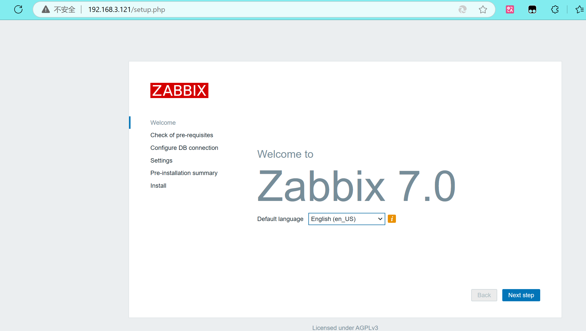

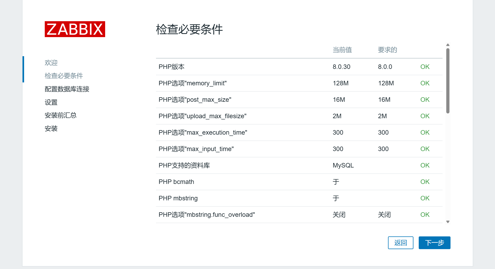

> 这里需要全部显示ok

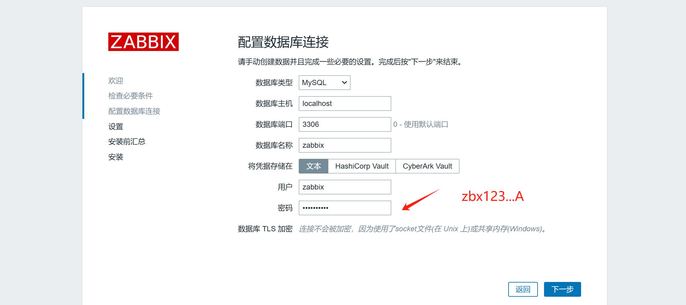

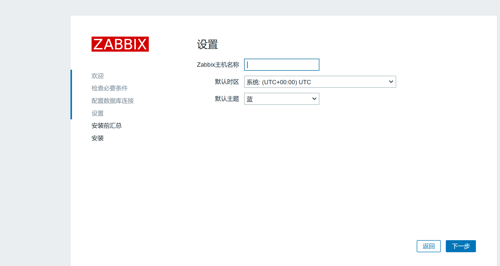

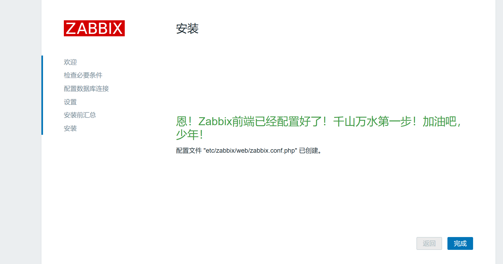

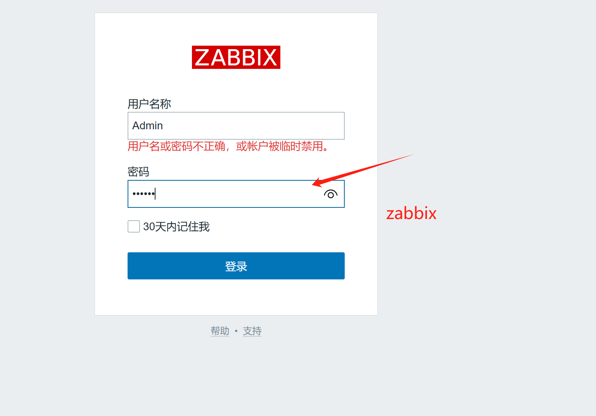

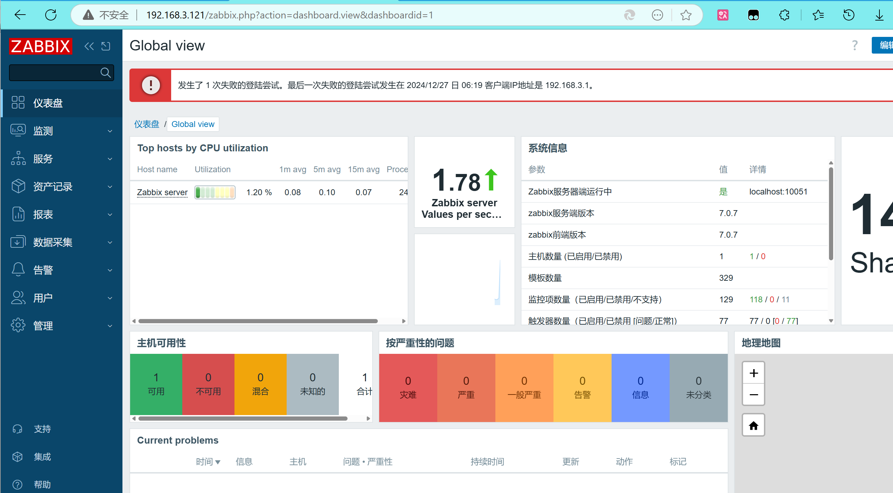

> 成功进入

# 准备zabbix-agent

> zabbix-agent 安装7.0仓库

```
[root@zabbix-agent ~]# rpm -Uvh https://repo.zabbix.com/zabbix/7.0/rocky/9/x86_64/zabbix-release-7.0-5.el9.noarch.rpm
```

> 安装zabbix-agent包

```
dnf install -y zabbix-agent 
```

> 修改zabbix-agent配置文件，指定zabbix-server主机地址
>
> [root@zabbix-agent ~]#  vim /etc/zabbix/zabbix_agentd.conf

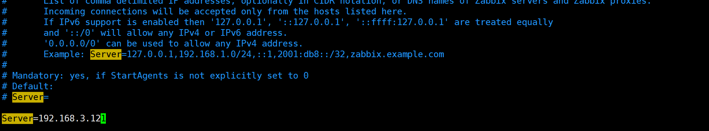

> 启动zabbix-agent

```
systemctl enable zabbix-agent --now
```


# zabbix添加主机

> 在 【数据采集】-【主机】-【创建主机】 中添加主机信息

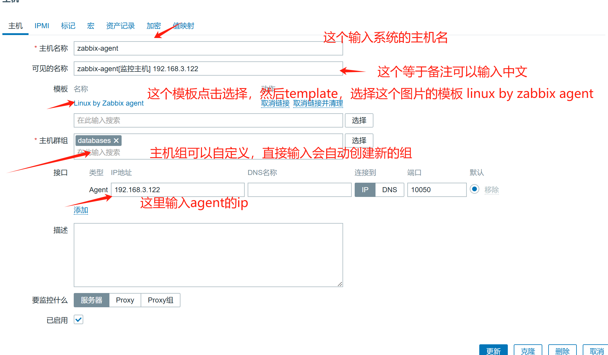

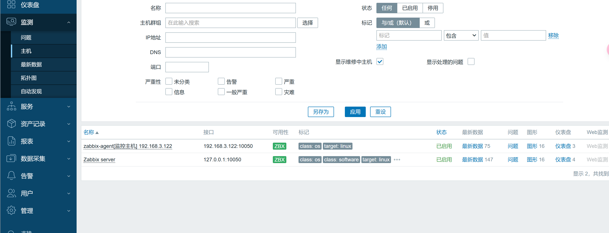

> 修改字体乱码

```
# 这里选择win电脑的 C:\Windows\Fonts 复制一个里面的字体
# 上传选择的字体
[root@zabbix-server fonts]# ls
SIMSUN.TTC  graphfont.ttf  zabbix-icons.svg  zabbix-icons.ttf  zabbix-icons.woff  zabbix-icons.woff2
[root@zabbix-server fonts]# cp SIMSUN.TTC graphfont.ttf 
cp: overwrite 'graphfont.ttf'? y  #覆盖一下
[root@zabbix-server fonts]# rm -rf SIMSUN.TTC  # 然后删除

```

